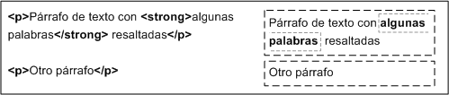
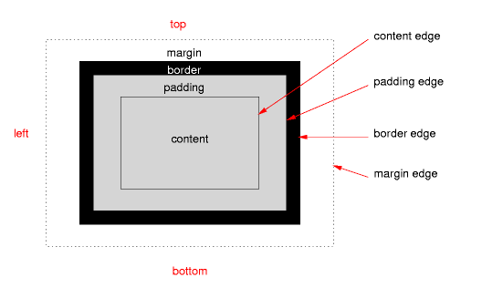
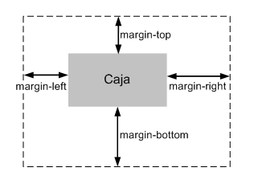
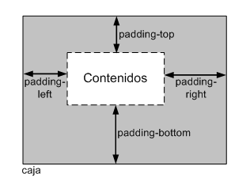
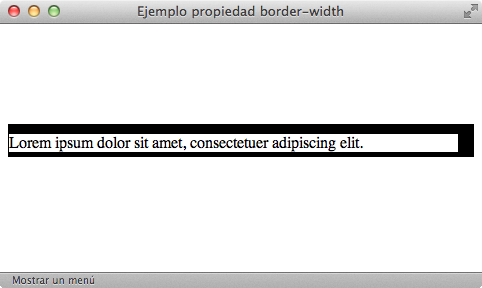
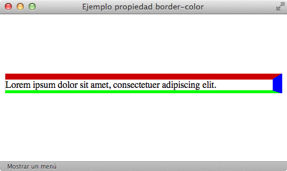
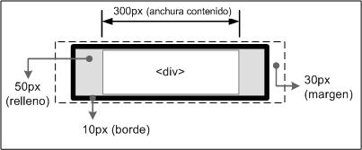

# Modelo de cajas

El modelo de cajas o "*box model*" es seguramente la característica más importante del lenguaje de hojas de estilos CSS, ya que condiciona el diseño de todas las páginas web. El modelo de cajas es el comportamiento de CSS que hace que todos los elementos de las páginas se representen mediante cajas rectangulares.

Las cajas de una página se crean automáticamente. Cada vez que se inserta una etiqueta HTML, se crea una nueva caja rectangular que encierra los contenidos de ese elemento. La siguiente imagen muestra las tres cajas rectangulares que crean las tres etiquetas HTML que incluye la página:

Las cajas de las páginas no son visibles a simple vista porque inicialmente no muestran ningún color de fondo ni ningún borde. La siguiente imagen muestra las cajas que forman la página web de [http://www.alistapart.com/](http://www.alistapart.com/) después de forzar a que todas las cajas muestren su borde:

Los navegadores crean y colocan las cajas de forma automática, pero CSS permite modificar todas sus características. Cada una de las cajas está formada por seis partes, tal y como muestra la siguiente imagen:

Las partes que componen cada caja y su orden de visualización desde el punto de vista del usuario son las siguientes:

- Contenido (*content*): se trata del contenido HTML del elemento (las palabras de un párrafo, una imagen, el texto de una lista de elementos, etc.)
- Relleno (*padding*): espacio libre opcional existente entre el contenido y el borde.
- Borde (*border*): línea que encierra completamente el contenido y su relleno.
- Imagen de fondo (*background image*): imagen que se muestra por detrás del contenido y el espacio de relleno.
- Color de fondo (*background color*): color que se muestra por detrás del contenido y el espacio de relleno.
- Margen (*margin*): separación opcional existente entre la caja y el resto de cajas adyacentes.

El relleno y el margen son transparentes, por lo que en el espacio ocupado por el relleno se muestra el color o imagen de fondo (si están definidos) y en el espacio ocupado por el margen se muestra el color o imagen de fondo de su elemento padre (si están definidos). Si ningún elemento padre tiene definido un color o imagen de fondo, se muestra el color o imagen de fondo de la propia página (si están definidos).

Si una caja define tanto un color como una imagen de fondo, la imagen tiene más prioridad y es la que se visualiza. No obstante, si la imagen de fondo no cubre totalmente la caja del elemento o si la imagen tiene zonas transparentes, también se visualiza el color de fondo. Combinando imagenes transparentes y colores de fondo se pueden lograr efectos gráficos muy interesantes.

## Anchura y altura

### Anchura

La propiedad CSS que controla la anchura de la caja de los elementos se denomina `width`.

| Propiedad             | `width`    |
| --------------------: | :------------- |
| **Valores** | unidad de medida \| porcentaje \| auto \| inherit |
| **Se aplica a** | Todos los elementos, salvo los elementos en línea que no sean imágenes, las filas de tabla y los grupos de filas de tabla |
| **Valor inicial**  | auto |
| **Descripción**       | Establece la anchura de un elemento |

La propiedad `width` no admite valores negativos y los valores en porcentaje se calculan a partir de la anchura de su elemento padre. El valor `inherit` indica que la anchura del elemento se hereda de su elemento padre. El valor `auto`, que es el que se utiliza si no se establece de forma explícita un valor a esta propiedad, indica que el navegador debe calcular automáticamente la anchura del elemento, teniendo en cuenta sus contenidos y el sitio disponible en la página.

El siguiente ejemplo establece el valor de la anchura del elemento `
` lateral:

    [html]
    #lateral { width: 200px; }
    
    

        ...
    

CSS define otras dos propiedades relacionadas con la anchura de los elementos: `min-width` y `max-width`, que se verán más adelante.

### Altura

La propiedad CSS que controla la altura de los elementos se denomina `height`.

| Propiedad             | `height`    |
| --------------------: | :------------- |
| **Valores** | unidad de medida \| porcentaje \| auto \| inherit |
| **Se aplica a** | Todos los elementos, salvo los elementos en línea que no sean imágenes, las filas de tabla y los grupos de filas de tabla |
| **Valor inicial**  | auto |
| **Descripción**       | Establece la altura de un elemento |

Al igual que sucede con `width`, la propiedad `height` no admite valores negativos. Si se indica un porcentaje, se toma como referencia la altura del elemento padre. Si el elemento padre no tiene una altura definida explícitamente, se asigna el valor `auto` a la altura.

El valor `inherit` indica que la altura del elemento se hereda de su elemento padre. El valor auto, que es el que se utiliza si no se establece de forma explícita un valor a esta propiedad, indica que el navegador debe calcular automáticamente la altura del elemento, teniendo en cuenta sus contenidos y el sitio disponible en la página.

El siguiente ejemplo establece el valor de la altura del elemento `
` de cabecera:

    [html]
    #cabecera { height: 60px; }
     
    

      ...
    

CSS define otras dos propiedades relacionadas con la altura de los elementos: `min-height` y `max-height`, que se verán más adelante.

## Margen y relleno

### Margen

CSS define cuatro propiedades para controlar cada uno de los márgenes horizontales y verticales de un elemento.

| Propiedades             | `margin-top, margin-right, margin-bottom, margin-left`    |
| --------------------: | :------------- |
| **Valores** | unidad de medida \| porcentaje \| auto \| inherit |
| **Se aplica a** | Todos los elementos, salvo margin-top y margin-bottom que sólo se aplican a los elementos de bloque y a las imágenes |
| **Valor inicial**  | 0 |
| **Descripción**       | Establece cada uno de los márgenes horizontales y verticales de un elemento |

Cada una de las propiedades establece la separación entre el borde lateral de la caja y el resto de cajas adyacentes:

Las unidades más utilizadas para indicar los márgenes de un elemento son los píxeles (cuando se requiere una precisión total), los `em` (para hacer diseños que mantengan las proporciones) y los porcentajes (para hacer diseños líquidos o fluidos).

El siguiente ejemplo añade un margen izquierdo al segundo párrafo:

    [css]
    .destacado {
      margin-left: 2em;
    }

    [html]
    
Lorem ipsum dolor sit amet, consectetuer adipiscing elit. Nam et elit.
    Vivamus placerat lorem. Maecenas sapien. Integer ut massa. Cras diam ipsum,
    laoreet non, tincidunt a, viverra sed, tortor.

     
    
Vestibulum lectus diam, luctus vel, venenatis
    ultrices, cursus vel, tellus. Etiam placerat erat non sem. Nulla
    molestie odio non nisl tincidunt faucibus.

     
    
Aliquam euismod sapien eu libero. Ut tempor orci at nulla. Nam in eros
    egestas massa vehicula nonummy. Morbi posuere, nibh ultricies consectetuer
    tincidunt, risus turpis laoreet elit, ut tincidunt risus sem et nunc.

A continuación se muestra el aspecto del ejemplo anterior en cualquier navegador:

Los márgenes verticales (`margin-top` y `margin-bottom`) sólo se pueden aplicar a los elementos de bloque y las imágenes, mientras que los márgenes laterales (`margin-left` y `margin-right`) se pueden aplicar a cualquier elemento, tal y como muestra la siguiente imagen:

La imagen anterior muestra el resultado de aplicar los mismos márgenes a varios enlaces (elementos en línea) y varios párrafos (elementos de bloque). En los elementos en línea los márgenes verticales no tienen ningún efecto, por lo que los enlaces no muestran ninguna separación vertical, al contrario de lo que sucede con los párrafos. Sin embargo, los márgenes laterales funcionan sobre cualquier tipo de elemento, por lo que los enlaces se muestran separados entre sí y los párrafos aumentan su separación con los bordes laterales de su elemento contenedor.

Además de las cuatro propiedades que controlan cada uno de los márgenes del elemento, CSS define una propiedad especial que permite establecer los cuatro márgenes de forma simultánea. Estas propiedades especiales se denominan "*propiedades shorthand*" y CSS define varias propiedades de este tipo, como se verá más adelante.

La propiedad que permite definir de forma simultanea los cuatro márgenes se denomina `margin`.

| Propiedad             | `margin`    |
| --------------------: | :------------- |
| **Valores** | ( unidad de medida \| porcentaje \| auto ) {1, 4} \| inherit |
| **Se aplica a** | Todos los elementos salvo algunos casos especiales de elementos mostrados como tablas |
| **Valor inicial**  | - |
| **Descripción**       | Establece de forma directa todos los márgenes de un elemento |

La notación `{1, 4}` de la definición anterior significa que la propiedad `margin` admite entre uno y cuatro valores, con el siguiente significado:

- Si solo se indica un valor, todos los márgenes tienen ese valor.
- Si se indican dos valores, el primero se asigna al margen superior e inferior y el segundo se asigna a los márgenes izquierdo y derecho.
- Si se indican tres valores, el primero se asigna al margen superior, el tercero se asigna al margen inferior y el segundo valor se asigna los márgenes izquierdo y derecho.
- Si se indican los cuatro valores, el orden de asignación es: margen superior, margen derecho, margen inferior y margen izquierdo.

El ejemplo anterior de márgenes se puede reescribir utilizando la propiedad `margin`:

Código CSS original:

    [css]
    div img {
      margin-top: .5em;
      margin-bottom: .5em;
      margin-left: 1em;
      margin-right: .5em;
    }

Alternativa directa:

    [css]
    div img {
      margin: .5em .5em .5m 1em;
    }

Otra alternativa:

    [css]
    div img {
      margin: .5em;
      margin-left: 1em;
    }

El comportamiento de los márgenes verticales es más complejo de lo que se puede imaginar. Cuando se juntan dos o más márgenes verticales, se fusionan de forma automática y la altura del nuevo margen será igual a la altura del margen más alto de los que se han fusionado.

De la misma forma, si un elemento está contenido dentro de otro elemento, sus márgenes verticales se fusionan y resultan en un nuevo margen de la misma altura que el mayor margen de los que se han fusionado:

Aunque en principio puede parecer un comportamiento extraño, la razón por la que se propuso este mecanismo de fusión automática de márgenes verticales es el de dar uniformidad a las páginas web habituales. En una página con varios párrafos, si no se diera este comportamiento y se estableciera un determinado margen a todos los párrafos, el primer párrafo no mostraría un aspecto homogéneo respecto de los demás.

En el caso de un elemento que se encuentra en el interior de otro y sus márgenes se fusionan de forma automática, se puede evitar este comportamiento añadiendo un pequeño relleno (`padding: 1px`) o un borde (`border: 1px solid transparent`) al elemento contenedor.

### Relleno

CSS define cuatro propiedades para controlar cada uno de los espacios de relleno horizontales y verticales de un elemento.

| Propiedades           | `padding-top, padding-right, padding-bottom, padding-left`    |
| --------------------: | :------------- |
| **Valores** | unidad de medida \| porcentaje \| inherit |
| **Se aplica a** | Todos los elementos excepto algunos elementos de tablas como grupos de cabeceras y grupos de pies de tabla |
| **Valor inicial**  | 0 |
| **Descripción**       | Establece cada uno de los rellenos horizontales y verticales de un elemento |

Cada una de estas propiedades establece la separación entre el contenido y los bordes laterales de la caja del elemento:

Como sucede con los márgenes, CSS también define una propiedad de tipo "*shorthand*" llamada `padding` para establecer los cuatro rellenos de un elemento de forma simultánea.

| Propiedad             | `padding`    |
| --------------------: | :------------- |
| **Valores** | ( unidad de medida \| porcentaje ) {1, 4} \| inherit |
| **Se aplica a** | Todos los elementos excepto algunos elementos de tablas como grupos de cabeceras y grupos de pies de tabla |
| **Valor inicial**  | - |
| **Descripción**       | Establece de forma directa todos los rellenos de los elementos |

La notación `{1, 4}` de la definición anterior significa que la propiedad `padding` admite entre uno y cuatro valores, con el mismo significado que el de la propiedad `margin`. Ejemplo:

    [css]
    /* Todos los rellenos valen 2em */
    body {padding: 2em}
    /* Superior e inferior = 1em, Izquierdo y derecho = 2em */
    body {padding: 1em 2em}
    /* Superior = 1em, derecho = 2em, inferior = 3em, izquierdo = 2em */
    body {padding: 1em 2em 3em}
    /* Superior = 1em, derecho = 2em, inferior = 3em, izquierdo = 4em */
    body {padding: 1em 2em 3em 4em}

  
Ejercicio 3

[Ver enunciado](#ej03)

## Bordes

CSS permite modificar el aspecto de cada uno de los cuatro bordes de la caja de un elemento. Para cada borde se puede establecer su anchura o grosor, su color y su estilo, por lo que en total CSS define 20 propiedades relacionadas con los bordes.

### Anchura

La anchura de los bordes se controla con las cuatro propiedades siguientes:

| Propiedades           | `border-top-width, border-right-width, border-bottom-width, border-left-width`    |
| --------------------: | :------------- |
| **Valores** | ( unidad de medida \| thin \| medium \| thick ) \| inherit |
| **Se aplica a** | Todos los elementos |
| **Valor inicial**  | medium |
| **Descripción**       | Establece la anchura de cada uno de los cuatro bordes de los elementos |

La anchura de los bordes se indica mediante una medida (en cualquier unidad de medida absoluta o relativa) o mediante las palabras clave `thin` (borde delgado), `medium` (borde normal) y `thick` (borde ancho).

La unidad de medida más habitual para establecer el grosor de los bordes es el píxel, ya que es la que permite un control más preciso sobre el grosor. Las palabras clave apenas se utilizan, ya que el estándar CSS no indica explícitamente el grosor al que equivale cada palabra clave, por lo que pueden producirse diferencias visuales entre navegadores. Así por ejemplo, el grosor `medium` equivale a `4px` en algunas versiones de Internet Explorer y a `3px` en el resto de navegadores.

El siguiente ejemplo muestra un elemento con cuatro anchuras diferentes de borde:

Las reglas CSS utilizadas se muestran a continuación:

    [css]
    div {
      border-top-width: 10px;
      border-right-width: 1em;
      border-bottom-width: thick;
      border-left-width: thin;
    }

Si se quiere establecer de forma simultánea la anchura de todos los bordes de una caja, es necesario utilizar una propiedad "*shorthand*" llamada `border-width`:

| Propiedad           | `border-width`    |
| --------------------: | :------------- |
| **Valores** | ( unidad de medida \| thin \| medium \| thick ) {1, 4} \| inherit |
| **Se aplica a** | Todos los elementos |
| **Valor inicial**  | medium |
| **Descripción**       | Establece la anchura de todos los bordes del elemento |

La propiedad `border-width` permite indicar entre uno y cuatro valores. El significado de cada caso es el habitual de las propiedades "*shorthand*":

    [css]
    p { border-width: thin }                   /* thin thin thin thin */
    p { border-width: thin thick }             /* thin thick thin thick */
    p { border-width: thin thick medium }      /* thin thick medium thick */
    p { border-width: thin thick medium thin } /* thin thick medium thin */

Si se indica un solo valor, se aplica a los cuatro bordes. Si se indican dos valores, el primero se aplica al borde superior e inferior y el segundo valor se aplica al borde izquierdo y derecho.

Si se indican tres valores, el primero se aplica al borde superior, el segundo se aplica al borde izquierdo y derecho y el tercer valor se aplica al borde inferior. Si se indican los cuatro valores, el orden de aplicación es superior, derecho, inferior e izquierdo.

### Color

El color de los bordes se controla con las cuatro propiedades siguientes:

| Propiedades           | `border-top-color, border-right-color, border-bottom-color, border-left-color`    |
| --------------------: | :------------- |
| **Valores** | color \| transparent \| inherit |
| **Se aplica a** | Todos los elementos |
| **Valor inicial**  | - |
| **Descripción**       | Establece el color de cada uno de los cuatro bordes de los elementos |

El ejemplo anterior se puede modificar para mostrar cada uno de los bordes de un color diferente:

CSS incluye una propiedad "*shorthand*" llamada `border-color` para establecer de forma simultánea el color de todos los bordes de una caja:

| Propiedad           | `border-color`    |
| --------------------: | :------------- |
| **Valores** | ( color \| transparent ) {1, 4} \| inherit |
| **Se aplica a** | Todos los elementos |
| **Valor inicial**  | medium |
| **Descripción**       | Establece el color de todos los bordes del elemento |

En este caso, al igual que sucede con la propiedad `border-width`, es posible indicar de uno a cuatro valores y las reglas de aplicación son idénticas a las de la propiedad `border-width`.

### Estilo

Por último, CSS permite establecer el estilo de cada uno de los bordes mediante las siguientes propiedades:

| Propiedades           | `border-top-style, border-right-style, border-bottom-style, border-left-style`    |
| --------------------: | :------------- |
| **Valores** | none \| hidden \| dotted \| dashed \| solid \| double \| groove \| ridge \| inset \| outset \| inherit |
| **Se aplica a** | Todos los elementos |
| **Valor inicial**  | none |
| **Descripción**       | Establece el estilo de cada uno de los cuatro bordes de los elementos |

El estilo de los bordes sólo se puede indicar mediante alguna de las palabras reservadas definidas por CSS. Como el valor por defecto de esta propiedad es `none`, los elementos no muestran ningún borde visible a menos que se establezca explícitamente un estilo de borde.

Siguiendo el ejemplo anterior, se puede modificar el estilo de cada uno de los bordes:

Las reglas CSS necesarias para mostrar los estilos anteriores son las siguientes:

    [css]
    div {
      border-top-style: dashed;
      border-right-style: double;
      border-bottom-style: dotted;
      border-left-style: solid;
    }

Los bordes más utilizados son `solid` y `dashed`, seguidos de `double` y `dotted`. Los estilos `none` y `hidden` son idénticos visualmente, pero se diferencian en la forma que los navegadores resuelven los conflictos entre los bordes de las celdas adyacentes en las tablas.

Para establecer de forma simultánea los estilos de todos los bordes de una caja, es necesario utilizar la propiedad "*shorthand*" llamada `border-style`:

| Propiedad           | `border-style`    |
| --------------------: | :------------- |
| **Valores** | (none \| hidden \| dotted \| dashed \| solid \| double \| groove \| ridge \| inset \| outset) {1, 4} \| inherit |
| **Se aplica a** | Todos los elementos |
| **Valor inicial**  | - |
| **Descripción**       | Establece el estilo de todos los bordes del elemento |

Como es habitual, la propiedad permite indicar de uno a cuatro valores diferentes y las reglas de aplicación son las habituales de las propiedades "*shorthand*".

### Propiedades shorthand

Como sucede con los márgenes y los rellenos, CSS define una serie de propiedades de tipo "*shorthand*" que permiten establecer todos los atributos de los bordes de forma simultánea. CSS incluye una propiedad "*shorthand*" para cada uno de los cuatro bordes y una propiedad "*shorthand*" global.

| Propiedades           | `border-top, border-right, border-bottom, border-left`    |
| --------------------: | :------------- |
| **Valores** | ( unidad de medida_borde \|\| color_borde \|\| estilo_borde ) \| inherit |
| **Se aplica a** | Todos los elementos |
| **Valor inicial**  | - |
| **Descripción**       | Establece el estilo completo de cada uno de los cuatro bordes de los elementos |

El significado de cada uno de los valores especiales es el siguiente:

- `<medida_borde>`: una medida CSS o alguna de las siguientes palabras clave: thin, medium, thick.
- `<color_borde>`: un color de CSS o la palabra clave transparent
- `<estilo_borde>`: una de las siguientes palabras clave: `none, hidden, dotted, dashed, solid, double, groove, ridge, inset, outset`.

Las propiedades "*shorthand*" permiten establecer alguno o todos los atributos de cada borde. El siguiente ejemplo establece el color y el tipo del borde inferior, pero no su anchura:

    [css]
    h1 {
      border-bottom: solid red;
    }

En el ejemplo anterior, la anchura del borde será la correspondiente al valor por defecto (`medium`). Este otro ejemplo muestra la forma habitual utilizada para establecer el estilo de cada borde:

    [css]
    div {
      border-top: 1px solid #369;
      border-bottom: 3px double #369;
    }

Por ultimo, CSS define una propiedad de tipo "*shorthand*" global para establecer el valor de todos los atributos de todos los bordes de forma directa:

| Propiedad           | `border`    |
| --------------------: | :------------- |
| **Valores** | ( unidad de medida_borde \|\| color_borde \|\| estilo_borde ) \| inherit |
| **Se aplica a** | Todos los elementos |
| **Valor inicial**  | - |
| **Descripción**       | Establece el estilo completo de todos los bordes de los elementos |

Las siguientes reglas CSS son equivalentes:

    [css]
    div {
      border-top: 1px solid red;
      border-right: 1px solid red;
      border-bottom: 1px solid red;
      border-left: 1px solid red;
    }
    
    div { border: 1px solid red; }

Como el valor por defecto de la propiedad `border-style` es none, si una propiedad *shorthand* no establece explícitamente el estilo de un borde, el elemento no muestra ese borde:

    [css]
    /* Sólo se establece el color, por lo que el estilo es 
        "none" y el borde no se muestra */
    div { border: red; }
     
    /* Se establece el grosor y el color del borde, pero no
       su estilo, por lo que es "none" y el borde no se muestra */
    div { border-bottom: 5px blue; }

Cuando los cuatro bordes no son idénticos pero sí muy parecidos, se puede utilizar la propiedad `border` para establecer de forma directa los atributos comunes de todos los bordes y posteriormente especificar para cada uno de los cuatro bordes sus propiedades particulares:

    [css]
    h1 {
      border: solid #000;
      border-top-width: 6px;
      border-left-width: 8px;
    }

  
Ejercicio 4

[Ver enunciado](#ej04)

## Margen, relleno, bordes y modelo de cajas

La anchura y altura de un elemento no solamente se calculan teniendo en cuenta sus propiedades `width` y `height`. El margen, el relleno y los bordes establecidos a un elemento determinan la anchura y altura final del elemento. En el siguiente ejemplo se muestran los estilos CSS de un elemento:

    [css]
    div {
      width: 300px;
      padding-left:  50px;
      padding-right: 50px;
      margin-left:   30px;
      margin-right:  30px;
      border: 10px solid black;
    }

La anchura total con la que se muestra el elemento no son los `300` píxel indicados en la propiedad `width`, sino que también se añaden todos sus márgenes, rellenos y bordes:

De esta forma, la anchura del elemento en pantalla sería igual a la suma de la anchura original, los márgenes, los bordes y los rellenos:

    30px + 10px + 50px + 300px + 50px + 10px + 30px = 480 píxel

Así, la anchura/altura establecida con CSS siempre hace referencia a la anchura/altura del contenido. La anchura/altura total del elemento debe tener en cuenta además los valores del resto de partes que componen la caja del box model.

## Fondos

El último elemento que forma el box model es el fondo de la caja del elemento. El fondo puede ser un color simple o una imagen. El fondo solamente se visualiza en el área ocupada por el contenido y su relleno, ya que el color de los bordes se controla directamente desde los bordes y las zonas de los márgenes siempre son transparentes.

Para establecer un color o imagen de fondo en la página entera, se debe establecer un fondo al elemento `<body>`. Si se establece un fondo a la página, como el valor inicial del fondo de los elementos es transparente, todos los elementos de la página se visualizan con el mismo fondo a menos que algún elemento especifique su propio fondo.

CSS define cinco propiedades para establecer el fondo de cada elemento (`background-color, background-image, background-repeat, background-attachment, background-position`) y otra propiedad de tipo "*shorthand*" (`background`).

| Propiedad           | `background`    |
| --------------------: | :------------- |
| **Valores** | ( background-color \|\| background-image \|\| background-repeat \|\| background-attachment \|\| background-position ) \| inherit |
| **Se aplica a** | Todos los elementos |
| **Valor inicial**  | - |
| **Descripción**       | Establece todas las propiedades del fondo de un elemento |

El orden en el que se indican las propiedades es indiferente, aunque en general se sigue el formato indicado de color, url de imagen, repetición y posición.

El siguiente ejemplo muestra la ventaja de utilizar la propiedad background:

    [css]
    /* Color e imagen de fondo de la página mediante una propiedad shorthand */
    body { background: #222d2d url(./graphics/colorstrip.gif) repeat-x 0 0; }
     
    /* La propiedad shorthand anterior es equivalente a las siguientes propiedades */
    body {
      background-color: #222d2d;
      background-image: url("./graphics/colorstrip.gif");
      background-repeat: repeat-x;
      background-position: 0 0;
    }

La propiedad background permite asignar todos o sólo algunos de todos los valores que se pueden definir para los fondos de los elementos:

    [css]
    background: url("./graphics/wide/bg-content-secondary.gif") repeat-y;
     
    background: url("./graphics/wide/footer-content-secondary.gif") no-repeat bottom left;
     
    background: transparent url("./graphics/navigation.gif") no-repeat 0 -27px;
     
    background: none;
     
    background: #293838 url("./graphics/icons/icon-permalink-big.gif") no-repeat center left;

  
Ejercicio 5

[Ver enunciado](#ej05)