# Posicionamiento y visualización
Cuando los navegadores descargan el contenido HTML y CSS de las páginas web, aplican un procesamiento muy complejo antes de mostrar las páginas en la pantalla del usuario.

Para cumplir con el modelo de cajas presentado en el capítulo anterior, los navegadores crean una caja para representar a cada elemento de la página HTML. Los factores que se tienen en cuenta para generar cada caja son:

- Las propiedades `width` y `height` de la caja (si están establecidas).
- El tipo de cada elemento HTML (elemento de bloque o elemento en línea).
- Posicionamiento de la caja (normal, relativo, absoluto, fijo o flotante).
- Las relaciones entre elementos (dónde se encuentra cada elemento, elementos descendientes, etc.)
- Otro tipo de información, como por ejemplo el tamaño de las imágenes y el tamaño de la ventana del navegador.

En este capítulo se muestran los cinco tipos de posicionamientos definidos para las cajas y se presentan otras propiedades que afectan a la forma en la que se visualizan las cajas.

## Tipos de elementos

El estándar HTML clasifica a todos sus elementos en dos grandes grupos: elementos en línea y elementos de bloque.

Los elementos de bloque ("*block elements*" en inglés) siempre empiezan en una nueva línea y ocupan todo el espacio disponible hasta el final de la línea. Por su parte, los elementos en línea ("*inline elements*" en inglés) no empiezan necesariamente en nueva línea y sólo ocupan el espacio necesario para mostrar sus contenidos.

Debido a este comportamiento, el tipo de un elemento influye de forma decisiva en la caja que el navegador crea para mostrarlo. La siguiente imagen muestra las cajas que crea el navegador para representar los diferentes elementos que forman una página HTML:

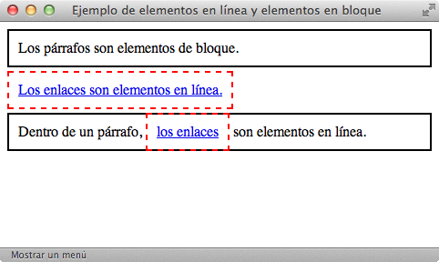

El primer elemento de la página anterior es un párrafo. Los párrafos son elementos de bloque y por ese motivo su caja empieza en una nueva línea y llega hasta el final de esa misma línea. Aunque los contenidos de texto del párrafo no son suficientes para ocupar toda la línea, el navegador reserva todo el espacio disponible en la primera línea.

El segundo elemento de la página es un enlace. Los enlaces son elementos en línea, por lo que su caja sólo ocupa el espacio necesario para mostrar sus contenidos. Si después de este elemento se incluye otro elemento en línea (por ejemplo otro enlace o una imagen) el navegador mostraría los dos elementos en la misma línea, ya que existe espacio suficiente.

Por último, el tercer elemento de la página es un párrafo que se comporta de la misma forma que el primer párrafo. En su interior, se encuentra un enlace que también se comporta de la misma forma que el enlace anterior. Así, el segundo párrafo ocupa toda una línea y el segundo enlace sólo ocupa el espacio necesario para mostrar sus contenidos.

Por sus características, los elementos de bloque no pueden insertarse dentro de elementos en línea y tan sólo pueden aparecer dentro de otros elementos de bloque. En cambio, un elemento en línea puede aparecer tanto dentro de un elemento de bloque como dentro de otro elemento en línea.

Los elementos en línea definidos por HTML son: `a, abbr, acronym, b, basefont, bdo, big, br, cite, code, dfn, em, font, i, img, input, kbd, label, q, s, samp, select, small, span, strike, strong, sub, sup, textarea, tt, u, var`.

Los elementos de bloque definidos por HTML son: `address, blockquote, center, dir, div, dl, fieldset, form, h1, h2, h3, h4, h5, h6, hr, isindex, menu, noframes, noscript, ol, p, pre, table, ul`.

Los siguientes elementos también se considera que son de bloque: `dd, dt, frameset, li, tbody, td, tfoot, th, thead, tr`.

Los siguientes elementos pueden ser en línea y de bloque según las circunstancias: `button, del, iframe, ins, map, object, script`.

## Posicionamiento

Los navegadores crean y posicionan de forma automática todas las cajas que forman cada página HTML. No obstante, CSS permite al diseñador modificar la posición en la que se muestra cada caja.

Utilizando las propiedades que proporciona CSS para alterar la posición de las cajas es posible realizar efectos muy avanzados y diseñar estructuras de páginas que de otra forma no serían posibles.

El estándar de CSS define cinco modelos diferentes para posicionar una caja:

- Posicionamiento normal o estático: se trata del posicionamiento que utilizan los navegadores si no se indica lo contrario.
- Posicionamiento relativo: variante del posicionamiento normal que consiste en posicionar una caja según el posicionamiento normal y después desplazarla respecto de su posición original.
- Posicionamiento absoluto: la posición de una caja se establece de forma absoluta respecto de su elemento contenedor y el resto de elementos de la página ignoran la nueva posición del elemento.
- Posicionamiento fijo: variante del posicionamiento absoluto que convierte una caja en un elemento inamovible, de forma que su posición en la pantalla siempre es la misma independientemente del resto de elementos e independientemente de si el usuario sube o baja la página en la ventana del navegador.
- Posicionamiento flotante: se trata del modelo más especial de posicionamiento, ya que desplaza las cajas todo lo posible hacia la izquierda o hacia la derecha de la línea en la que se encuentran.

El posicionamiento de una caja se establece mediante la propiedad `position`:

| Propiedad             | `position`    |
| --------------------: | :------------- |
| **Valores** | static \| relative \| absolute \| fixed \| inherit |
| **Se aplica a** | Todos los elementos |
| **Valor inicial**  | static |
| **Descripción**       | Selecciona el posicionamiento con el que se mostrará el elemento |

El significado de cada uno de los posibles valores de la propiedad `position` es el siguiente:

- `static`: corresponde al posicionamiento normal o estático. Si se utiliza este valor, se ignoran los valores de las propiedades `top, right, bottom` y `left` que se verán a continuación.
- `relative`: corresponde al posicionamiento relativo. El desplazamiento de la caja se controla con las propiedades `top, right, bottom` y `left`.
- `absolute`: corresponde al posicionamiento absoluto. El desplazamiento de la caja también se controla con las propiedades `top, right, bottom` y `left`, pero su interpretación es mucho más compleja, ya que el origen de coordenadas del desplazamiento depende del posicionamiento de su elemento contenedor.
- `fixed`: corresponde al posicionamiento fijo. El desplazamiento se establece de la misma forma que en el posicionamiento absoluto, pero en este caso el elemento permanece inamovible en la pantalla.

La propiedad `position` no permite controlar el posicionamiento flotante, que se establece con otra propiedad llamada `float` y que se explica más adelante. Además, la propiedad `position` sólo indica cómo se posiciona una caja, pero no la desplaza.

Normalmente, cuando se posiciona una caja también es necesario desplazarla respecto de su posición original o respecto de otro origen de coordenadas. CSS define cuatro propiedades llamadas `top, right, bottom` y `left` para controlar el desplazamiento de las cajas posicionadas:

| Propiedades             | `top, right, bottom, left`    |
| --------------------: | :------------- |
| **Valores** | unidad de medida \| porcentaje \| auto \| inherit |
| **Se aplica a** | Todos los elementos posicionados |
| **Valor inicial**  | auto |
| **Descripción**       | Indican el desplazamiento horizontal y vertical del elemento respecto de su posición original |

En el caso del posicionamiento relativo, cada una de estas propiedades indica el desplazamiento del elemento desde la posición original de su borde superior/derecho/inferior/izquierdo. Si el posicionamiento es absoluto, las propiedades indican el desplazamiento del elemento respecto del borde superior/derecho/inferior/izquierdo de su primer elemento padre posicionado.

En cualquiera de los dos casos, si el desplazamiento se indica en forma de porcentaje, se refiere al porcentaje sobre la anchura (propiedades `right` y `left`) o altura (propiedades `top` y `bottom`) del elemento.

## Posicionamiento normal

El posicionamiento normal o estático es el modelo que utilizan por defecto los navegadores para mostrar los elementos de las páginas. En este modelo, sólo se tiene en cuenta si el elemento es de bloque o en línea, sus propiedades `width` y `height` y su contenido.

Los elementos de bloque forman lo que CSS denomina "*contextos de formato de bloque*". En este tipo de contextos, las cajas se muestran una debajo de otra comenzando desde el principio del elemento contenedor. La distancia entre las cajas se controla mediante los márgenes verticales.

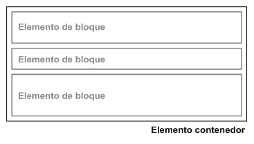

Si un elemento se encuentra dentro de otro, el elemento padre se llama "*elemento contenedor*" y determina tanto la posición como el tamaño de todas sus cajas interiores.

Si un elemento no se encuentra dentro de un elemento contenedor, entonces su elemento contenedor es el elemento `<body>` de la página. Normalmente, la anchura de los elementos de bloque está limitada a la anchura de su elemento contenedor, aunque en algunos casos sus contenidos pueden desbordar el espacio disponible.

Los elementos en línea forman los "*contextos de formato en línea*". En este tipo de contextos, las cajas se muestran una detrás de otra de forma horizontal comenzando desde la posición más a la izquierda de su elemento contenedor. La distancia entre las cajas se controla mediante los márgenes laterales.

Si las cajas en línea ocupan más espacio del disponible en su propia línea, el resto de cajas se muestran en las líneas inferiores. Si las cajas en línea ocupan un espacio menor que su propia línea, se puede controlar la distribución de las cajas mediante la propiedad text-align para centrarlas, alinearlas a la derecha o justificarlas.

## Posicionamiento relativo

El estándar CSS considera que el posicionamiento relativo es un caso particular del posicionamiento normal, aunque en la práctica presenta muchas diferencias.

El posicionamiento relativo desplaza una caja respecto de su posición original establecida mediante el posicionamiento normal. El desplazamiento de la caja se controla con las propiedades `top, right, bottom` y `left`.

El valor de la propiedad `top` se interpreta como el desplazamiento entre el borde superior de la caja en su posición final y el borde superior de la misma caja en su posición original.

De la misma forma, el valor de las propiedades `left, right` y `bottom` indica respectivamente el desplazamiento entre el borde izquierdo/derecho/inferior de la caja en su posición final y el borde izquierdo/derecho/inferior de la caja original.

Por tanto, la propiedad `top` se emplea para mover las cajas de forma descendente, la propiedad `bottom` mueve las cajas de forma ascendente, la propiedad `left` se utiliza para desplazar las cajas hacia la derecha y la propiedad `right` mueve las cajas hacia la izquierda. Este comportamiento parece poco intuitivo y es causa de errores cuando se empiezan a diseñar páginas con CSS. Si se utilizan valores negativos en las propiedades `top, right, bottom` y `left`, su efecto es justamente el inverso.

El desplazamiento relativo de una caja no afecta al resto de cajas adyacentes, que se muestran en la misma posición que si la caja desplazada no se hubiera movido de su posición original.

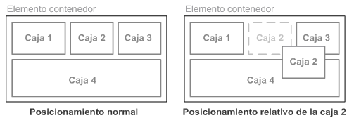

En la imagen anterior, la caja 2 se ha desplazado lateralmente hacia la derecha y verticalmente de forma descendente. Como el resto de cajas de la página no modifican su posición, se producen solapamientos entre los contenidos de las cajas.

Las cajas desplazadas de forma relativa no modifican su tamaño, por lo que los valores de las propiedades `left` y `right` siempre cumplen que `left = -right`.

Si tanto `left` como `right` tienen un valor de `auto` (que es su valor por defecto) la caja no se mueve de su posición original. Si sólo el valor de `left` es auto, su valor real es `-right`. Igualmente, si sólo el valor de `right` es auto, su valor real es `-left`.

Si tanto `left` como `right` tienen valores distintos de auto, uno de los dos valores se tiene que ignorar porque son mutuamente excluyentes. Para determinar la propiedad que se tiene en cuenta, se considera el valor de la propiedad `direction`.

La propiedad `direction` permite establecer la dirección del texto de un contenido. Si el valor de `direction` es `ltr`, el texto se muestra de izquierda a derecha, que es el método de escritura habitual en la mayoría de países. Si el valor de direction es `rtl`, el método de escritura es de derecha a izquierda, como el utilizado por los idiomas árabe y hebreo.

Si el valor de `direction` es `ltr`, y las propiedades `left` y `right` tienen valores distintos de `auto`, se ignora la propiedad `right` y sólo se tiene en cuenta el valor de la propiedad `left`. De la misma forma, si el valor de `direction` es `rtl`, se ignora el valor de `left` y sólo se tiene en cuenta el valor de `right`.

## Posicionamiento absoluto

El posicionamiento absoluto se emplea para establecer de forma exacta la posición en la que se muestra la caja de un elemento. La nueva posición de la caja se indica mediante las propiedades `top, right, bottom` y `left`. La interpretación de los valores de estas propiedades es mucho más compleja que en el posicionamiento relativo, ya que en este caso dependen del posicionamiento del elemento contenedor.

Cuando una caja se posiciona de forma absoluta, el resto de elementos de la página se ven afectados y modifican su posición. Al igual que en el posicionamiento relativo, cuando se posiciona de forma absoluta una caja es probable que se produzcan solapamientos con otras cajas.

En el siguiente ejemplo, se posiciona de forma absoluta la caja 2:

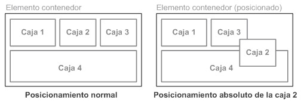

La caja 2 está posicionada de forma absoluta, lo que provoca que el resto de elementos de la página modifiquen su posición. En concreto, la caja 3 deja su lugar original y pasa a ocupar el hueco dejado por la caja 2.

El estándar de CSS 2.1 indica que las cajas posicionadas de forma absoluta "*salen del flujo normal de la página*", lo que provoca que el resto de elementos de la página se muevan y en ocasiones, ocupen la posición original en la que se encontraba la caja.

Por otra parte, el desplazamiento de una caja posicionada de forma absoluta se controla mediante las propiedades `top, right, bottom` y `left`. A diferencia del posicionamiento relativo, la interpretación de los valores de estas propiedades depende del elemento contenedor de la caja posicionada.

Determinar la referencia utilizada para interpretar los valores de `top, right, bottom` y `left` de una caja posicionada de forma absoluta es un proceso complejo que se compone de los siguientes pasos:

- Se buscan todos los elementos contenedores de la caja hasta llegar al elemento `<body>` de la página.
- Se recorren todos los elementos contenedores empezando por el más cercano a la caja y llegando hasta el `<body>`
- El primer elemento contenedor que esté posicionado de cualquier forma diferente a position: `static` se convierte en la referencia que determina la posición de la caja posicionada de forma absoluta.
- Si ningún elemento contenedor está posicionado, la referencia es la ventana del navegador, que no debe confundirse con el elemento `<body>` de la página.

Una vez determinada la referencia del posicionamiento absoluto, la interpretación de los valores de las propiedades `top, right, bottom` y `left` se realiza como sigue:

- El valor de la propiedad `top` indica el desplazamiento desde el borde superior de la caja hasta el borde superior del elemento contenedor que se utiliza como referencia.
- El valor de la propiedad `right` indica el desplazamiento desde el borde derecho de la caja hasta el borde derecho del elemento contenedor que se utiliza como referencia.
- El valor de la propiedad `bottom` indica el desplazamiento desde el borde inferior de la caja hasta el borde inferior del elemento contenedor que se utiliza como referencia.
- El valor de la propiedad `left` indica el desplazamiento desde el borde izquierdo de la caja hasta el borde izquierdo del elemento contenedor que se utiliza como referencia.

En los siguientes ejemplos, se utiliza la página HTML que muestra la siguiente imagen:

A continuación, se muestra el código HTML y CSS de la página original:

    [css]
    div {
      border: 2px solid #CCC;
      padding: 1em;
      margin: 1em 0 1em 4em;
      width: 300px;
    }

    [html]
    

      
      
Lorem ipsum dolor sit amet, consectetuer adipiscing elit.
      Phasellus ullamcorper velit eu ipsum. Ut pellentesque,
      est in volutpat cursus, risus mi viverra augue, at pulvinar
      turpis leo sed orci. Donec ipsum. Curabitur felis dui,
      ultrices ut, sollicitudin vel, rutrum at, tellus.

    

En primer lugar, se posiciona de forma absoluta la imagen mediante la propiedad position y se indica su nueva posición mediante las propiedades `top` y `left`:

    [css]
    div img {
      position: absolute;
      top:  50px;
      left: 50px;
    }

El resultado visual se muestra en la siguiente imagen:

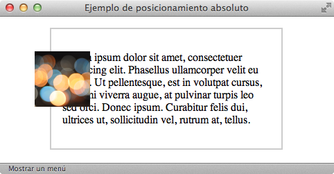

Para posicionar la imagen de forma absoluta, el navegador realiza los siguientes pasos:

1. Obtiene la lista de elementos contenedores de la imagen: `
` y `<body>`.
2. Recorre la lista de elementos contenedores desde el más cercano a la imagen (el `
`) hasta terminar en el `<body>` buscando el primer elemento contenedor que esté posicionado.
3. El posicionamiento de todos los elementos contenedores es el normal o estático, ya que ni siquiera tienen establecida la propiedad position
4. Como ningún elemento contenedor está posicionado, la referencia es la ventana del navegador.
5. A partir de esa referencia, la caja de la imagen se desplaza `50px` hacia la derecha (left: `50px`) y otros `50px` de forma descendente (top: `50px`).

Como la imagen se posiciona de forma absoluta, el resto de elementos de la página se mueven para ocupar el lugar libre dejado por la imagen. Por este motivo, el párrafo sube hasta el principio del `
` y se produce un solapamiento con la imagen posicionada que impide ver parte de los contenidos del párrafo.

A continuación, se modifica el ejemplo anterior posicionando de forma relativa el elemento `
` que contiene la imagen y el párrafo. La única propiedad añadida al `
` es `position: relative` por lo que el elemento contenedor se posiciona pero no se desplaza respecto de su posición original:

    [css]
    div {
      border: 2px solid #CCC;
      padding: 1em;
      margin: 1em 0 1em 4em;
      width: 300px;
      position: relative;
    }
    
    div img {
      position: absolute;
      top: 50px;
      left: 50px;
    }

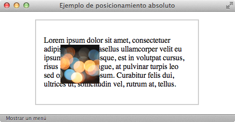

En este caso, como el elemento contenedor de la imagen está posicionado, se convierte en la referencia para el posicionamiento absoluto. El resultado es que la posición de la imagen es muy diferente a la del ejemplo anterior. Por tanto, si se quiere posicionar un elemento de forma absoluta respecto de su elemento contenedor, es imprescindible posicionar este último. Para ello, sólo es necesario añadir la propiedad `position: relative`, por lo que no es obligatorio desplazar el elemento contenedor respecto de su posición original.

## Posicionamiento fijo

El estándar CSS considera que el posicionamiento fijo es un caso particular del posicionamiento absoluto, ya que sólo se diferencian en el comportamiento de las cajas posicionadas.

Cuando una caja se posiciona de forma fija, la forma de obtener el origen de coordenadas para interpretar su desplazamiento es idéntica al posicionamiento absoluto. De hecho, si el usuario no mueve la página HTML en la ventana del navegador, no existe ninguna diferencia entre estos dos modelos de posicionamiento.

La principal característica de una caja posicionada de forma fija es que su posición es inamovible dentro de la ventana del navegador. El posicionamiento fijo hace que las cajas no modifiquen su posición ni aunque el usuario suba o baje la página en la ventana de su navegador.

Si la página se visualiza en un medio paginado (por ejemplo en una impresora) las cajas posicionadas de forma fija se repiten en todas las páginas. Esta característica puede ser útil para crear encabezados o pies de página en páginas HTML preparadas para imprimir.

El posicionamiento fijo apenas se ha utilizado en el diseño de páginas web hasta hace poco tiempo porque el navegador Internet Explorer 6 y las versiones anteriores no lo soportan.

## Posicionamiento flotante

El posicionamiento flotante es el más difícil de comprender pero al mismo tiempo es el más utilizado. La mayoría de estructuras de las páginas web complejas están diseñadas con el posicionamiento flotante, como se verá más adelante.

Cuando una caja se posiciona con el modelo de posicionamiento flotante, automáticamente se convierte en una caja flotante, lo que significa que se desplaza hasta la zona más a la izquierda o más a la derecha de la posición en la que originalmente se encontraba.

La siguiente imagen muestra el resultado de posicionar de forma flotante hacia la derecha la caja 1:

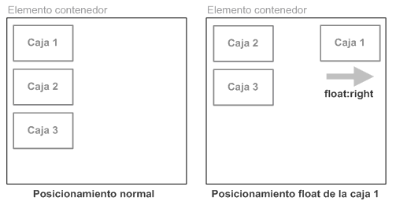

Cuando se posiciona una caja de forma flotante:

- La caja deja de pertenecer al flujo normal de la página, lo que significa que el resto de cajas ocupan el lugar dejado por la caja flotante.
- La caja flotante se posiciona lo más a la izquierda o lo más a la derecha posible de la posición en la que se encontraba originalmente.

Si en el anterior ejemplo la caja 1 se posiciona de forma flotante hacia la izquierda, el resultado es el que muestra la siguiente imagen:

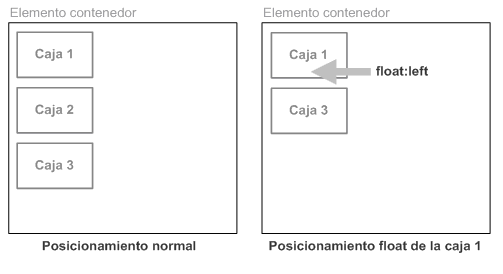

La caja 1 es de tipo flotante, por lo que desaparece del *flujo normal* de la página y el resto de cajas ocupan su lugar. El resultado es que la caja 2 ahora se muestra donde estaba la caja 1 y la caja 3 se muestra donde estaba la caja 2.

Al mismo tiempo, la caja 1 se desplaza todo lo posible hacia la izquierda de la posición en la que se encontraba. El resultado es que la caja 1 se muestra encima de la nueva posición de la caja 2 y tapa todos sus contenidos.

Si existen otras cajas flotantes, al posicionar de forma flotante otra caja, se tiene en cuenta el sitio disponible. En el siguiente ejemplo se posicionan de forma flotante hacia la izquierda las tres cajas:

En el ejemplo anterior, las cajas no se superponen entre sí porque las cajas flotantes tienen en cuenta las otras cajas flotantes existentes. Como la caja 1 ya estaba posicionada lo más a la izquierda posible, la caja 2 sólo puede colocarse al lado del borde derecho de la caja 1, que es el sitio más a la izquierda posible respecto de la zona en la que se encontraba.

Si no existe sitio en la línea actual, la caja flotante baja a la línea inferior hasta que encuentra el sitio necesario para mostrarse lo más a la izquierda o lo más a la derecha posible en esa nueva línea:

Las cajas flotantes influyen en la disposición de todas las demás cajas. Los elementos en línea *hacen sitio* a las cajas flotantes adaptando su anchura al espacio libre dejado por la caja desplazada. Los elementos de bloque no les hacen sitio, pero sí que adaptan sus contenidos para que no se solapen con las cajas flotantes.

La propiedad CSS que permite posicionar de forma flotante una caja se denomina float:

| Propiedad             | `float`    |
| --------------------: | :------------- |
| **Valores** | left \| right \| none \| inherit |
| **Se aplica a** | Todos los elementos |
| **Valor inicial**  | none |
| **Descripción**       | Establece el tipo de posicionamiento flotante del elemento |

Si se indica un valor `left`, la caja se desplaza hasta el punto más a la izquierda posible en esa misma línea (si no existe sitio en esa línea, la caja baja una línea y se muestra lo más a la izquierda posible en esa nueva línea). El resto de elementos adyacentes se adaptan y *fluyen* alrededor de la caja flotante.

El valor `right` tiene un funcionamiento idéntico, salvo que en este caso, la caja se desplaza hacia la derecha. El valor none permite anular el posicionamiento flotante de forma que el elemento se muestre en su posición original.

  
Ejercicio 6

[Ver enunciado](#ej06)

Los elementos que se encuentran alrededor de una caja flotante adaptan sus contenidos para que fluyan alrededor del elemento posicionado:

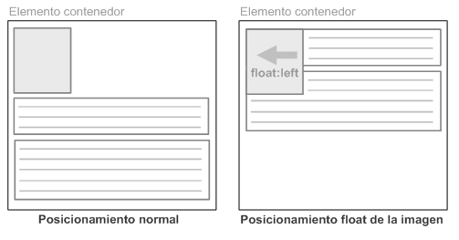

La regla CSS que se aplica en la imagen del ejemplo anterior es:

    [css]
    img {
      float: left;
    }

Uno de los principales motivos para la creación del posicionamiento `float` fue precisamente la posibilidad de colocar imágenes alrededor de las cuales fluye el texto.

CSS permite controlar la forma en la que los contenidos fluyen alrededor de los contenidos posicionados mediante `float`. De hecho, en muchas ocasiones es admisible que algunos contenidos fluyan alrededor de una imagen, pero el resto de contenidos deben mostrarse en su totalidad sin fluir alrededor de la imagen:

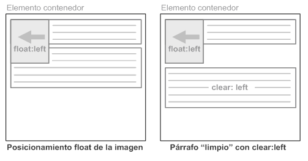

La propiedad clear permite modificar el comportamiento por defecto del posicionamiento flotante para forzar a un elemento a mostrarse debajo de cualquier caja flotante. La regla CSS que se aplica al segundo párrafo del ejemplo anterior es la siguiente:

    [html]
    
...

La definición formal de la propiedad clear se muestra a continuación:

| Propiedad             | `clear`    |
| --------------------: | :------------- |
| **Valores** | none \| left \| right \| both \| inherit |
| **Se aplica a** | Todos los elementos de bloque |
| **Valor inicial**  | none |
| **Descripción**       | Indica el lado del elemento que no debe ser adyacente a ninguna caja flotante |

La propiedad `clear` indica el lado del elemento HTML que no debe ser adyacente a ninguna caja posicionada de forma flotante. Si se indica el valor `left`, el elemento se desplaza de forma descendente hasta que pueda colocarse en una línea en la que no haya ninguna caja flotante en el lado izquierdo.

La especificación oficial de CSS explica este comportamiento como "*un desplazamiento descendente hasta que el borde superior del elemento esté por debajo del borde inferior de cualquier elemento flotante hacia la izquierda*".

Si se indica el valor `right`, el comportamiento es análogo, salvo que en este caso se tienen en cuenta los elementos desplazados hacia la derecha.

El valor `both` despeja los lados izquierdo y derecho del elemento, ya que desplaza el elemento de forma descendente hasta que el borde superior se encuentre por debajo del borde inferior de cualquier elemento flotante hacia la izquierda o hacia la derecha.

Como se verá más adelante, la propiedad `clear` es imprescindible cuando se crean las estructuras de las páginas web complejas.

Si se considera el siguiente código CSS y HTML:

    [css]
    #paginacion {
      border: 1px solid #CCC;
      background-color: #E0E0E0;
      padding: .5em;
    }
    
    .derecha   { float: right; }
    .izquierda { float: left;  }
    

      &laquo; Anterior
      Siguiente &raquo;
    

Si se visualiza la página anterior en cualquier navegador, el resultado es el que muestra la siguiente imagen:

Los elementos `Anterior` y `Siguiente` se salen de su elemento contenedor y el resultado es visualmente incorrecto. El motivo de este comportamiento es que un elemento posicionado de forma flotante ya no pertenece al flujo normal de la página HTML. Por tanto, el elemento `
` en realidad no encierra ningún contenido y por eso se visualiza incorrectamente.

La solución consiste en utilizar la propiedad overflow (que se explica más adelante) sobre el elemento contenedor:

    [css]
    #paginacion {
      border: 1px solid #CCC;
      background-color: #E0E0E0;
      padding: .5em;
      overflow: hidden;
    }
     
    .derecha   { float: right; }
    .izquierda { float: left;  }

Si se visualiza de nuevo la página anterior en cualquier navegador, el resultado ahora sí que es el esperado:

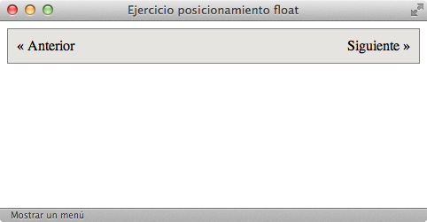

## Visualización

Además de las propiedades que controlan el posicionamiento de los elementos, CSS define otras cuatro propiedades para controlar su visualización: `display`, `visibility`, `overflow` y `z-index`.

Utilizando algunas de estas propiedades es posible ocultar y/o hacer invisibles las cajas de los elementos, por lo que son imprescindibles para realizar efectos avanzados y animaciones.

## Propiedades display y visibility

Las propiedades `display` y `visibility` controlan la visualización de los elementos. Las dos propiedades permiten ocultar cualquier elemento de la página. Habitualmente se utilizan junto con JavaScript para crear efectos dinámicos como mostrar y ocultar determinados textos o imágenes cuando el usuario pincha sobre ellos.

La propiedad `display` permite ocultar completamente un elemento haciendo que desaparezca de la página. Como el elemento oculto no se muestra, el resto de elementos de la página se mueven para ocupar su lugar.

Por otra parte, la propiedad `visibility` permite hacer invisible un elemento, lo que significa que el navegador crea la caja del elemento pero no la muestra. En este caso, el resto de elementos de la página no modifican su posición, ya que aunque la caja no se ve, sigue ocupando sitio.

La siguiente imagen muestra la diferencia entre ocultar la caja número 5 mediante la propiedad `display` o hacerla invisible mediante la propiedad `visibility`:

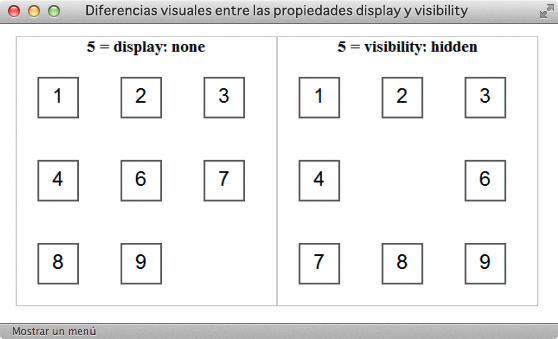

En general, cuando se oculta un elemento no es deseable que siga ocupando sitio en la página, por lo que la propiedad `display` se utiliza mucho más que la propiedad `visibility`.

A continuación se muestra la definición completa de la propiedad `display`:

| Propiedad             | `display`    |
| --------------------: | :------------- |
| **Valores** | inline \| block \| none \| list-item \| run-in \| inline-block \| table \| inline-table \| table-row-group \| table-header-group \| table-footer-group \| table-row \| table-column-group \| table-column \| table-cell \| table-caption \| inherit |
| **Se aplica a** | Todos los elementos |
| **Valor inicial**  | inline |
| **Descripción**       | Permite controlar la forma de visualizar un elemento e incluso ocultarlo |

Las posibilidades de la propiedad `display` son mucho más avanzadas que simplemente ocultar elementos. En realidad, la propiedad `display` modifica la forma en la que se visualiza un elemento.

Los valores más utilizados son `inline, block` y `none`. El valor `block` muestra un elemento como si fuera un elemento de bloque, independientemente del tipo de elemento que se trate. El valor `inline` visualiza un elemento en forma de elemento en línea, independientemente del tipo de elemento que se trate.

El valor `none` oculta un elemento y hace que desaparezca de la página. El resto de elementos de la página se visualizan como si no existiera el elemento oculto, es decir, pueden ocupar el espacio en el que se debería visualizar el elemento.

Como se verá más adelante, la propiedad `display: inline` se puede utilizar en las listas (`<ul>, <ol>`) que se quieren mostrar horizontalmente y la propiedad `display: block` se emplea frecuentemente para los enlaces que forman el menú de navegación.

Por su parte, la definición completa de la propiedad visibility es mucho más sencilla:

| Propiedad             | `visibility`    |
| --------------------: | :------------- |
| **Valores** | visible \| hidden \| collapse \| inherit |
| **Se aplica a** | Todos los elementos |
| **Valor inicial**  | visible |
| **Descripción**       | Permite hacer visibles e invisibles a los elementos |

Las posibilidades de la propiedad `visibility` son mucho más limitadas que las de la propiedad `display`, ya que sólo permite hacer visibles o invisibles a los elementos de la página.

Inicialmente todas las cajas que componen la página son visibles. Empleando el valor `hidden` es posible convertir una caja en invisible para que no muestre sus contenidos. El resto de elementos de la página se muestran como si la caja todavía fuera visible, por lo que en el lugar donde originalmente se mostraba la caja invisible, ahora se muestra un hueco vacío.

Por último, el valor `collapse` de la propiedad `visibility` sólo se puede utilizar en las filas, grupos de filas, columnas y grupos de columnas de una tabla. Su efecto es similar al de la propiedad `display`, ya que oculta completamente la fila y/o columna y se pueden mostrar otros contenidos en ese lugar. Si se utiliza el valor `collapse` sobre cualquier otro tipo de elemento, su efecto es idéntico al valor `hidden`.

### Relación entre display, float y position

Cuando se establecen las propiedades `display, float` y `position` sobre una misma caja, su interpretación es la siguiente:

- Si `display` vale `none`, se ignoran las propiedades `float` y `position` y la caja no se muestra en la página.
- Si `position` vale `absolute` o `fixed`, la caja se posiciona de forma absoluta, se considera que `float` vale `none` y la propiedad `display` vale `block` tanto para los elementos en línea como para los elementos de bloque. La posición de la caja se determina mediante el valor de las propiedades `top, right, bottom` y `left`.

En cualquier otro caso, si float tiene un valor distinto de none, la caja se posiciona de forma flotante y la propiedad display vale block tanto para los elementos en línea como para los elementos de bloque.

### Propiedad overflow

Normalmente, los contenidos de un elemento se pueden mostrar en el espacio reservado para ese elemento. Sin embargo, en algunas ocasiones el contenido de un elemento no cabe en el espacio reservado para ese elemento y se desborda.

La situación más habitual en la que el contenido sobresale de su espacio reservado es cuando se establece la anchura y/o altura de un elemento mediante la propiedad `width` y/o `height`. Otra situación habitual es la de las líneas muy largas contenidas dentro de un elemento `<pre>`, que hacen que la página entera sea demasiado ancha.

CSS define la propiedad `overflow` para controlar la forma en la que se visualizan los contenidos que sobresalen de sus elementos.

| Propiedad             | `overflow`    |
| --------------------: | :------------- |
| **Valores** | visible \| hidden \| scroll \| auto \| inherit |
| **Se aplica a** | Elementos de bloque y celdas de tablas |
| **Valor inicial**  | visible |
| **Descripción**       | Permite controlar los contenidos sobrantes de un elemento |

Los valores de la propiedad overflow tienen el siguiente significado:

- `visible`: el contenido no se corta y se muestra sobresaliendo la zona reservada para visualizar el elemento. Este es el comportamiento por defecto.
- `hidden`: el contenido sobrante se oculta y sólo se visualiza la parte del contenido que cabe dentro de la zona reservada para el elemento.
- `scroll`: solamente se visualiza el contenido que cabe dentro de la zona reservada para el elemento, pero también se muestran barras de scroll que permiten visualizar el resto del contenido.
- `auto`: el comportamiento depende del navegador, aunque normalmente es el mismo que la propiedad `scroll`.

La siguiente imagen muestra un ejemplo de los tres valores típicos de la propiedad `overflow`:

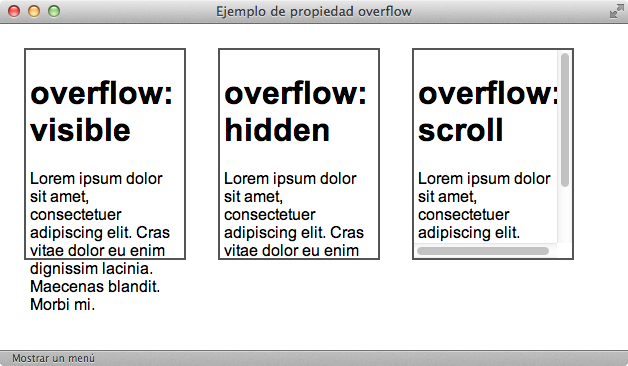

### Propiedad z-index

Además de posicionar una caja de forma horizontal y vertical, CSS permite controlar la posición tridimensional de las cajas posicionadas. De esta forma, es posible indicar las cajas que se muestran delante o detrás de otras cajas cuando se producen solapamientos.

La posición tridimensional de un elemento se establece sobre un tercer eje llamado Z y se controla mediante la propiedad `z-index`. Utilizando esta propiedad es posible crear páginas complejas con varios niveles o capas.

A continuación se muestra la definición formal de la propiedad `z-index`:

| Propiedad             | `z-index`    |
| --------------------: | :------------- |
| **Valores** | auto \| numero \| inherit |
| **Se aplica a** | Elementos que han sido posicionados explícitamente |
| **Valor inicial**  | auto |
| **Descripción**       | Establece el nivel tridimensional en el que se muestra el elemento |

El valor más común de la propiedad `z-index` es un número entero. Aunque la especificación oficial permite los números negativos, en general se considera el número 0 como el nivel más bajo.

Cuanto más alto sea el valor numérico, más cerca del usuario se muestra la caja. Un elemento con `z-index: 10` se muestra por encima de los elementos con `z-index: 8` o `z-index: 9`, pero por debajo de elementos con `z-index: 20` o `z-index: 50`.

La propiedad `z-index` sólo tiene efecto en los elementos posicionados, por lo que es obligatorio que la propiedad `z-index` vaya acompañada de la propiedad position. Si debes posicionar un elemento pero no quieres moverlo de su posición original ni afectar al resto de elementos de la página, puedes utilizar el posicionamiento relativo (`position: relative`).