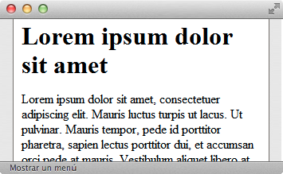
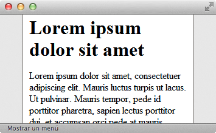
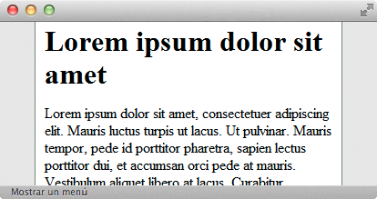
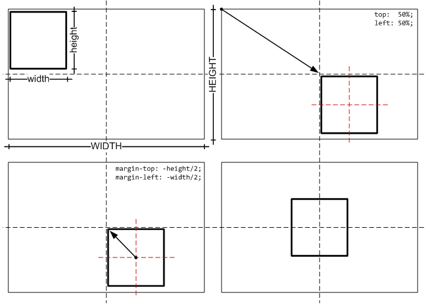
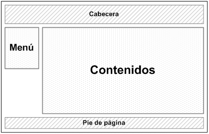
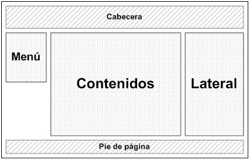
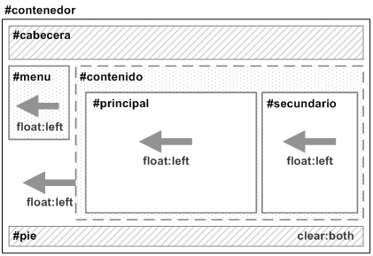

# Layout básico

El diseño de las páginas web habituales se divide en bloques: cabecera, menú, contenidos y pie de página. Visualmente, los bloques se disponen en varias filas y columnas. Por este motivo, hace varios años la estructura de las páginas HTML se definía mediante tablas.

El desarrollo de CSS ha permitido que se puedan realizar los mismos diseños sin utilizar tablas HTML. Las principales ventajas de diseñar la estructura de las páginas web con CSS en vez de con tablas HTML son las siguientes:

* **Mantenimiento**: una página diseñada exclusivamente con CSS es mucho más fácil de mantener que una página diseñada con tablas. Cambiar el aspecto de una página creada con CSS es tan fácil como modificar unas pocas reglas en las hojas de estilos. Sin embargo, realizar la misma modificación en una página creada con tablas supone un esfuerzo muy superior y es más probable cometer errores.

* **Accesibilidad**: las páginas creadas con CSS son más accesibles que las páginas diseñadas con tablas. De hecho, los navegadores que utilizan las personas discapacitadas (en especial las personas invidentes) pueden tener dificultades con la estructura de las páginas complejas creadas con tablas HTML. No obstante, diseñar una página web exclusivamente con CSS no garantiza que la página sea accesible.

* **Velocidad de carga**: el código HTML de una página diseñada con tablas es mucho mayor que el código de la misma página diseñada exclusivamente con CSS, por lo que tarda más tiempo en descargarse. En cualquier caso, si el usuario accede al sitio con una conexión de banda ancha y la página es de un tamaño medio o reducido, las diferencias son casi imperceptibles.

* **Semántica**: aunque resulta obvio, las tablas HTML sólo se deben utilizar para mostrar datos cuya información sólo se entiende en forma de filas y columnas. Utilizar tablas para crear la estructura completa de una página es tan absurdo como utilizar por ejemplo la etiqueta `<ul>` para crear párrafos de texto.
Por estos motivos, la estructura basada en tablas ha dado paso a la estructura basada exclusivamente en CSS. Aunque crear la estructura de las páginas sólo con CSS presenta en ocasiones retos importantes, en general es más sencilla y flexible.

En este capítulo se muestra cómo crear algunas de las estructuras o *layouts* más habituales de los diseños web utilizando exclusivamente CSS.

## Centrar una página horizontalmente

A medida que aumenta el tamaño y la resolución de las pantallas de ordenador, se hace más difícil diseñar páginas que se adapten al tamaño de la ventana del navegador. El principal reto que se presenta con resoluciones superiores a 1024 x 768 píxel, es que las líneas de texto son demasiado largas como para leerlas con comodidad. Por ese motivo, normalmente se opta por diseños con una anchura fija limitada a un valor aceptable para mantener la legibilidad del texto.

Por otra parte, los navegadores alinean por defecto las páginas web a la izquierda de la ventana. Cuando la resolución de la pantalla es muy grande, la mayoría de páginas de anchura fija alineadas a la izquierda parecen muy estrechas y provocan una sensación de vacío.

La solución más sencilla para evitar los grandes espacios en blanco consiste en crear páginas con una anchura fija adecuada y centrar la página horizontalmente respecto de la ventana del navegador. Las siguientes imágenes muestran el aspecto de una página centrada a medida que aumenta la anchura de la ventana del navegador.

Utilizando la propiedad `margin` de CSS, es muy sencillo centrar una página web horizontalmente. La solución consiste en agrupar todos los contenidos de la página en un elemento `
` y asignarle a ese `
` unos márgenes laterales automáticos. El `
` que encierra los contenidos se suele llamar `contenedor` (en inglés se denomina `wrapper` o `container`):

    [css]
    #contenedor {
      width: 300px;
      margin: 0 auto;
    }

    [html]
    <body>
      

        <h1>Lorem ipsum dolor sit amet</h1>
        ...
      

    </body>

Como se sabe, el valor `0 auto` significa que los márgenes superior e inferior son iguales a `0` y los márgenes laterales toman un valor de `auto`. Cuando se asignan márgenes laterales automáticos a un elemento, los navegadores centran ese elemento respecto de su elemento padre. En este ejemplo, el elemento padre del `
` es la propia página (el elemento `<body>`), por lo que se consigue centrar el elemento `
` respecto de la ventana del navegador.

Modificando ligeramente el código CSS anterior se puede conseguir un diseño dinámico o líquido (también llamado fluido) que se adapta a la anchura de la ventana del navegador y permanece siempre centrado:

    [css]
    #contenedor {
      width: 70%;
      margin: 0 auto;
    }

Estableciendo la anchura del elemento contenedor mediante un porcentaje, su anchura se adapta de forma continua a la anchura de la ventana del navegador. De esta forma, si se reduce la anchura de la ventana del navegador, la página se verá más estrecha y si se maximiza la ventana del navegador, la página se verá más ancha.

Las siguientes imágenes muestran cómo se adapta el diseño dinámico a la anchura de la ventana del navegador, mostrando cada vez más contenidos a medida que se agranda la ventana.

## Centrar una página verticalmente

Cuando se centra una página web de forma horizontal, sus márgenes laterales se adaptan dinámicamente de forma que la página siempre aparece en el centro de la ventana del navegador, independientemente de la anchura de la ventana. De la misma forma, cuando se centra una página web verticalmente, el objetivo es que sus contenidos aparezcan en el centro de la ventana del navegador y por tanto, que sus márgenes verticales se adapten de forma dinámica en función del tamaño de la ventana del navegador.

Aunque centrar una página web horizontalmente es muy sencillo, centrarla verticalmente es mucho más complicado. Afortunadamente, no es muy común que una página web aparezca centrada de forma vertical. El motivo es que la mayoría de páginas web son más altas que la ventana del navegador, por lo que no es posible centrarlas verticalmente.

A continuación se muestra la forma de centrar una página web respecto de la ventana del navegador, es decir, centrarla tanto horizontalmente como verticalmente.

Siguiendo el mismo razonamiento que el planteado para centrar la página horizontalmente, se podrían utilizar las siguientes reglas CSS para centrar la página respecto de la ventana del navegador:

    [css]
    #contenedor {
      width: 300px;
      height: 250px;
      margin: auto;
    }

    [html]
    <body>
      

        <h1>Lorem ipsum dolor sit amet</h1>
        ...
      

    </body>

Si el valor `auto` se puede utilizar para que los márgenes laterales se adapten dinámicamente, también debería ser posible utilizar el valor `auto` para los márgenes verticales. Desafortunadamente, la propiedad `margin: auto` no funciona tal y como se espera para los márgenes verticales y la página no se muestra centrada.

La solución correcta para centrar verticalmente una página web se basa en el posicionamiento absoluto e implica realizar un cálculo matemático sencillo. A continuación se muestra el esquema gráfico de los cuatro pasos necesarios para centrar una página web en la ventana del navegador:

En primer lugar, se asigna una altura y una anchura al elemento que encierra todos los contenidos de la página. En la primera figura, los contenidos de la página tienen una anchura llamada `width` y una altura llamada `height` que son menores que la anchura y altura de la ventana del navegador. En el siguiente ejemplo, se supone que tanto la anchura como la altura de la página es igual a 500px:

    [css]
    #contenedor {
      width: 500px;
      height: 500px;
    }

    [html]
    <body>
      

        <h1>Lorem ipsum dolor sit amet</h1>
        ...
      

    </body>

A continuación, se posiciona de forma absoluta el elemento `contenedor` y se asigna un valor de `50%` tanto a la propiedad `top` como a la propiedad `left`. El resultado es que la esquina superior izquierda del elemento `contenedor se posiciona en el centro de la ventana del navegador:

    [css]
    #contenedor {
      width: 500px;
      height: 500px;
    
      position: absolute;
      top: 50%;
      left: 50%;
    }

Si la página se debe mostrar en el centro de la ventana del navegador, es necesario desplazar hacia arriba y hacia la izquierda los contenidos de la página web. Para determinar el desplazamiento necesario, se realiza un cálculo matemático sencillo. Como se ve en la tercera figura del esquema anterior, el punto central de la página debe desplazarse hasta el centro de la ventana del navegador.

Como se desprende de la imagen anterior, la página web debe moverse hacia arriba una cantidad igual a la mitad de su altura y debe desplazarse hacia la izquierda una cantidad equivalente a la mitad de su anchura. Utilizando las propiedades `margin-top` y `margin-left` con valores negativos, la página se desplaza hasta el centro de la ventana del navegador.

    [css]
    #contenedor {
      width: 500px;
      height: 500px;
    
      position: absolute;
      top: 50%;
      left: 50%;
    
      margin-top: -250px;   /* height/2 = 500px / 2 */
      margin-left: -250px;  /* width/2 = 500px / 2 */
    }

Con las reglas CSS anteriores, la página web siempre aparece centrada verticalmente y horizontalmente respecto de la ventana del navegador. El motivo es que la anchura/altura de la página son fijas (propiedades `width` y `height`), el desplazamiento necesario para centrarla también es fijo (propiedades `margin-top` y `margin-left`) y el desplazamiento hasta el centro de la ventana del navegador se calcula dinámicamente gracias al uso de porcentajes en las propiedades `top` y `left`.

Para centrar una página sólo verticalmente, se debe prescindir tanto del posicionamiento horizontal como del desplazamiento horizontal:

    [css]
    #contenedor {
      width: 500px;
      height: 500px;
    
      position: absolute;
      top: 50%;

      margin-top: -250px;   /* height/2 = 500px / 2 */
    }

## Estructura o layout

### Diseño a 2 columnas con cabecera y pie de página

El objetivo de este diseño es definir una estructura de página con cabecera y pie, un menú lateral de navegación y una zona de contenidos. La anchura de la página se fija en `700px`, la anchura del menú es de `150px` y la anchura de los contenidos es de `550px`:

La solución CSS se basa en el uso de la propiedad `float` para los elementos posicionados como el menú y los contenidos y el uso de la propiedad `clear` en el pie de página para evitar los solapamientos ocasionados por los elementos posicionados con float`.

El código HTML y CSS mínimos para definir la estructura de la página sin aplicar ningún estilo adicional son los siguientes:

    [css]
    #contenedor {
      width: 700px;
    }
    #cabecera {
    }
    #menu {
      float: left;
      width: 150px;
    }
    #contenido {
      float: left;
      width: 550px;
    }
    #pie {
      clear: both;
    }

    [html]
    <body>
    

      

      

    
      

      

    
      

      

    
      

      

    

    </body>

En los estilos CSS anteriores se ha optado por desplazar tanto el menú como los contenidos hacia la izquierda de la página (`float: left`). Sin embargo, en este caso también se podría desplazar el menú hacia la izquierda (`float:left`) y los contenidos hacia la derecha (`float: right`).

El diseño anterior es de anchura fija, lo que significa que no se adapta a la anchura de la ventana del navegador. Para conseguir una página de anchura variable y que se adapte de forma dinámica a la ventana del navegador, se deben aplicar las siguientes reglas CSS:

    [css]
    #contenedor {
    }
    #cabecera {
    }
    #menu {
      float: left;
      width: 15%;
    }
    #contenido {
      float: left;
      width: 85%;
    }
    #pie {
      clear: both;
    }

Si se indican la anchuras de los bloques que forman la página en porcentajes, el diseño final es dinámico. Para crear diseños de anchura fija, basta con establecer las anchuras de los bloques en píxel.

### Diseño a 3 columnas con cabecera y pie de página

Además del diseño a dos columnas, el diseño más utilizado es el de tres columnas con cabecera y pie de página. En este caso, los contenidos se dividen en dos zonas diferenciadas: zona principal de contenidos y zona lateral de contenidos auxiliares:

La solución CSS emplea la misma estrategia del diseño a dos columnas y se basa en utilizar las propiedades `float` y `clear`:

El código HTML y CSS mínimos para definir la estructura de la página sin aplicar ningún estilo adicional son los siguientes:

    [css]
    #contenedor {
    }
    #cabecera {
    }
    #menu {
      float: left;
      width: 15%;
    }
    #contenido {
      float: left;
      width: 85%;
    }
    #contenido #principal {
      float: left;
      width: 80%;
    }
    #contenido #secundario {
      float: left;
      width: 20%;
    }
    
    #pie {
      clear: both;
    }

    [html]
    <body>
    

      

      

    
      

      

    
      

        

        

    
        

        

      

    
      

      

    

    </body>

El código anterior crea una página con anchura variable que se adapta a la ventana del navegador. Para definir una página con anchura fija, solamente es necesario sustituir las anchuras en porcentajes por anchuras en píxel.

Al igual que sucedía en el diseño a dos columnas, se puede optar por posicionar todos los elementos mediante `float: left` o se puede utilizar `float: left` para el menú y la zona principal de contenidos y `float: right` para el contenedor de los contenidos y la zona secundaria de contenidos.

## Alturas/anchuras máximas y mínimas

Cuando se diseña la estructura de una página web, se debe tomar la decisión de optar por un diseño de anchura fija o un diseño cuya anchura se adapta a la anchura de la ventana del navegador.

Sin embargo, la mayoría de las veces sería conveniente una solución intermedia: que la anchura de la página sea variable y se adapte a la anchura de la ventana del navegador, pero respetando ciertos límites. En otras palabras, que la anchura de la página no sea tan pequeña como para que no se puedan mostrar correctamente los contenidos y tampoco sea tan ancha como para que las líneas de texto no puedan leerse cómodamente.

CSS define cuatro propiedades que permiten limitar la anchura y altura mínima y máxima de cualquier elemento de la página. Las propiedades son `max-width`, `min-width`, `max-height` y `min-height`.

| Propiedad             | `max-width`    |
| --------------------: | :------------- |
| **Valores** | unidad de medida \| porcentaje \| none \| inherit |
| **Se aplica a** | Todos los elementos salvo filas y grupos de filas de tablas |
| **Valor inicial**  | none |
| **Descripción**       | Permite definir la anchura máxima de un elemento |

| Propiedad             | `min-width`    |
| --------------------: | :------------- |
| **Valores** | unidad de medida \| porcentaje \| inherit |
| **Se aplica a** | Todos los elementos salvo filas y grupos de filas de tablas |
| **Valor inicial**  | 0 |
| **Descripción**       | Permite definir la anchura mínima de un elemento |

| Propiedad             | `max-height`    |
| --------------------: | :------------- |
| **Valores** | unidad de medida \| porcentaje \| none \| inherit |
| **Se aplica a** | Todos los elementos salvo columnas y grupos de columnas de tablas |
| **Valor inicial**  | none |
| **Descripción**       | Permite definir la altura máxima de un elemento |

| Propiedad             | `min-height`    |
| --------------------: | :------------- |
| **Valores** | unidad de medida \| porcentaje \| inherit |
| **Se aplica a** | Todos los elementos salvo columnas y grupos de columnas de tablas |
| **Valor inicial**  | 0 |
| **Descripción**       | Permite definir la altura mínima de un elemento |

De esta forma, para conseguir un diseño de anchura variable pero controlada, se podrían utilizar reglas CSS como la siguiente:

    [css]
    #contenedor {
      min-width: 500px;
      max-width: 900px;
    }

Las propiedades que definen la altura y anchura máxima y mínima se pueden aplicar a cualquier elemento, aunque solamente suelen utilizarse para estructurar la página. En general, las propiedades más utilizadas son `max-width` y `min-width`, ya que no es muy habitual definir alturas máximas y mínimas.

Desafortunadamente, Internet Explorer 6 y las versiones anteriores no soportan ninguna de las cuatro propiedades sobre ningún elemento. Hasta que se incorpore en las nuevas versiones del navegador, es preciso recurrir a trucos que simulen el comportamiento de las propiedades:

`max-width` equivalente para Internet Explorer:

    [css]
    div {
      max-width: 800px;
      width: expression(document.body.clientWidth > 801? "800px": "auto");
    }

`min-width` equivalente para Internet Explorer:

    [css]
    div {
      min-width:800px;
      width: expression(document.body.clientWidth < 801? "800px": "auto" );
    }

`max-height` equivalente para Internet Explorer:

    [css]
    div {
      max-height: 300px;
      overflow: hidden;
      height: expression(this.scrollHeight > 301? "300px" : "auto" );
    }

`min-height` equivalente para Internet Explorer:

    [css]
    div {
      min-height:300px;
      overflow: hidden;
      height: expression(this.scrollHeight < 301? "300px" : "auto" );
    }

Los equivalentes para Internet Explorer han sido extraídos de: [http://www.svendtofte.com/code/max_width_in_ie/](http://www.svendtofte.com/code/max_width_in_ie/)

## Estilos avanzados

En general, la columna de los contenidos es la más larga y la columna de navegación es la más corta. El principal inconveniente de los diseños mostrados anteriormente es que no se puede garantizar que todas las columnas se muestren con la misma altura.

Si las columnas tienen algún color o imagen de fondo, este comportamiento no es admisible, ya que se vería que alguna columna no llega hasta el final de la columna más larga y el diseño final parecería inacabado.

Desde la aparición de este problema se han presentado numerosas soluciones. La más conocida es la técnica faux columns (*"columnas falsas"*) y que simula el color/imagen de fondo de las columnas laterales mediante la imagen de fondo de la columna central de contenidos.

La técnica fue presentada originalmente por Dan Cederholm en su célebre artículo *"Faux Columns"* ([http://alistapart.com/articles/fauxcolumns/](http://alistapart.com/articles/fauxcolumns/)).

Más recientemente se ha presentado el proyecto *"In Search of the One True Layout"* que busca definir una serie de técnicas que permitan crear de forma sencilla cualquier estructura de página basada en columnas.

La página principal del proyecto se puede encontrar en: [http://www.positioniseverything.net/articles/onetruelayout/](http://www.positioniseverything.net/articles/onetruelayout/)

Además, está disponible una herramienta interactiva para crear diseños basados en columnas con la posibilidad de definir el número de columnas, su anchura y obligar a que todas las columnas muestren la misma altura:

La herramienta interactiva se puede encontrar en: [http://www.fu2k.org/alex/css/onetruelayout/example/interactive](http://www.fu2k.org/alex/css/onetruelayout/example/interactive)