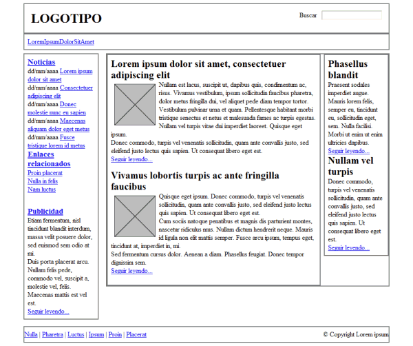
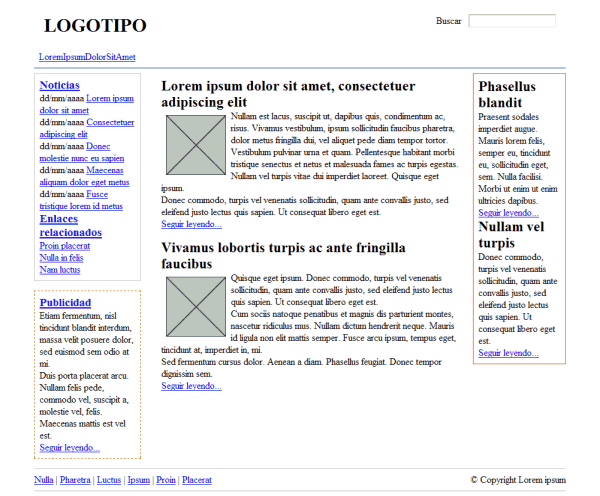
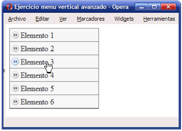
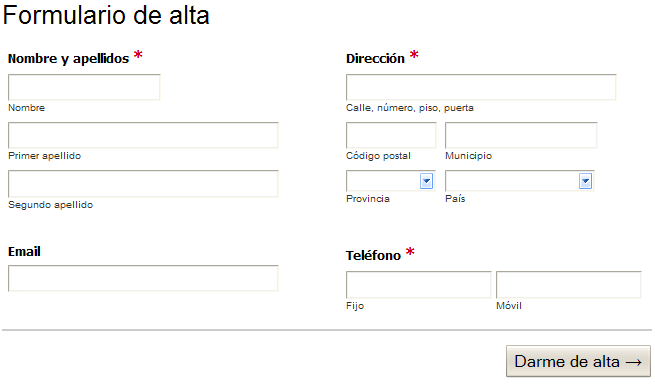
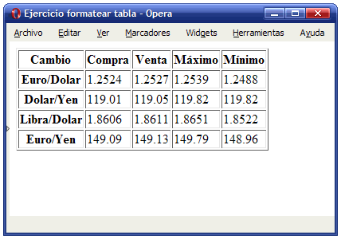
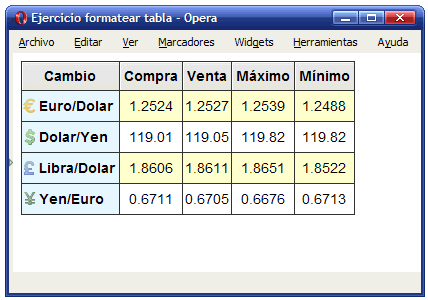

# Ejercicios de CSS

## Capítulo 2

### Ejercicio 1 ## {#ej01}

A partir del código HTML y CSS que se muestra, añadir los selectores CSS que faltan para aplicar los estilos deseados. Cada regla CSS incluye un comentario en el que se explica los elementos a los que debe aplicarse:

    [html]
    <!DOCTYPE html PUBLIC "-//W3C//DTD XHTML 1.0 Transitional//EN"
        "http://www.w3.org/TR/xhtml1/DTD/xhtml1-transitional.dtd">
    <html xmlns="http://www.w3.org/1999/xhtml">
    <head>
        <meta http-equiv="Content-Type" content="text/html; charset=UTF-8" />
        <title>Ejercicio de selectores</title>
        
    </head>
     
    <body>
        

            
Lorem ipsum dolor sit amet, <a href="#">consectetuer adipiscing
            elit</a>. Praesent blandit nibh at felis. Sed nec diam in dolor
            vestibulum aliquet. Duis ullamcorper, nisi non facilisis molestie,
            <em>lorem sem aliquam nulla</em>, id lacinia velit mi vestibulum
            enim.

        

         
        

            
Phasellus eu velit sed lorem sodales egestas. Ut feugiat.
            <a href="#">Donec porttitor</a>, magna eu varius
            luctus, metus massa tristique massa, in imperdiet est
            velit vel magna. Phasellus erat. Duis risus.
            <a href="#">Maecenas dictum</a>, nibh vitae pellentesque auctor,
            tellus velit consectetuer tellus, tempor pretium
            felis tellus at metus.

         
            
Cum sociis natoque <em class="especial">penatibus et
            magnis</em> dis parturient montes, nascetur ridiculus mus.
            Proin aliquam convallis ante. Pellentesque habitant morbi
            tristique senectus et netus et malesuada fames ac turpis egestas.
            Nunc aliquet. Sed eu metus. Duis justo.

         
            
Donec facilisis blandit velit. Vestibulum nisi. Proin
            volutpat, <em class="especial">enim id iaculis congue</em>, orci
            justo ultrices tortor, <a href="#">quis lacinia eros libero in
            eros</a>. Sed malesuada dui vel quam. Integer at eros.

        

    </body>
    </html>

## Capítulo 2

### Ejercicio 2 ## {#ej02}

A partir del código HTML proporcionado, añadir las reglas CSS necesarias para que la página resultante tenga el mismo aspecto que el de la siguiente imagen:

A continuación se muestra el código HTML de la página sin estilos:

    [html]
    <!DOCTYPE html PUBLIC "-//W3C//DTD XHTML 1.0 Transitional//EN"
        "http://www.w3.org/TR/xhtml1/DTD/xhtml1-transitional.dtd">
    <html xmlns="http://www.w3.org/1999/xhtml">
    <head>
        <meta http-equiv="Content-Type" content="text/html; charset=utf-8" />
        <title>Ejercicio de selectores</title>
    </head>
     
    <body>
        <h1 class="titulo">Lorem ipsum dolor sit amet</h1>
     
        
Nulla pretium. Sed tempus nunc vitae neque.
        <strong>Suspendisse gravida</strong>, metus a scelerisque
        sollicitudin, lacus velit ultricies nisl, nonummy tempus
        neque diam quis felis. Etiam
        sagittis tortor sed arcu sagittis tristique.

     
        <h2 class="subtitulo">Aliquam tincidunt, sem eget volutpat porta</h2>
     
        
Vivamus velit dui, placerat vel, feugiat in, ornare et, urna.
        <a href="#">Aenean turpis metus, <em>aliquam non</em>, tristique in</a>
        , pretium varius, sapien. Proin vitae nisi. Suspendisse
        porttitor purus ac elit.
        Suspendisse eleifend odio at dui. In in elit sed metus pretium
        elementum.

     
        <table summary="Descripción de la tabla y su contenido">
        <caption>Título de la tabla</caption>
        <thead>
          <tr>
            <th scope="col"></th>
            <th scope="col" class="especial">Título columna 1</th>
            <th scope="col" class="especial">Título columna 2</th>
          </tr>
        </thead>
         
        <tfoot>
          <tr>
            <th scope="col"></th>
            <th scope="col">Título columna 1</th>
            <th scope="col">Título columna 2</th>
          </tr>
        </tfoot>
         
        <tbody>
          <tr>
            <th scope="row" class="especial">Título fila 1</th>
            <td>Donec purus ipsum</td>
            <td>Curabitur <em>blandit</em></td>
          </tr>
          <tr>
            <th scope="row">Título fila 2</th>
            <td>Donec <strong>purus ipsum</strong></td>
            <td>Curabitur blandit</td>
          </tr>
        </tbody>
        </table>
     
        

            
Donec purus ipsum, posuere id, venenatis at,
            placerat ac, lorem. Curabitur blandit,
            eros sed gravida aliquet, risus justo 
            porta lorem, ut mollis lectus tortor in orci.
            Pellentesque nec augue.

             
            
Fusce nec felis eu diam pretium adipiscing.
            Nunc elit elit, vehicula vulputate,
            venenatis in, posuere id, lorem. Etiam sagittis, tellus in
            ultrices accumsan, diam nisi feugiat ante, eu congue magna mi
            non nisl.

             
            
Vivamus ultrices aliquet augue. <a href="#">Donec arcu pede,
            pretium vitae</a>, rutrum aliquet, tincidunt blandit, pede. 
            Aliquam in nisi. Suspendisse volutpat. Nulla facilisi.
            Ut ullamcorper nisi quis mi.

        

    </body>
    </html>

Los nombres de los colores están estandarizados y se corresponden con el nombre en inglés de cada color. En este ejercicio, se deben utilizar los colores: teal, red, blue, orange, purple, olive, fuchsia y green.

## Capítulo 4

### Ejercicio 3 ## {#ej03}

A partir del código HTML y CSS proporcionados, determinar las reglas CSS necesarias para añadir los siguientes márgenes y rellenos:

1. El elemento con clase `cabecera` debe tener un relleno de `1em` en todos los lados.
2. El elemento con clase `menu` debe tener un relleno de `0.5em` en todos los lados y un margen inferior de `0.5em`.
3. El resto de elementos con clases `noticias, publicidad, principal, secundario` deben tener `0.5em` de relleno en todos sus lados, salvo el elemento `pie`, que sólo debe tener relleno en la zona superior e inferior.
4. Los elementos con clase `articulo` deben mostrar una separación entre ellos de `1em`.
5. Las imágenes de los artículos muestran un margen de `0.5em` en todos sus lados.
6. El elemento con clase `publicidad` está separado `1em` de su elemento superior.
7. El elemento con clase `pie` debe tener un margen superior de `1em`.

[Descargar ficheros](snippets/cap14/ej03.zip)

### Ejercicio 4 ## {#ej04}

A partir del código HTML y CSS proporcionados, determinar las reglas CSS necesarias para añadir los siguientes bordes:

1. Eliminar el borde gris que muestran por defecto todos los elementos.
2. El elemento con clase `menu` debe tener un borde inferior de 1 píxel y azul (`#004C99`).
3. El elemento con clase `noticias` muestra un borde de 1 píxel y gris claro (`#C5C5C5`).
4. El elemento con clase `publicidad` debe mostrar un borde discontinuo de 1 píxel y de color `#CC6600`.
5. El lateral formado por el elemento con clase `secundario` muestra un borde de 1 píxel y de color `#CC6600`.
6. El elemento con clase `pie` debe mostrar un borde superior y otro inferior de 1 píxel y color gris claro `#C5C5C5`.

[Descargar ficheros](snippets/cap14/ej04.zip)

### Ejercicio 5 ## {#ej05}

A partir del código HTML y CSS proporcionados, determinar las reglas CSS necesarias para añadir los siguientes colores e imágenes de fondo:

- Los elementos con clase `noticias` y `pie` tiene un color de fondo gris claro (`#F8F8F8`).
- El elemento con clase `publicidad` muestra un color de fondo amarillo claro (`#FFF6CD`).
- Los elementos `<h2>` del lateral con clase `secundario` muestran un color de fondo `#DB905C` y un pequeño padding de `.2em`.
- El fondo del elemento con clase `menu` se construye mediante una pequeña imagen llamada `fondo_menu.gif`.
- El logotipo del sitio se muestra mediante una imagen de fondo del elemento `<h1>` contenido en el elemento con clase `cabecera` (la imagen se llama `logo.gif`).

[Descargar ficheros](snippets/cap14/ej05.zip)

## Capítulo 5

### Ejercicio 6 ## {#ej06}

A partir del código HTML proporcionado:

    [html]
    <!DOCTYPE html PUBLIC "-//W3C//DTD XHTML 1.0 Transitional//EN"
        "http://www.w3.org/TR/xhtml1/DTD/xhtml1-transitional.dtd">
    <html xmlns="http://www.w3.org/1999/xhtml">
    <head>
      <meta http-equiv="Content-Type" content="text/html; charset=uft-8" />
      <title>Ejercicio posicionamiento float</title>
      <link rel="stylesheet" type="text/css" href="main.css" />
    </head>
     
    <body>
      

        &laquo; Anterior &nbsp; Siguiente &raquo;
      

    </body>
    </html>

Determinar las reglas CSS necesarias para que el resultado sea similar al mostrado en la siguiente imagen:

## Capítulo 6

### Ejercicio 7 ## {#ej07}

A partir del código HTML y CSS proporcionados, determinar las reglas CSS necesarias para añadir las siguientes propiedades a la tipografía de la página:

1. La fuente base de la página debe ser: color negro, tipo Arial, tamaño `0.9em`, interlineado `1.4`.

2. Los elementos `<h2>` de .articulo se muestran en color `#CC6600`, con un tamaño de letra de `1.6em`, un interlineado de `1.2` y un margen inferior de `0.3em`.

3. Los elementos del `menu` deben mostrar un margen a su derecha de `1em` y los enlaces deben ser de color blanco y tamaño de letra `1.3em`.

4. El tamaño del texto de todos los contenidos de `lateral` debe ser de `0.9em`. La fecha de cada noticia debe ocupar el espacio de toda su línea y mostrarse en color gris claro `#999`. El elemento `<h3>` de `noticias` debe mostrarse de color `#003366`.

5. El texto del elemento con clase `publicidad` es de color gris oscuro `#555` y todos los enlaces de color `#CC6600`.

6. Los enlaces contenidos dentro de `articulo` son de color `#CC6600` y todos los párrafos muestran un margen superior e inferior de `0.3em`.

7. Añadir las reglas necesarias para que el contenido de `secundario` se vea como en la imagen que se muestra.

8. Añadir las reglas necesarias para que el contenido de `pie` se vea como en la imagen que se muestra.

Determinar las reglas CSS necesarias para que el resultado sea similar al mostrado en la siguiente imagen:

[Descargar ficheros](snippets/cap14/ej07.zip)

## Capítulo 7

### Ejercicio 8 ## {#ej08}

Definir las reglas CSS que permiten mostrar los enlaces con los siguientes estilos:

1. En su estado normal, los enlaces se muestran de color rojo `#CC0000`.

2. Cuando el usuario pasa su ratón sobre el enlace, se muestra con un color de fondo rojo `#CC0000` y la letra de color blanco `#FFF`.

3. Los enlaces visitados se muestran en color gris claro `#CCC`.

## Capítulo 8

### Ejercicio 9 ## {#ej09}

Modificar el menú vertical sencillo para que muestre el siguiente comportamiento:

1) Los elementos deben mostrar una imagen de fondo (`flecha_inactiva.png`):

2) Cuando se pasa el ratón por encima de un elemento, se debe mostrar una imagen alternativa (`flecha_activa.png`):

3) El color de fondo del elemento también debe variar ligeramente y mostrar un color gris más oscuro (`#E4E4E4`) cuando se pasa el ratón por encima:

[Descargar ficheros](snippets/cap14/ej09.zip)

## Capítulo 9

### Ejercicio 10 ## {#ej10}

A partir del código HTML proporcionado:

1) Aplicar las reglas CSS necesarias para que el formulario muestre el siguiente aspecto:

2) Cuando el usuario pasa el ratón por encima de cada grupo de elementos de formulario (es decir, por encima de cada `<li>`) se debe modificar su color de fondo (sugerencia: color amarillo claro `#FF9`). Además, cuando el usuario se posiciona en un cuadro de texto, se debe modificar su borde para resaltar el campo que está activo cada momento (sugerencia: color amarillo `#E6B700`):

3) Utilizando el menor número de reglas CSS, cambiar el aspecto del formulario para que se muestre como la siguiente imagen:

4) Cuando el usuario pasa el ratón por encima de un grupo de elementos de formulario (es decir, por encima de cada `<li>`) se debe mostrar el mensaje de ayuda asociado. Añadir las reglas CSS necesarias para que el formulario tenga el aspecto definitivo mostrado en la siguiente imagen:

[Descargar ficheros](snippets/cap14/ej10.html)

## Capítulo 10

### Ejercicio 11 ## {#ej11}

Determinar las reglas CSS necesarias para mostrar la siguiente tabla con el aspecto final mostrado en la imagen (modificar el código HTML que se considere necesario añadiendo los atributos class oportunos).

Tabla original:

Tabla original:

1) Alinear el texto de las celdas, cabeceras y título. Definir los bordes de la tabla, celdas y cabeceras (color gris oscuro `#333`):

2) Formatear las cabeceras de fila y columna con la imagen de fondo correspondiente en cada caso (`fondo_gris.gif, euro.png, dolar.png, yen.png, libra.png`). Modificar el tipo de letra de la tabla y utilizar `Arial`. El color azul claro es `#E6F3FF`.

3) Mostrar un color alterno en las filas de datos (color amarillo claro `#FFFFCC`).

[Descargar ficheros](snippets/cap14/ej11.zip)

## Ejercicio final

Determinar las reglas CSS necesarias para mostrar la página HTML que se proporciona con el estilo que se muestra en la siguiente imagen:

A continuación se indica una propuesta de los pasos que se pueden seguir para obtener el aspecto final deseado:

* Añadir los estilos básicos de la página (tipo de letra Verdana, color de letra `#192666`, imagen de fondo llamada `fondo.gif`, color de fondo `#F2F5FE`).

* Definir la estructura básica de la página: anchura fija de `770 píxel`, centrada en la ventana del navegador, cabecera y pie, columna central de contenidos de anchura `530 píxel` y columna secundaria de contenidos de `200 píxel` de anchura.

* La cabecera tiene una altura de `100 píxel` y una imagen de fondo llamada `cabecera.jpg`.

* Los elementos del menú de navegación tienen un color de fondo `#253575`, un color de letra `#B5C4E3`. Cuando el ratón pasa por encima de cada elemento, su color de fondo cambia a `#31479B`. Los elementos seleccionados se muestran con un color de fondo blanco y un color de letra `#FF9000`:

* Con la ayuda de las imágenes que se proporcionan, mostrar cada uno de los artículos de contenido con el estilo que se muestra en la siguiente imagen:

* Añadir los estilos adecuados para mostrar los elementos de la columna secundaria de contenidos con el siguiente aspecto.

[Descargar ficheros](snippets/final/final.zip)