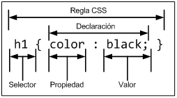

# Introducción

## ¿Qué es CSS?

CSS es un lenguaje de hojas de estilos creado para controlar el aspecto o presentación de los documentos electrónicos definidos con HTML y XHTML. CSS es la mejor forma de separar los contenidos y su presentación y es imprescindible para crear páginas web complejas.

Separar la definición de los contenidos y la definición de su aspecto presenta numerosas ventajas, ya que obliga a crear documentos HTML/XHTML bien definidos y con significado completo (también llamados "*documentos semánticos*"). Además, mejora la accesibilidad del documento, reduce la complejidad de su mantenimiento y permite visualizar el mismo documento en infinidad de dispositivos diferentes.

Al crear una página web, se utiliza en primer lugar el lenguaje HTML/XHTML para marcar los contenidos, es decir, para designar la función de cada elemento dentro de la página: párrafo, titular, texto destacado, tabla, lista de elementos, etc.

Una vez creados los contenidos, se utiliza el lenguaje CSS para definir el aspecto de cada elemento: color, tamaño y tipo de letra del texto, separación horizontal y vertical entre elementos, posición de cada elemento dentro de la página, etc.

## Especificación oficial

La especificación o norma oficial que se utiliza actualmente para diseñar páginas web con CSS es la versión CSS 2.1, actualizada por última vez el 7 de junio de 2011 y que se puede consultar libremente en [w3.org/TR/CSS21](http://www.w3.org/TR/CSS21/)

Desde hace varios años, el organismo W3C trabaja en la elaboración de la próxima versión de CSS, conocida como CSS3. Esta nueva versión incluye multitud de cambios importantes en todos los niveles y es mucho más avanzada y compleja que CSS 2. Puedes consultar el estado actual de cada componente de CSS3 en [w3.org/Style/CSS/current-work](http://www.w3.org/Style/CSS/current-work). También existe un [blog oficial](http://www.w3.org/blog/CSS) en el que se publican todas las novedades relacionadas con el estándar CSS.

Mientras CSS3 se convierte en un estandar, los distintos navegadores pueden incluir o no las mejoras propuestas, o incluso añadir las suyas propias. La web [Can I use...](http://caniuse.com/) incluye un listado completo de funcionalidades soportadas por los ditintos navegadores.

## Funcionamiento básico de CSS

Antes de que se generalizara el uso de CSS, los diseñadores de páginas web utilizaban etiquetas HTML especiales para modificar el aspecto de los elementos de la página. El siguiente ejemplo muestra una página HTML con estilos definidos sin utilizar CSS:

    [html]
    <!DOCTYPE html PUBLIC "-//W3C//DTD XHTML 1.0 Transitional//EN"
      "http://www.w3.org/TR/xhtml1/DTD/xhtml1-transitional.dtd">
    <html xmlns="http://www.w3.org/1999/xhtml">
    <head>
      <meta http-equiv="Content-Type" content="text/html; charset=UTF-8" />
      <title>Ejemplo de estilos sin CSS</title>
    </head>
    <body>
      <h1>Titular de la página</h1>
      
Un párrafo de texto no muy largo.

    </body>
    </html>

El ejemplo anterior utiliza la etiqueta `` con sus atributos `color`, `face` y `size` para definir el color, el tipo y el tamaño de letra de cada elemento de la página.

El problema de utilizar este método para definir el aspecto de los elementos se puede ver claramente con el siguiente ejemplo: si la página tuviera 50 elementos diferentes, habría que insertar 50 etiquetas ``. Si el sitio web entero se compone de 10.000 páginas diferentes, habría que definir 500.000 etiquetas ``. Como cada etiqueta `` tiene tres atributos, habría que definir 1.5 millones de atributos.

Como el diseño de los sitios web está en constante evolución, es habitual modificar cada cierto tiempo el aspecto de las páginas del sitio. Siguiendo con el ejemplo anterior, cambiar el aspecto del sitio requeriría modificar 500.000 etiquetas y 1.5 millones de atributos.

La solución que propone CSS es mucho mejor, como se puede ver en el siguiente ejemplo:

    [html]
    <!DOCTYPE html PUBLIC "-//W3C//DTD XHTML 1.0 Transitional//EN"
    	"http://www.w3.org/TR/xhtml1/DTD/xhtml1-transitional.dtd">
    <html xmlns="http://www.w3.org/1999/xhtml">
    <head>
    	<meta http-equiv="Content-Type" content="charset=UTF-8" />
    	<title>Ejemplo de estilos con CSS</title>
    	
    </head>
    <body>
    	<h1>Titular de la página</h1>
    	
Un párrafo de texto no muy largo.

    </body>
    </html>

CSS permite separar los contenidos de la página y la información sobre su aspecto. En el ejemplo anterior, dentro de la propia página HTML se crea una zona especial en la que se incluye toda la información relacionada con los estilos de la página.

Utilizando CSS, se pueden establecer los mismos estilos con menos esfuerzo y sin ensuciar el código HTML de los contenidos con etiquetas ``. Como se verá más adelante, la etiqueta `
    </head>
    <body>
    	
Un párrafo de texto.

    </body>
    </html>

Este método se emplea cuando se define un número pequeño de estilos o cuando se quieren incluir estilos específicos en una determinada página HTML que completen los estilos que se incluyen por defecto en todas las páginas del sitio web.

El principal inconveniente es que si se quiere hacer una modificación en los estilos definidos, es necesario modificar todas las páginas que incluyen el estilo que se va a modificar.

Los ejemplos mostrados en este libro utilizan este método para aplicar CSS al contenido HTML de las páginas. De esta forma el código de los ejemplos es más conciso y se aprovecha mejor el espacio.

### Definir CSS en un archivo externo

En este caso, todos los estilos CSS se incluyen en un archivo de tipo CSS que las páginas HTML enlazan mediante la etiqueta <link>. Un archivo de tipo CSS no es más que un archivo simple de texto cuya extensión es .css Se pueden crear todos los archivos CSS que sean necesarios y cada página HTML puede enlazar tantos archivos CSS como necesite.

Si se quieren incluir los estilos del ejemplo anterior en un archivo CSS externo, se deben seguir los siguientes pasos:

1) Se crea un archivo de texto y se le añade solamente el siguiente contenido:

    [css]
    p { color: black; font-family: Verdana; }

2) Se guarda el archivo de texto con el nombre estilos.css Se debe poner especial atención a que el archivo tenga extensión .css y no .txt

3) En la página HTML se enlaza el archivo CSS externo mediante la etiqueta `<link>`:

    [html]
    <!DOCTYPE html PUBLIC "-//W3C//DTD XHTML 1.0 Transitional//EN"
        "http://www.w3.org/TR/xhtml1/DTD/xhtml1-transitional.dtd">
    <html xmlns="http://www.w3.org/1999/xhtml">
    <head>
        <meta http-equiv="Content-Type" content="text/html; charset=UTF-8" />
        <title>Ejemplo de estilos CSS en un archivo externo</title>
        <link rel="stylesheet" type="text/css"
            href="/css/estilos.css" media="screen" />
    </head>
    <body>
        
Un párrafo de texto.

        </body>
    </html>

Cuando el navegador carga la página HTML anterior, antes de mostrar sus contenidos también descarga los archivos CSS externos enlazados mediante la etiqueta `<link>` y aplica los estilos a los contenidos de la página.

Normalmente, la etiqueta `<link>` incluye cuatro atributos cuando enlaza un archivo CSS:

- `rel`: indica el tipo de relación que existe entre el recurso enlazado (en este caso, el archivo CSS) y la página HTML. Para los archivos CSS, siempre se utiliza el valor stylesheet
- `type`: indica el tipo de recurso enlazado. Sus valores están estandarizados y para los archivos CSS su valor siempre es text/css
- `href`: indica la URL del archivo CSS que contiene los estilos. La URL indicada puede ser relativa o absoluta y puede apuntar a un recurso interno o externo al sitio web.
- `media`: indica el medio en el que se van a aplicar los estilos del archivo CSS. Más adelante se explican en detalle los medios CSS y su funcionamiento.
De todas las formas de incluir CSS en las páginas HTML, esta es la más utilizada con mucha diferencia. La principal ventaja es que se puede incluir un mismo archivo CSS en multitud de páginas HTML, por lo que se garantiza la aplicación homogénea de los mismos estilos a todas las páginas que forman un sitio web.

Con este método, el mantenimiento del sitio web se simplifica al máximo, ya que un solo cambio en un solo archivo CSS permite variar de forma instantánea los estilos de todas las páginas HTML que enlazan ese archivo.

Aunque generalmente se emplea la etiqueta `<link>` para enlazar los archivos CSS externos, también se puede utilizar la etiqueta `
    </head>
    <body>
        
Un párrafo de texto.

        </body>
    </html>

En este caso, para incluir en la página HTML los estilos definidos en archivos CSS externos se utiliza una regla especial de tipo `@import`. Las reglas de tipo `@import` siempre preceden a cualquier otra regla CSS (con la única excepción de la regla `@charset`).

La URL del archivo CSS externo se indica mediante una cadena de texto encerrada con comillas simples o dobles o mediante la palabra reservada url(). De esta forma, las siguientes reglas `@import` son equivalentes:

    [css]
    @import '/css/estilos.css';
    @import "/css/estilos.css";
    @import url('/css/estilos.css');
    @import url("/css/estilos.css");

### Incluir CSS en los elementos HTML

El último método para incluir estilos CSS en documentos HTML es el peor y el menos utilizado, ya que tiene los mismos problemas que la utilización de las etiquetas ``.

Ejemplo:

    [html]
    <!DOCTYPE html PUBLIC "-//W3C//DTD XHTML 1.0 Transitional//EN"
      "http://www.w3.org/TR/xhtml1/DTD/xhtml1-transitional.dtd">
    <html xmlns="http://www.w3.org/1999/xhtml">
    <head>
        <meta http-equiv="Content-Type" content="text/html; charset=UTF-8" />
        <title>Ejemplo de estilos CSS en el propio documento</title>
    </head>
    <body>
        
Un párrafo de texto.

        </body>
    </html>

Esta forma de incluir CSS directamente en los elementos HTML solamente se utiliza en determinadas situaciones en las que se debe incluir un estilo muy específico para un solo elemento concreto.

## Glosario básico

CSS define una serie de términos que permiten describir cada una de las partes que componen los estilos CSS. El siguiente esquema muestra las partes que forman un estilo CSS muy básico:

Los diferentes términos se definen a continuación:

- Regla: cada uno de los estilos que componen una hoja de estilos CSS. Cada regla está compuesta de una parte de "*selectores*", un símbolo de "*llave de apertura*" ({), otra parte denominada "*declaración*" y por último, un símbolo de "*llave de cierre*" (}).
- Selector: indica el elemento o elementos HTML a los que se aplica la regla CSS.
- Declaración: especifica los estilos que se aplican a los elementos. Está compuesta por una o más propiedades CSS.
- Propiedad: característica que se modifica en el elemento seleccionado, como por ejemplo su tamaño de letra, su color de fondo, etc.
- Valor: establece el nuevo valor de la característica modificada en el elemento.
Un archivo CSS puede contener un número ilimitado de reglas CSS, cada regla se puede aplicar a varios selectores diferentes y cada declaración puede incluir tantos pares propiedad/valor como se desee.

El estándar CSS 2.1 define 115 propiedades, cada una con su propia lista de valores permitidos. Por su parte, los últimos borradores del estándar CSS 3 ya incluyen 239 propiedades.

## Medios CSS

Una de las características más importantes de las hojas de estilos CSS es que permiten definir diferentes estilos para diferentes medios o dispositivos: pantallas, impresoras, móviles, proyectores, etc.

Además, CSS define algunas propiedades específicamente para determinados medios, como por ejemplo la paginación y los saltos de página para los medios impresos o el volumen y tipo de voz para los medios de audio. La siguiente tabla muestra el nombre que CSS utiliza para identificar cada medio y su descripción:

| Medio | Descripción |
| ----- | ----------- |
| all | Todos los medios definidos |
| braille | Dispositivos táctiles que emplean el sistema braille |
| embosed | Impresoras braille |
| handheld | Dispositivos de mano: móviles, PDA, etc. |
| print | Impresoras y navegadores en el modo "Vista Previa para Imprimir" |
| projection | Proyectores y dispositivos para presentaciones |
| screen | Pantallas de ordenador |
| speech | Sintetizadores para navegadores de voz utilizados por personas discapacitadas |
| tty | Dispositivos textuales limitados como teletipos y terminales de texto |
| tv | Televisores y dispositivos con resolución baja |

Los medios más utilizados actualmente son `screen` (para definir el aspecto de la página en pantalla) y `print` (para definir el aspecto de la página cuando se imprime), seguidos de `handheld` (que define el aspecto de la página cuando se visualiza mediante un dispositivo móvil).

La gran ventaja de CSS es que permite modificar los estilos de una página en función del medio en el que se visualiza. Existen cuatro formas diferentes de indicar el medio en el que se deben aplicar los estilos CSS.

### Medios definidos con las reglas de tipo @media

Las reglas `@media` son un tipo especial de regla CSS que permiten indicar de forma directa el medio o medios en los que se aplicarán los estilos incluidos en la regla. Para especificar el medio en el que se aplican los estilos, se incluye su nombre después de `@media`. Si los estilos se aplican a varios medios, se incluyen los nombres de todos los medios separados por comas.

A continuación se muestra un ejemplo sencillo:

    [css]
    @media print {
      body { font-size: 10pt }
    }
    @media screen {
      body { font-size: 13px }
    }
    @media screen, print {
      body { line-height: 1.2 }
    }

El ejemplo anterior establece que el tamaño de letra de la página cuando se visualiza en una pantalla debe ser `13 píxel`. Sin embargo, cuando se imprimen los contenidos de la página, su tamaño de letra debe ser de `10 puntos`. Por último, tanto cuando la página se visualiza en una pantalla como cuando se imprimen sus contenidos, el interlineado del texto debe ser de `1.2` veces el tamaño de letra del texto.

### Medios definidos con las reglas de tipo @import

Cuando se utilizan reglas de tipo `@import` para enlazar archivos CSS externos, se puede especificar el medio en el que se aplican los estilos indicando el nombre del medio después de la URL del archivo CSS:

    [css]
    @import url("estilos_basicos.css") screen;
    @import url("estilos_impresora.css") print;

Las reglas del ejemplo anterior establecen que cuando la página se visualiza por pantalla, se cargan los estilos definidos en el primer archivo CSS. Por otra parte, cuando la página se imprime, se tienen en cuenta los estilos que define el segundo archivo CSS.

Si los estilos del archivo CSS externo deben aplicarse en varios medios, se indican los nombres de todos los medios separados por comas. Si no se indica el medio en una regla de tipo `@import`, el navegador sobreentiende que el medio es `all`, es decir, que los estilos se aplican en todos los medios.

### Medios definidos con la etiqueta

Si se utiliza la etiqueta `<link>` para enlazar los archivos CSS externos, se puede utilizar el atributo media para indicar el medio o medios en los que se aplican los estilos de cada archivo:

    [html]
    <link rel="stylesheet" type="text/css" media="screen" href="basico.css" />
    <link rel="stylesheet" type="text/css" media="print, handheld" href="especial.css" />

En este ejemplo, el primer archivo CSS se tiene en cuenta cuando la página se visualiza en la pantalla (`media="screen"`). Los estilos indicados en el segundo archivo CSS, se aplican al imprimir la página (`media="print"`) o al visualizarla en un dispositivo móvil (`media="handheld"`), como por ejemplo en un iPhone.

Si la etiqueta `<link>` no indica el medio CSS, se sobreentiende que los estilos se deben aplicar a todos los medios, por lo que es equivalente a indicar `media="all"`.

### Medios definidos mezclando varios métodos

CSS también permite mezclar los tres métodos anteriores para indicar los medios en los que se aplica cada archivo CSS externo:

    [html]
    <link rel="stylesheet" type="text/css"  media="screen" href="basico.css" />
    @import url("estilos_seccion.css") screen;
    @media print {
      /* Estilos específicos para impresora */
    }

Los estilos CSS que se aplican cuando se visualiza la página en una pantalla se obtienen mediante el recurso enlazado con la etiqueta `<link>` y mediante el archivo CSS externo incluido con la regla de tipo `@import`. Además, los estilos aplicados cuando se imprime la página se indican directamente en la página HTML mediante la regla de tipo `@media`.

## Comentarios

CSS permite incluir comentarios entre sus reglas y estilos. Los comentarios son contenidos de texto que el diseñador incluye en el archivo CSS para su propia información y utilidad. Los navegadores ignoran por completo cualquier comentario de los archivos CSS, por lo que es común utilizarlos para estructurar de forma clara los archivos CSS complejos.

El comienzo de un comentario se indica mediante los caracteres `/*` y el final del comentario se indica mediante `*/`, tal y como se muestra en el siguiente ejemplo:

    [css]
    /* Este es un comentario en CSS */

Los comentarios pueden ocupar tantas líneas como sea necesario, pero no se puede incluir un comentario dentro de otro comentario:

    [css]
    /* Este es un
       comentario CSS de varias
       lineas */

Aunque los navegadores ignoran los comentarios, su contenido se envía junto con el resto de estilos, por lo que no se debe incluir en ellos ninguna información sensible o confidencial.

La sintaxis de los comentarios CSS es muy diferente a la de los comentarios HTML, por lo que no deben confundirse:

    [html]
    <!-- Este es un comentario en HTML -->

    [html]
    <!-- Este es un
         comentario HTML de varias
         lineas -->

## Sintaxis de la definición de cada propiedad CSS

A lo largo de los próximos capítulos, se incluyen las definiciones formales de la mayoría de propiedades de CSS. La definición formal se basa en la información recogida en el estándar oficial y se muestra en forma de tabla.

Una de las principales informaciones de cada definición es la lista de posibles valores que admite la propiedad. Para definir la lista de valores permitidos se sigue un formato que es necesario detallar.

Si el valor permitido se indica como una sucesión de palabras sin ningún carácter que las separe (paréntesis, comas, barras, etc.) el valor de la propiedad se debe indicar tal y como se muestra y con esas palabras en el mismo orden.

Si el valor permitido se indica como una sucesión de valores separados por una barra simple (carácter `|`) el valor de la propiedad debe tomar uno y sólo uno de los valores indicados. Por ejemplo, la notación `<porcentaje> | <medida> | inherit` indica que la propiedad solamente puede tomar como valor la palabra reservada `inherit` o un porcentaje o una medida.

Si el valor permitido se indica como una sucesión de valores separados por una barra doble (símbolo `||`) el valor de la propiedad puede tomar uno o más valores de los indicados y en cualquier orden.

Por ejemplo, la notación `<color> || <estilo> || <medida>` indica que la propiedad puede tomar como valor cualquier combinación de los valores indicados y en cualquier orden. Se podría establecer un color y un estilo, solamente una medida o una medida y un estilo. Además, el orden en el que se indican los valores es indiferente. Opcionalmente, se pueden utilizar paréntesis para agrupar diferentes valores.

Por último, en cada valor o agrupación de valores se puede indicar el tipo de valor: opcional, obligatorio, múltiple o restringido.

El carácter `*` indica que el valor ocurre cero o más veces; el carácter `+` indica que el valor ocurre una o más veces; el carácter `?` indica que el valor es opcional y por último, el carácter `{número_1, número_2}` indica que el valor ocurre al menos tantas veces como el valor indicado en `número_1` y como máximo tantas veces como el valor indicado en `número_2`.

Por ejemplo, el valor `[<family-name> , ]*` indica que el valor de tipo `<family_name>` seguido por una coma se puede incluir cero o más veces. El valor `<url>? <color>` significa que la URL es opcional y el color obligatorio y en el orden indicado. Por último, el valor `[<medida> | thick | thin] {1,4}` indica que se pueden escribir entre 1 y 4 veces un valor que sea o una medida o la palabra `thick` o la palabra `thin`.

No obstante, la mejor forma de entender la notación formal para las propiedades de CSS es observar la definición de cada propiedad y volver a esta sección siempre que sea necesario.