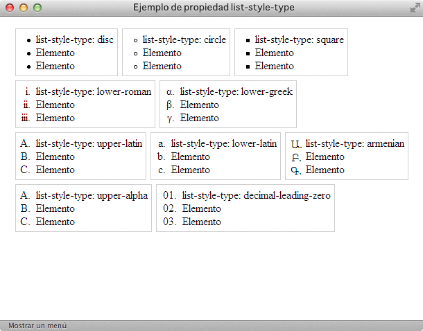
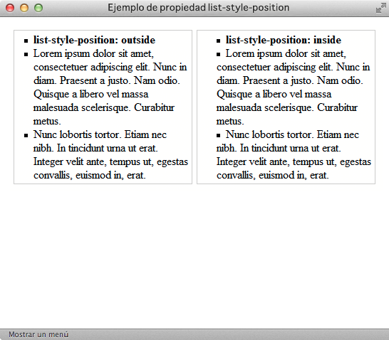
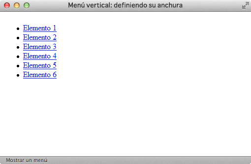
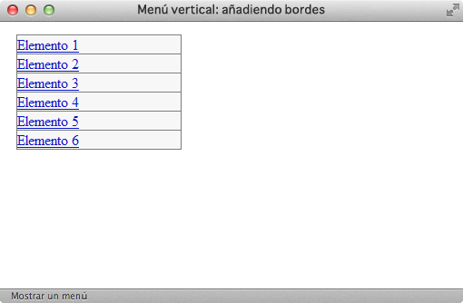
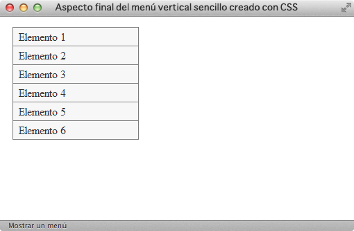
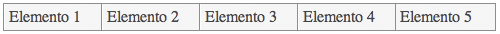
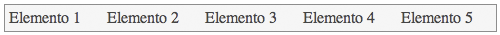
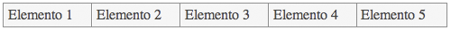

# Listas

## Estilos básicos

### Viñetas personalizadas

Por defecto, los navegadores muestran los elementos de las listas no ordenadas con una viñeta formada por un pequeño círculo de color negro. Los elementos de las listas ordenadas se muestran por defecto con la numeración decimal utilizada en la mayoría de países.

No obstante, CSS define varias propiedades para controlar el tipo de viñeta que muestran las listas, además de poder controlar la posición de la propia viñeta. La propiedad básica es la que controla el tipo de viñeta que se muestra y que se denomina `list-style-type`.

| Propiedad             | `list-style-type`    |
| --------------------: | :------------- |
| **Valores** | disc \| circle \| square \| decimal \| decimal-leading-zero \| lower-roman \| upper-roman \| lower-greek \| lower-latin \| upper-latin \| armenian \| georgian \| lower-alpha \| upper-alpha \| none \| inherit |
| **Se aplica a** | Elementos de una lista |
| **Valor inicial**  | disc |
| **Descripción**       | Permite establecer el tipo de viñeta mostrada para una lista |

En primer lugar, el valor `none` permite mostrar una lista en la que sus elementos no contienen viñetas, números o letras. Se trata de un valor muy utilizado, ya que es imprescindible para los menús de navegación creados con listas, como se verá más adelante.

El resto de valores de la propiedad `list-style-type` se dividen en tres tipos: gráficos, numéricos y alfabéticos.

* Los valores gráficos son `disc`, `circle` y `square` y muestran como viñeta un círculo relleno, un círculo vacío y un cuadrado relleno respectivamente.

* Los valores numéricos están formados por `decimal`, `decimal-leading-zero`, `lower-roman`, `upper-roman`, `armenian` y `georgian`.

* Por último, los valores alfanuméricos se controlan mediante `lower-latin`, `lower-alpha`, `upper-latin`, `upper-alpha` y `lower-greek`.
La siguiente imagen muestra algunos de los valores definidos por la propiedad `list-style-type:

El código CSS de algunas de las listas del ejemplo anterior se muestra a continuación:

    [html]
    <ul style="list-style-type: square">
        <li>list-style-type: square</li>
        <li>Elemento</li>
        <li>Elemento</li>
    </ul>
    
    <ol style="list-style-type: lower-roman">
        <li>list-style-type: lower-roman</li>
        <li>Elemento</li>
        <li>Elemento</li>
    </ol>
    
    <ol style="list-style-type: decimal-leading-zero; padding-left: 2em;">
        <li>list-style-type: decimal-leading-zero</li>
        <li>Elemento</li>
        <li>Elemento</li>
    </ol>

La propiedad `list-style-position` permite controlar la colocación de las viñetas.

| Propiedad             | `list-style-position`    |
| --------------------: | :------------- |
| **Valores** | inside \| outside \| inherit |
| **Se aplica a** | Elementos de una lista |
| **Valor inicial**  | outside |
| **Descripción**       | Permite establecer la posición de la viñeta de cada elemento de una lista |

La diferencia entre los valores `outside` y `inside` se hace evidente cuando los elementos contienen mucho texto, como en la siguiente imagen:

Utilizando las propiedades anteriores (`list-style-type` y `list-style-position`), se puede seleccionar el tipo de viñeta y su posición, pero no es posible personalizar algunas de sus características básicas como su color y tamaño.

Cuando se requiere personalizar el aspecto de las viñetas, se debe emplear la propiedad `list-style-image`, que permite mostrar una imagen propia en vez de una viñeta automática.

| Propiedad             | `list-style-image`    |
| --------------------: | :------------- |
| **Valores** | url \| none \| inherit |
| **Se aplica a** | Elementos de una lista |
| **Valor inicial**  | none |
| **Descripción**       | Permite reemplazar las viñetas automáticas por una imagen personalizada |

Las imágenes personalizadas se indican mediante la URL de la imagen. Si no se encuentra la imagen o no se puede cargar, se muestra la viñeta automática correspondiente (salvo que explícitamente se haya eliminado mediante la propiedad `list-style-type`).

La siguiente imagen muestra el uso de la propiedad `list-style-image` mediante tres ejemplos sencillos de listas con viñetas personalizadas:

Las reglas CSS correspondientes al ejemplo anterior se muestran a continuación:

    [css]
    ul.ok { list-style-image: url("imagenes/ok.png"); }
    ul.flecha { list-style-image: url("imagenes/flecha.png"); }
    ul.circulo { list-style-image: url("imagenes/circulo_rojo.png"); }

Como es habitual, CSS define una propiedad de tipo "shorthand" que permite establecer todas las propiedades de una lista de forma directa. La propiedad se denomina `list-style`.

| Propiedad             | `list-style`    |
| --------------------: | :------------- |
| **Valores** | ( list-style-type || list-style-position || list-style-image ) \| inherit |
| **Se aplica a** | Elementos de una lista |
| **Valor inicial**  | - |
| **Descripción**       | Propiedad que permite establecer de forma simultánea todas las opciones de una lista |

En la definición anterior, la notación `||` significa que el orden en el que se indican los valores de la propiedad es indiferente. El siguiente ejemplo indica que no se debe mostrar ni viñetas automáticas ni viñetas personalizadas:

    [css]
    ul { list-style: none }

Cuando se utiliza una viñeta personalizada, es conveniente indicar la viñeta automática que se mostrará cuando no se pueda cargar la imagen:

    [css]
    ul { list-style: url("imagenes/cuadrado_rojo.gif") square; }

### Menú vertical

Los sitios web correctamente diseñados emplean las listas de elementos para crear todos sus menús de navegación. Utilizando la etiqueta `<ul>` de HTML se agrupan todas las opciones del menú y haciendo uso de CSS se modifica su aspecto para mostrar un menú horizontal o vertical.

A continuación se muestra la transformación de una lista sencilla de enlaces en un menú vertical de navegación.

Lista de enlaces original:

    [html]
    <ul>
        <li><a href="#">Elemento 1</a></li>
        <li><a href="#">Elemento 2</a></li>
        <li><a href="#">Elemento 3</a></li>
        <li><a href="#">Elemento 4</a></li>
        <li><a href="#">Elemento 5</a></li>
        <li><a href="#">Elemento 6</a></li>
    </ul>

Aspecto final del menú vertical:

El proceso de transformación de la lista en un menú requiere de los siguientes pasos:

1) Definir la anchura del menú:

    [css]
    ul.menu { width: 180px; }

2) Eliminar las viñetas automáticas y todos los márgenes y espaciados aplicados por defecto:

    [css]
    ul.menu {
        list-style: none;
        margin: 0;
        padding: 0;
        width: 180px;
    }

3) Añadir un borde al menú de navegación y establecer el color de fondo y los bordes de cada elemento del menú:

    [css]
    ul.menu {
        border: 1px solid #7C7C7C;
        border-bottom: none;  
        list-style: none;
        margin: 0;
        padding: 0;
        width: 180px;
    }
    ul.menu li {
        background: #F4F4F4;
        border-bottom: 1px solid #7C7C7C;
        border-top: 1px solid #FFF;
    }

4) Aplicar estilos a los enlaces: mostrarlos como un elemento de bloque para que ocupen todo el espacio de cada `<li>` del menú, añadir un espacio de relleno y modificar los colores y la decoración por defecto:

    [css]
    ul.menu li a {
        color: #333;
        display: block;
        padding: .2em 0 .2em .5em;
        text-decoration: none;
    }

Los tipos de menús verticales que se pueden definir mediante las propiedades CSS son innumerables, como se puede observar en la página [http://www.exploding-boy.com/images/EBmenus/menus.html](http://www.exploding-boy.com/images/EBmenus/menus.html).

## Estilos avanzados

### Menú horizontal básico

Partiendo de la misma lista de elementos del menú vertical, resulta muy sencillo crear un menú de navegación horizontal. La clave reside en modificar el posicionamiento original de los elementos de la lista.

Código HTML del menú horizontal:

    [html]
    <ul>
      <li><a href="#">Elemento 1</a></li>
      <li><a href="#">Elemento 2</a></li>
      <li><a href="#">Elemento 3</a></li>
      <li><a href="#">Elemento 4</a></li>
      <li><a href="#">Elemento 5</a></li>
    </ul>

Aspecto final del menú horizontal:

El proceso de creación del menú horizontal consta de los siguientes pasos:

1) Aplicar los estilos CSS básicos para establecer el estilo del menú (similares a los del menú vertical anterior):

    [css]
    ul.menu {
      background: #F4F4F4;
      border: 1px solid #7C7C7C;
      list-style: none;
      margin: 0;
      padding: 0;
    }
    
    ul.menu li a {
      color: #333;
      display: block;
      padding: .3em;
      text-decoration: none;
    }
   
       

2) Establecer la anchura de los elementos del menú. Como el menú es de anchura variable y contiene cinco elementos, se asigna una anchura del `20%` a cada elemento. Si se quiere tener un control más preciso sobre el aspecto de cada elemento, es necesario asignar una anchura fija al menú.

Además, se posiciona de forma flotante los elementos de la lista mediante la propiedad `float`. Esta es la clave de la transformación de una lista en un menú horizontal:

    [css]
    ul.menu li {
      float: left;
      width: 20%;
    }

Después de posicionar de forma flotante a todos los elementos de la lista, el elemento `<ul>` es un elemento vacío ya que en su interior no existe ningún elemento posicionado de forma normal.

Como ya se explicó en las secciones anteriores, la solución de este problema consiste en aplicar la propiedad `overflow: hidden;` al elemento `<ul>`, de forma que encierre a todos los elementos posicionados de forma flotante:

    [css]
    ul.menu {
      overflow: hidden;
    }

3) Establecer los bordes de los elementos que forman el menú:

    [css]
    ul.menu li a {
      border-left: 1px solid #FFF;
      border-right: 1px solid #7C7C7C;
    }

4) Por último, se elimina el borde derecho del último elemento de la lista, para evitar el borde duplicado:

    [html]
    <ul>
      <li><a href="#">Elemento 1</a></li>
      <li><a href="#">Elemento 2</a></li>
      <li><a href="#">Elemento 3</a></li>
      <li><a href="#">Elemento 4</a></li>
      <li><a href="#" style="border-right: none">Elemento 5</a></li>
    </ul>

El código CSS final se muestra a continuación:

    [css]
    ul.menu {
      background: #F4F4F4;
      border: 1px solid #7C7C7C;
      list-style: none;
      margin: 0;
      padding: 0;
      overflow: hidden;
    }
    
    ul.menu li {
      float: left;
      width: 20%;
    }
    
    ul.menu li a {
      border-left: 1px solid #FFF;
      border-right: 1px solid #7C7C7C;
      color: #333;
      display: block;
      padding: .3em;
      text-decoration: none;
    }

### Menús avanzados

Modificando los estilos de cada elemento del menú y utilizando imágenes de fondo y las pseudo-clases `:hover` y `:active`, se pueden crear menús horizontales complejos, incluso con el aspecto de un menú de solapas o pestañas:

El código fuente de los menús de la imagen anterior y muchos otros se puede encontrar en [http://exploding-boy.com/images/cssmenus/menus.html](http://exploding-boy.com/images/cssmenus/menus.html)

Además de los menús horizontales de pestañas, haciendo uso de las propiedades de CSS se pueden crear menús verticales y horizontales muy avanzados:

El código CSS de todos los ejemplos de la imagen anterior y muchos otros se pueden encontrar en: [http://alvit.de/css-showcase/css-navigation-techniques-showcase.php](http://alvit.de/css-showcase/css-navigation-techniques-showcase.php)

  
Ejercicio 9

[Ver enunciado](#ej09)