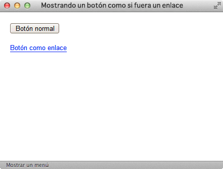
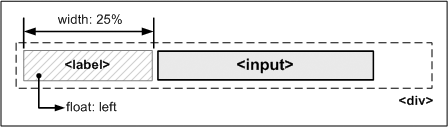
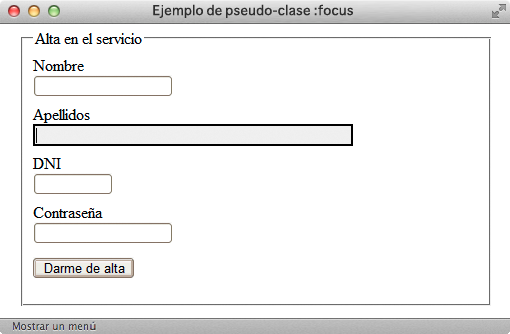

# Formularios

## Estilos básicos

### Mostrar un botón como un enlace

Como ya se vio anteriormente, el estilo por defecto de los enlaces se puede modificar para que se muestren como botones de formulario. Ahora, los botones de formulario también se pueden modificar para que parezcan enlaces.

Las reglas CSS del ejemplo anterior son las siguientes:

    [css]
    .enlace {
      border: 0;
      padding: 0;
      background-color: transparent;
      color: blue;
      border-bottom: 1px solid blue;
    }

    [html]
    <input type="button" value="Botón normal" />
    <input class="enlace" type="button" value="Botón como enlace" />

### Mejoras en los campos de texto

Por defecto, los campos de texto de los formularios no incluyen ningún espacio de relleno, por lo que el texto introducido por el usuario aparece pegado a los bordes del cuadro de texto.

Añadiendo un pequeño `padding` a cada elemento `<input>`, se mejora notablemente el aspecto del formulario:

La regla CSS necesaria para mejorar el formulario es muy sencilla:

    [css]
    form.elegante input {
      padding: .2em;
    }

### Labels alineadas y formateadas

Los elementos `<input>` y `<label>` de los formularios son elementos en línea, por lo que el aspecto que muestran los formularios por defecto, es similar al de la siguiente imagen:

El código HTML del ejemplo anterior es el siguiente:

    [html]
    <form>
      <fieldset>
      <legend>Alta en el servicio</legend>
    
      <label for="nombre">Nombre</label>
      <input type="text" id="nombre" />
    
      <label for="apellidos">Apellidos</label>
      <input type="text" id="apellidos" size="50" />
    
      <label for="dni">DNI</label>
      <input type="text" id="dni" size="10" maxlength="9" />
    
      <label for="contrasena">Contraseña</label>
      <input type="password" id="contrasena" />
    
      <input class="btn" type="submit" value="Darme de alta" />
      </fieldset>
    </form>

Aprovechando los elementos `<label>`, se pueden aplicar unos estilos CSS sencillos que permitan mostrar el formulario con el aspecto de la siguiente imagen:

En primer lugar, se muestran los elementos `<label>` como elementos de bloque, para que añadan una separación para cada campo del formulario. Además, se añade un margen superior para no mostrar juntas todas las filas del formulario:

    [css]
    label {
      display: block;
      margin: .5em 0 0 0;
    }

El botón del formulario también se muestra como un elemento de bloque y se le añade un margen para darle el aspecto final deseado:

    [css]
    .btn {
      display: block;
      margin: 1em 0;
    }

En ocasiones, es más útil mostrar todos los campos del formulario con su `<label>` alineada a la izquierda y el campo del formulario a la derecha de cada `<label>`, como muestra la siguiente imagen:

Para mostrar un formulario tal y como aparece en la imagen anterior no es necesario crear una tabla y controlar la anchura de sus columnas para conseguir una alineación perfecta. Sin embargo, sí que es necesario añadir un nuevo elemento (por ejemplo un `
`) que encierre a cada uno de los campos del formulario (`<label>` y `<input>`). El esquema de la solución propuesta es el siguiente:

Por tanto, en el código HTML del formulario anterior se añaden los elementos `
`:

    [html]
    <form>
      <fieldset>
      <legend>Alta en el servicio</legend>
    
      

        <label for="nombre">Nombre</label>
        <input type="text" id="nombre" />
      

    
      

        <label for="apellidos">Apellidos</label>
        <input type="text" id="apellidos" size="35" />
      

      ...
      </fieldset>
    </form>

Y en el código CSS se añaden las reglas necesarias para alinear los campos del formulario:

    [css]
    div {
      margin: .4em 0;
    }
    
    div label {
      width: 25%;
      float: left;
    }

##  Estilos avanzados

### Formulario en varias columnas

Los formularios complejos con decenas de campos pueden ocupar mucho espacio en la ventana del navegador. Además del uso de pestañas para agrupar los campos relacionados en un formulario, también es posible mostrar el formulario a dos columnas, para aprovechar mejor el espacio.

La solución consiste en aplicar la siguiente regla CSS a los `<fieldset>` del formulario:

    [css]
    form fieldset {
      float: left;
      width: 48%;
    }

    [html]
    <form>
      <fieldset>
        ...
      </fieldset>
    
      ...
    </form>

Si se quiere mostrar el formulario con más de dos columnas, se aplica la misma regla pero modificando el valor de la propiedad width de cada `<fieldset>`. Si el formulario es muy complejo, puede ser útil agrupar los `<fieldset>` de cada fila mediante elementos `
`.

###Resaltar el campo seleccionado

Una de las mejoras más útiles para los formularios HTML consiste en resaltar de alguna forma especial el campo en el que el usuario está introduciendo datos. Para ello, CSS define la pseudo-clase `:focus`, que permite aplicar estilos especiales al elemento que en ese momento tiene el foco o atención del usuario.

La siguiente imagen muestra un formulario que resalta claramente el campo en el que el usuario está introduciendo la información:

Añadiendo la pseudo-clase :focus después del selector normal, el navegador se encarga de aplicar esos estilos cuando el usuario activa el elemento:

    [css]
    input:focus {
      border: 2px solid #000;
      background: #F3F3F3;
    }

  
Ejercicio 10

[Ver enunciado](#ej10)