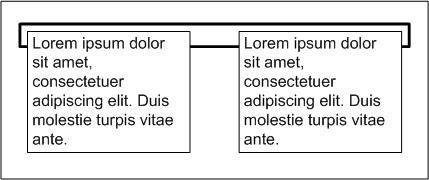
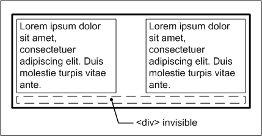
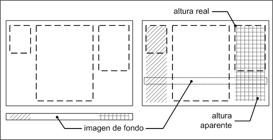
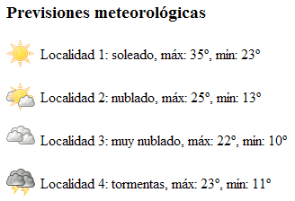

# CSS Avanzado

## Técnicas imprescindibles

En las próximas secciones se muestran las siguientes técnicas imprescindibles:

* Propiedades shorthand para crear hojas de estilos concisas.

* Limpiar floats, para trabajar correctamente con los elementos posicionados de forma flotante.

* Cómo crear elementos de la misma altura, imprescindible para el layout o estructura de las páginas.

* Rollovers y sprites CSS para mejorar el tiempo de respuesta de las páginas.

### Propiedades shorthand

Algunas propiedades del estándar CSS 2.1 son especiales, ya que permiten establecer simultáneamente el valor de varias propiedades diferentes. Este tipo de propiedades se denominan "*propiedades shorthand*" y todos los diseñadores web profesionales las utilizan.

La gran ventaja de las *propiedades shorthand* es que permiten crear hojas de estilos mucho más concisas y por tanto, mucho más fáciles de leer. A continuación se incluye a modo de referencia la definición formal de las seis propiedades shorthand disponibles en el estándar CSS 2.1.

Si se considera la siguiente hoja de estilos:

    [css]
    p {
      font-style: normal;
      font-variant: small-caps;
      font-weight: bold;
      font-size: 1.5em;
      line-height: 1.5;
      font-family: Arial, sans-serif;
    }
    
    div {
      margin-top: 5px;
      margin-right: 10px;
      margin-bottom: 5px;
      margin-left: 10px;
      padding-top: 3px;
      padding-right: 5px;
      padding-bottom: 10px;
      padding-left: 7px;
    }
    
    h1 {
      background-color: #FFFFFF;
      background-image: url("imagenes/icono.png");
      background-repeat: no-repeat;
      background-position: 10px 5px;
    }

Utilizando las propiedades shorthand es posible convertir las 24 líneas que ocupa la hoja de estilos anterior en sólo 10 líneas, manteniendo los mismos estilos:

    [css]
    p {
      font: normal small-caps bold 1.5em/1.5 Arial, sans-serif;
    }
    
    div {
      margin: 5px 10px;
      padding: 3px 5px 10px 7px;
    }
    
    h1 {
      background: #FFF url("imagenes/icono.png") no-repeat 10px 5px;
    }

### Limpiar floats

La principal característica de los elementos posicionados de forma flotante mediante la propiedad `float` es que desaparecen del flujo normal del documento. De esta forma, es posible que algunos o todos los elementos flotantes se salgan de su elemento contenedor.

La siguiente imagen muestra un elemento contenedor que encierra a dos elementos de texto. Como los elementos interiores están posicionados de forma flotante y el elemento contenedor no dispone de más contenidos, el resultado es el siguiente:

El código HTML y CSS del ejemplo anterior se muestra a continuación:

    [html]
    

      
Lorem ipsum dolor sit amet, consectetuer
      adipiscing elit. Duis molestie turpis vitae ante.

      
Lorem ipsum dolor sit amet, consectetuer
      adipiscing elit. Nulla bibendum mi non lacus.

    

    [css]
    #contenedor {
      border: thick solid #000;
    }
     
    #izquierda {
      float: left;
      width: 40%;
    }
     
    #derecha {
      float: right;
      width: 40%;
    }

La solución tradicional de este problema consiste en añadir un elemento invisible después de todos los elementos posicionados de forma flotante para forzar a que el elemento contenedor tenga la altura suficiente. Los elementos invisibles más utilizados son `
`, ` ` y `
`.

De esta forma, si se añade un elemento `
` invisible con la propiedad clear de CSS en el ejemplo anterior:

    [html]
    

      
Lorem ipsum dolor sit amet, consectetuer
      adipiscing elit. Duis molestie turpis vitae ante.

      
Lorem ipsum dolor sit amet, consectetuer
      adipiscing elit. Nulla bibendum mi non lacus.

      
      

    

Ahora el elemento contenedor se visualiza correctamente porque encierra a todos sus elementos:

La técnica de corregir los problemas ocasionados por los elementos posicionados de forma flotante se suele denominar "*limpiar los float*".

Aunque añadir un elemento invisible corrige correctamente el problema, se trata de una solución poco elegante e incorrecta desde el punto de vista semántico. No tiene ningún sentido añadir un elemento vacío en el código HTML, sobre todo si ese elemento se utiliza exclusivamente para corregir el aspecto de los contenidos.

Afortunadamente, existe una solución alternativa para *limpiar los float* que no obliga a añadir nuevos elementos HTML y que además es elegante y muy sencilla. La solución consiste en utilizar la propiedad `overflow` de CSS sobre el elemento contenedor.

Si se modifica el código CSS anterior y se incluye la siguiente regla:

    [css]
    #contenedor {
      border:   thick solid #000;
      overflow: hidden;
    }

Ahora, el contenedor encierra correctamente a los dos elementos `
` interiores y no es necesario añadir ningún elemento adicional en el código HTML. Además del valor hidden, también es posible utilizar el valor auto obteniendo el mismo resultado.

### Elementos de la misma altura

Hasta hace unos años, la estructura de las páginas web complejas se creaba mediante tablas HTML. Aunque esta solución presenta muchos inconvenientes, su principal ventaja es que todas las columnas que forman la página son de la misma altura.

Normalmente, cuando se crea la estructura de una página compleja, se desea que todas las columnas que la forman tengan la misma altura. De hecho, cuando algunas o todas las columnas tienen imágenes o colores de fondo, esta característica es imprescindible para obtener un diseño correcto.

Sin embargo, como el contenido de cada columna suele ser variable, no es posible determinar la altura de la columna más alta y por tanto, no es posible hacer que todas las columnas tengan la misma altura directamente con la propiedad `height`.

Cuando se utiliza una tabla para crear la estructura de la página, este problema no existe porque cada columna de la estructura se corresponde con una celda de datos de la tabla. Sin embargo, cuando se diseña la estructura de la página utilizando sólo CSS, el problema no es tan fácil de solucionar. Afortunadamente, existen varias soluciones para asegurar que dos elementos tengan la misma altura.

El truco consiste en añadir un espacio de relleno inferior (`padding-bottom`) muy grande a todas las columnas y después añadirles un margen inferior negativo (`margin-bottom`) del mismo tamaño.

    [css]
    #contenedor {
      overflow: hidden;
    }
    
    #columna1, #columna2, #columna3 {
      padding-bottom: 32767px;
      margin-bottom: -32767px;
    }

El valor utilizado en el espacio de relleno y en el margen inferior de las columnas debe ser tan grande como la altura esperada para la columna más alta. Para evitar quedarse corto, se recomienda utilizar valores a partir de `10.000` píxeles.

Los dos principales problemas que presenta esta solución son los siguientes:

* Se pueden producir errores al imprimir la página con el navegador Internet Explorer.
* Si se utilizan enlaces de tipo ancla en cualquier columna, al pulsar sobre el enlace las columnas se desplazan de forma ascendente y desaparecen de la página.

Otra solución al problema de los elementos de la misma altura es la que presentó el diseñador Dan Cederholm en su célebre artículo Faux Columns. Si la solución anterior consitía en engañar al navegador, esta segunda solución se basa en engañar al ojo del usuario.

La solución de las columnas falsas consiste en establecer una imagen de fondo repetida verticalmente en el elemento contenedor. Como el contenedor es tan alto como la columna más alta, su imagen de fondo da la sensación de que todas las columnas son de la misma altura.

El principal inconveniente de esta técnica es que sólo se puede emplear cuando la estructura de la página es de anchura fija, es decir, cuando su diseño no es líquido y no se adapta a la anchura de la ventana del navegador.

Las dos soluciones planteadas hasta el momento consisten en trucos para engañar a los navegadores y a los usuarios. A continuación se presenta la única solución técnicamente correcta para forzar a que dos elementos muestren la misma altura.

La solución fue propuesta por el diseñador Roger Johansson en su artículo Equal height boxes with CSS y se basa en el uso avanzado de la propiedad `display` de CSS.

En primer lugar, es necesario añadir un elemento adicional (`
`) en el código HTML de la página:

    [html]
    

      

        

        

        

      

    

A continuación, se utiliza la propiedad display de CSS para mostrar los elementos `
` anteriores como si fueran celdas de una tabla de datos:

    [css]
    #contenedor {
      display: table;
    }
    
    #contenidos {
      display: table-row;
    }
    
    #columna1, #columna2, #columna3 {
      display: table-cell;
    }

Gracias a la propiedad `display` de CSS, cualquier elemento se puede comportar como una tabla, una fila de tabla o una celda de tabla, independientemente del tipo de elemento que se trate.

De esta forma, los elementos `
` que forman las columnas de la página en realidad se comportan como celdas de tabla, lo que permite que el navegador las muestre con la misma altura.

### Rollovers y sprites

Según varios estudios realizados por Yahoo!, hasta el 80% de la mejora en el rendimiento de la descarga de páginas web depende de la parte del cliente. En el artículo [Performance Research, Part 1: What the 80/20 Rule Tells Us about Reducing HTTP Requests Yahoo!](http://yuiblog.com/blog/2006/11/28/performance-research-part-1/) explica que generar dinámicamente el código HTML de la página y servirla ocupa el 20% del tiempo total de descarga de la página. El 80% del tiempo restante los navegadores descargan las imágenes, archivos JavaScript, hojas de estilos y cualquier otro tipo de archivo enlazado.

Además, en la mayoría de páginas web *normales*, la mayor parte de ese 80% del tiempo se dedica a la descarga de las imágenes. Por tanto, aunque los mayores esfuerzos siempre se centran en reducir el tiempo de generación dinámica de las páginas, se consigue más y con menos esfuerzo mejorando la descarga de las imágenes.

La idea para mejorar el rendimiento de una página que descarga por ejemplo 15 imágenes consiste en crear una única imagen grande que incluya las 15 imágenes individuales y utilizar las propiedades CSS de las imágenes de fondo para mostrar cada imagen. Esta técnica se presentó en el artículo [CSS Sprites: Image Slicing’s Kiss of Death](http://www.alistapart.com/articles/sprites) y desde entonces se conoce con el nombre de sprites CSS.

El siguiente ejemplo explica el uso de los *sprites* CSS en un sitio web que muestra la previsión meteorológica de varias localidades utilizando iconos:

La solución tradicional para crear la página anterior consiste en utilizar cuatro elementos  en el código HTML y disponer de cuatro imágenes correspondientes a los cuatro iconos:

    [html]
    <h3>Previsiones meteorológicas</h3>
    

        
        Localidad 1: soleado, máx: 35º, mín: 23º
    

    

        
        Localidad 2: nublado, máx: 25º, mín: 13º
    

    

        
        Localidad 3: muy nublado, máx: 22º, mín: 10º
    

    

        
        Localidad 4: tormentas, máx: 23º, mín: 11º
    

Aunque es una solución sencilla y que funciona muy bien, se trata de una solución completamente ineficiente. El navegador debe descargar cuatro imágenes diferentes para mostrar la página, por lo que debe realizar cuatro peticiones al servidor.

Después del tamaño de los archivos descargados, el número de peticiones realizadas al servidor es el factor que más penaliza el rendimiento en la descarga de páginas web. Utilizando la técnica de los sprites CSS se va a rehacer el ejemplo anterior para conseguir el mismo efecto con una sola imagen y por tanto, una sola petición al servidor.

El primer paso consiste en crear una imagen grande que incluya las cuatro imágenes individuales. Como los iconos son cuadrados de tamaño `32px`, se crea una imagen de `32px` x `128px`:

Para facilitar el uso de esta técnica, todas las imágenes individuales ocupan el mismo sitio dentro de la imagen grande. De esta forma, los cálculos necesarios para desplazar la imagen de fondo se simplifican al máximo.

El siguiente paso consiste en simplificar el código HTML:

    [html]
    <h3>Previsiones meteorológicas</h3>
    

        Localidad 1: soleado, máx: 35º, mín: 23º
    

    

        Localidad 2: nublado, máx: 25º, mín: 13º
    

    

        Localidad 3: muy nublado, máx: 22º, mín: 10º
    

    

        Localidad 4: tormentas, máx: 23º, mín: 11º
    

La clave de la técnica de los sprites CSS consiste en mostrar las imágenes mediante la propiedad `background-image`. Para mostrar cada vez una imagen diferente, se utiliza la propiedad `background-position` que desplaza la imagen de fondo teniendo en cuenta la posición de cada imagen individual dentro de la imagen grande:

    [css]
    #localidad1, #localidad2, #localidad3, #localidad4 {
      padding-left: 38px;
      height: 32px;
      line-height: 32px;
      background-image: url("imagenes/sprite.png");
      background-repeat: no-repeat;
    }
     
    #localidad1 {
      background-position: 0 0;
    }
    #localidad2 {
      background-position: 0 -32px;
    }
    #localidad3 {
      background-position: 0 -64px;
    }
    #localidad4 {
      background-position: 0 -96px;
    }

La siguiente imagen muestra lo que sucede con el segundo párrafo:

El párrafo tiene establecida una altura de `32px`, idéntica al tamaño de los iconos. Después de añadir un `padding-left` al párrafo, se añade la imagen de fondo mediante `background-image`. Para cambiar de una imagen a otra, sólo es necesario desplazar de forma ascendente o descendente la imagen grande.

Si se quiere mostrar la segunda imagen, se desplaza de forma ascendente la imagen grande. Para desplazarla en ese sentido, se utilizan valores negativos en el valor indicado en la propiedad `background-position`. Por último, como la imagen grande ha sido especialmente preparada, se sabe que el desplazamiento necesario son `32 píxel`, por lo que la regla CSS de este segundo elemento resulta en:

    [css]
    #localidad2 {
      padding-left: 38px;
      height: 32px;
      line-height: 32px;
      background-image: url("imagenes/sprite.png");
      background-repeat: no-repeat;
      background-position: 0 -32px;
    }

La solución original utilizaba cuatro imágenes y realizaba cuatro peticiones al servidor. La solución basada en sprites CSS sólo realiza una conexión para descargar una sola imagen. Además, los iconos del proyecto Tango que se han utilizado en este ejemplo ocupan 7.441 bytes cuando se suman los tamaños de los cuatro iconos por separado. Por su parte, la imagen grande que contiene los cuatro iconos sólo ocupa 2.238 bytes.

Los *sprites* que incluyen todas sus imágenes verticalmente son los más fáciles de manejar. Si en el ejemplo anterior se emplea un sprite con las imágenes dispuestas también horizontalmente:

Aparentemente, utilizar este nuevo sprite sólo implica que la imagen de fondo se debe desplazar también horizontalmente:

    [css]
    #localidad1, #localidad2, #localidad3, #localidad4 {
      padding-left: 38px;
      height: 32px;
      line-height: 32px;
      background-image: url("imagenes/sprite.png");
      background-repeat: no-repeat;
    }
     
    #localidad1 {
      background-position: 0 0;
    }
    #localidad2 {
      background-position: -32px 0;
    }
    #localidad3 {
      background-position: 0 -32px;
    }
    #localidad4 {
      background-position: -32px -32px;
    }

El problema del *sprite* anterior es que cuando una imagen tiene a su derecha o a su izquierda otras imágenes, estas también se ven:

La solución de este problema es sencilla, aunque requiere algún cambio en el código HTML:

    [html]
    <h3>Previsiones meteorológicas</h3>
    

        
        Localidad 1: soleado, máx: 35º, mín: 23º
    

    

        
        Localidad 2: nublado, máx: 25º, mín: 13º
    

    

        
        Localidad 3: muy nublado, máx: 22º, mín: 10º
    

    

        
        Localidad 4: tormentas, máx: 23º, mín: 11º
    

El código anterior muestra uno de los trucos habituales para manejar sprites complejos. En primer lugar se añade una imagen transparente de `1px` x `1px` a todos los elementos mediante una etiqueta ``. A continuación, desde CSS se establece una imagen de fondo a cada elemento `` y se limita su tamaño para que no deje ver las imágenes que se encuentran cerca:

    [css]
    #localidad1 img, #localidad2 img, #localidad3 img, #localidad4 img {
      height: 32px;
      width: 32px;
      background-image: url("imagenes/sprite2.png");
      background-repeat: no-repeat;
      vertical-align: middle;
    }
    
    #localidad1 img {
      background-position: 0 0;
    }
    #localidad2 img {
      background-position: -32px 0;
    }
    #localidad3 img {
      background-position: 0 -32px;
    }
    #localidad4 img {
      background-position: -32px -32px;
    }

Utilizar *sprites* CSS es una de las técnicas más eficaces para mejorar los tiempos de descarga de las páginas web complejas. La siguiente imagen muestra un *sprite* complejo que incluye 241 iconos del proyecto Tango y sólo ocupa 42 KB:

La mayoría de sitios web profesionales utilizan *sprites* para mostrar sus imágenes de adorno. La siguiente imagen muestra un *sprite* del sitio web Flickr:

Los principales inconvenientes de los *sprites* CSS son la poca flexibilidad que ofrece (añadir o modificar una imagen individual no es inmediato) y el esfuerzo necesario para crear el *sprite*.

Afortunadamente, existen aplicaciones web como [CSS Sprite Generator](http://spritegen.website-performance.org/) que generan el *sprite* a partir de un archivo comprimido en formato ZIP con todas las imágenes individuales.

## Selectores

Conocer y dominar todos los selectores de CSS es imprescindible para crear diseños web profesionales. El estándar de CSS 2.1 incluye una docena de tipos diferentes de selectores, que permiten seleccionar de forma muy precisa elementos individuales o conjuntos de elementos dentro de una página web.

Utilizando solamente los cinco selectores básicos de CSS 2.1 (universal, de tipo, descendente, de clase y de id) es posible diseñar cualquier página web. No obstante, los selectores avanzados de CSS 2.1 permiten simplificar las reglas CSS y también el código HTML.

### Selector de hijos

Se trata de un selector similar al selector descendente, pero muy diferente en su funcionamiento. Se utiliza para seleccionar un elemento que es *hijo* de otro elemento y se indica mediante el "*signo de mayor que*" (`>`).

Mientras que en el selector descendente sólo importa que un elemento esté dentro de otro, independientemente de lo profundo que se encuentre, en el selector de hijos el elemento debe ser *hijo* directo de otro elemento.

    [css]
    p > span { color: blue; }

    [html]
    

      Texto1
    

    
    

      <a href="#">
        Texto2
      </a>
    

En el ejemplo anterior, el selector `p > span` se interpreta como "*cualquier elemento `` que sea hijo directo de un elemento `
`*", por lo que el primer elemento `` cumple la condición del selector. Sin embargo, el segundo elemento `` no la cumple porque es descendiente pero no es hijo directo de un elemento `
`.

Utilizando el mismo ejemplo anterior se pueden comparar las diferencias entre el selector descendente y el selector de hijos:

    [css]
    p a { color: red; }
    p > a { color: red; }

    [html]
    

      <a href="#">Enlace1</a>
    

    
    

      
        <a href="#">Enlace2</a>
      
    

El primer selector es de tipo descendente (`p a`) y por tanto se aplica a todos los elementos `<a>` que se encuentran dentro de elementos `
`. En este caso, los estilos de este selector se aplican a los dos enlaces.

El segundo selector es de hijos (`p > a`) por lo que obliga a que el elemento `<a>` sea hijo directo de un elemento `
`. Por tanto, los estilos del selector `p > a` no se aplican al segundo enlace del ejemplo anterior.

### Selector adyacente

El selector adyacente se emplea para seleccionar elementos que son hermanos (su elemento padre es el mismo) y están seguidos en el código HTML. Este selector emplea en su sintaxis el símbolo `+`. Si se considera el siguiente ejemplo:

    [css]
    h1 + h2 { color: red }

    [html]
    <body>
        <h1>Titulo1</h1>
         
        <h2>Subtítulo</h2>
        ...
         
        <h2>Otro subtítulo</h2>
        ...
    </body>

Los estilos del selector `h1 + h2` se aplican al primer elemento `<h2>` de la página, pero no al segundo `<h2>`, ya que:

* El elemento padre de `<h1>` es `<body>`, el mismo padre que el de los dos elementos `<h2>`. Así, los dos elementos `<h2>` cumplen la primera condición del selector adyacente.
* El primer elemento `<h2>` aparece en el código HTML justo después del elemento `<h1>`, por lo que este elemento `<h2>` también cumple la segunda condición del selector adyacente.
* Por el contrario, el segundo elemento `<h2>` no aparece justo después del elemento `<h1>`, por lo que no cumple la segunda condición del selector adyacente y por tanto no se le aplican los estilos de `h1 + h2`.

El siguiente ejemplo puede ser útil para los textos que se muestran como libros:

    [css]
    p + p { text-indent: 1.5em; }

En muchos libros es habitual que la primera línea de todos los párrafos esté indentada, salvo la primera línea del primer párrafo. El selector `p + p` selecciona todos los párrafos que están dentro de un mismo elemento padre y que estén precedidos por otro párrafo. En otras palabras, el selector `p + p` selecciona todos los párrafos de un elemento salvo el primer párrafo.

El selector adyacente requiere que los dos elementos sean hermanos, por lo que su elemento padre debe ser el mismo. Si se considera el siguiente ejemplo:

    [css]
    p + p { color: red; }

    [html]
    
Lorem ipsum dolor sit amet...

    
Lorem ipsum dolor sit amet...

    

      
Lorem ipsum dolor sit amet...

    

En el ejemplo anterior, solamente el segundo párrafo se ve de color rojo, ya que:

* El primer párrafo no va precedido de ningún otro párrafo, por lo que no cumple una de las condiciones de `p + p`
* El segundo párrafo va precedido de otro párrafo y los dos comparten el mismo padre, por lo que se cumplen las dos condiciones del selector `p + p` y el párrafo muestra su texto de color rojo.
* El tercer párrafo se encuentra dentro de un elemento `
`, por lo que no se cumple ninguna condición del selector `p + p` ya que ni va precedido de un párrafo ni comparte padre con ningún otro párrafo.

### Selector de atributos

El último tipo de selectores avanzados lo forman los selectores de atributos, que permiten seleccionar elementos HTML en función de sus atributos y/o valores de esos atributos.

Los cuatro tipos de selectores de atributos son:

* `[nombre_atributo]`, selecciona los elementos que tienen establecido el atributo llamado nombre_atributo, independientemente de su valor.
* `[nombre_atributo=valor]`, selecciona los elementos que tienen establecido un atributo llamado nombre_atributo con un valor igual a valor.
* `[nombre_atributo~=valor]`, selecciona los elementos que tienen establecido un atributo llamado nombre_atributo y cuyo valor es una lista de palabras separadas por espacios en blanco en la que al menos una de ellas es exactamente igual a valor.
* `[nombre_atributo|=valor]`, selecciona los elementos que tienen establecido un atributo llamado nombre_atributo y cuyo valor es una serie de palabras separadas con guiones, pero que comienza con valor. Este tipo de selector sólo es útil para los atributos de tipo lang que indican el idioma del contenido del elemento.

A continuación se muestran algunos ejemplos de estos tipos de selectores:

    [css]
    /* Se muestran de color azul todos los enlaces que tengan un atributo "class", independientemente de su valor */
    a[class] { color: blue; }
    
    /* Se muestran de color azul todos los enlaces que tengan un atributo "class" con el valor "externo" */
    a[class="externo"] { color: blue; }
    
    /* Se muestran de color azul todos los enlaces que apunten al sitio "http://www.ejemplo.com" */
    a[href="http://www.ejemplo.com"] { color: blue; }
    
    /* Se muestran de color azul todos los enlaces que tengan un atributo "class" en el que al menos uno de sus valores sea "externo" */
    a[class~="externo"] { color: blue; }
    
    /* Selecciona todos los elementos de la página cuyo atributo "lang" sea igual a "en", es decir, todos los elementos en inglés */
    *[lang=en] { ... }
    
    /* Selecciona todos los elementos de la página cuyo atributo "lang" empiece por "es", es decir, "es", "es-ES", "es-AR", etc. */
    *[lang|="es"] { color : red }

### Pseudo-clases

#### La pseudo-clase :first-child

La pseudo-clase `:first-child` selecciona el primer elemento hijo de un elemento. Si se considera el siguiente ejemplo:

    [css]
    p em:first-child {
      color: red;
    }

    [html]
    
Lorem <em>ipsum dolor</em> sit amet, consectetuer adipiscing elit. Praesent odio sem, tempor quis, <em>auctor eu</em>, tempus at, enim. Praesent nulla ante, <em>ultricies</em> id, porttitor ut, pulvinar quis, dui.

El selector `p em:first-child` selecciona el primer elemento `<em>` que sea hijo de un elemento y que se encuentre dentro de un elemento `
`. Por tanto, en el ejemplo anterior sólo el primer `<em>` se ve de color rojo.

La pseudo-clase `:first-child` también se puede utilizar en los selectores simples, como se muestra a continuación:

    [css]
    p:first-child { ... }

La regla CSS anterior aplica sus estilos al primer párrafo de cualquier elemento. Si se modifica el ejemplo anterior y se utiliza un selector compuesto:

    [css]
    p:first-child em {
      color: red;
    }

    [html]
    <body>
        
Lorem <em>ipsum dolor</em> sit amet, consectetuer
        adipiscing elit. Praesent odio sem, tempor quis, <em>auctor eu</em>,
        tempus at, enim.

         
        
Lorem <em>ipsum dolor</em> sit amet, consectetuer
        adipiscing elit. Praesent odio sem, tempor quis, <em>auctor eu</em>,
        tempus at, enim.

         
        

          
Lorem <em>ipsum dolor</em> sit amet, consectetuer
          adipiscing elit. Praesent odio sem, tempor quis, <em>auctor eu</em>,
          tempus at, enim.

        

    </body>

El selector `p:first-child em` selecciona todos aquellos elementos `<em>` que se encuentren dentro de un elemento `
` que sea el primer hijo de cualquier otro elemento.

El primer párrafo del ejemplo anterior es el primer hijo de `<body>`, por lo que sus `<em>` se ven de color rojo. El segundo párrafo de la página no es el primer hijo de ningún elemento, por lo que sus elementos `<em>` interiores no se ven afectados. Por último, el tercer párrafo de la página es el primer hijo del elemento `
`, por lo que sus elementos `<em>` se ven de la misma forma que los del primer párrafo.

#### Las pseudo-clases :link y :visited

Las pseudo-clases `:link` y `:visited` se pueden utilizar para aplicar diferentes estilos a los enlaces de una misma página:

* La pseudo-clase `:link` se aplica a todos los enlaces que todavía no han sido visitados por el usuario.
* La pseudo-clase `:visited` se aplica a todos los enlaces que han sido visitados al menos una vez por el usuario.

El navegador gestiona de forma automática el cambio de enlace no visitado a enlace visitado. Aunque el usuario puede borrar la cache y el historial de navegación de forma explícita, los navegadores también borran de forma periódica la lista de enlaces visitados.

Por su propia definición, las pseudo-clases `:link` y `:visited` son mutuamente excluyentes, de forma que un mismo enlace no puede estar en los dos estados de forma simultánea.

Como los navegadores muestran por defecto los enlaces de color azul y los enlaces visitados de color morado, es habitual modificar los estilos para adaptarlos a la guía de estilo del sitio web:

    [css]
    a:link    { color: red;   }
    a:visited { color: green; }

#### Las pseudo-clases :hover, :active y :focus

Las pseudo-clases `:hover`, `:active` y `:focus` permiten al diseñador web variar los estilos de un elemento en respuesta a las acciones del usuario. Al contrario que las pseudo-clases `:link` y `:visited` que sólo se pueden aplicar a los enlaces, estas pseudo-clases se pueden aplicar a cualquier elemento.

A continuación se indican las acciones del usuario que activan cada pseudo-clase:

* `:hover`, se activa cuando el usuario pasa el ratón o cualquier otro elemento apuntador por encima de un elemento.
* `:active`, se activa cuando el usuario activa un elemento, por ejemplo cuando pulsa con el ratón sobre un elemento. El estilo se aplica durante un espacio de tiempo prácticamente imperceptible, ya que sólo dura desde que el usuario pulsa el botón del ratón hasta que lo suelta.
* `:focus`, se activa cuando el elemento tiene el foco del navegador, es decir, cuando el elemento está seleccionado. Normalmente se aplica a los elementos `<input>` de los formularios cuando están activados y por tanto, se puede escribir directamente en esos campos.

De las definiciones anteriores se desprende que un mismo elemento puede verse afectado por varias pseudo-clases diferentes de forma simultánea. Cuando se pulsa por ejemplo un enlace que fue visitado previamente, al enlace le afectan las pseudo-clases `:visited`, `:hover` y `:active`.

Debido a esta característica y al comportamiento en cascada de los estilos CSS, es importante cuidar el orden en el que se establecen las diferentes pseudo-clases. El siguiente ejemplo muestra el único orden correcto para establecer las cuatro pseudo-clases principales en un enlace:

    [css]
    a:link    { ... }
    a:visited { ... }
    a:hover   { ... }
    a:active  { ... }

Por último, también es posible aplicar estilos combinando varias pseudo-clases compatibles entre sí. La siguiente regla CSS por ejemplo sólo se aplica a aquellos enlaces que están seleccionados y en los que el usuario pasa el ratón por encima:

    [css]
    a:focus:hover { ... }

#### La pseudo-clase :lang

La pseudo-clase `:lang` se emplea para seleccionar elementos en función de su idioma. Los navegadores utilizan los atributos `lang`, las etiquetas `<meta>` y la información de la respuesta del servidor para determinar el idioma de cada elemento.

Si se considera el siguiente ejemplo:

    [css]
    p { color: blue; }
    p:lang(es) { color: red; }

Los párrafos del ejemplo anterior se ven de color azul, salvo los párrafos cuyo contenido esté escrito en español, que se ven de color rojo.

Como los navegadores actuales no son capaces de inferir el idioma de un elemento a partir de su contenido, el uso de esta clase está muy limitado salvo que la página utilice de forma explícita los atributos `lang:

    [html]
    
Lorem ipsum dolor sit amet...

    

        
Lorem ipsum dolor sit amet...

        
Lorem ipsum dolor sit amet...

    

    
Lorem ipsum dolor sit amet...

    <ul>
      <li lang="fr">Lorem ipsum dolor sit amet...</li>
    </ul>

La pseudo-clase `:lang(xx)` es muy diferente al selector de atributos `[lang|=xx], tal y como muestran las siguientes reglas:

    [css]
    *[lang|=es] { ... }  /* selector de atributo */
    *:lang(es)  { ... }  /* pseudo-clase */

    [html]
    <body lang="es">
      
Lorem ipsum dolor sit amet...

    </body>

El selector `*[lang|=es]` selecciona todos los elementos de la página que tengan un atributo llamado `lang` cuyo valor empiece por `es`. En el ejemplo anterior, solamente el elemento `<body>` cumple con la condición del selector.

Por otra parte, el selector `*:lang(es)` selecciona todos los elementos de la página cuyo idioma sea el español, sin tener en cuenta el método empleado por el navegador para averiguar el idioma de cada elemento. En este caso, tanto el elemento `<body>` como el elemento `
` cumplen esta condición.

## Pseudo-elementos

Los selectores de CSS, las pseudo-clases y todos los elementos HTML no son suficientes para poder aplicar estilos a algunos elementos especiales. Si se desea por ejemplo cambiar el estilo de la primera línea de texto de un elemento, no es posible hacerlo con las utilidades anteriores.

La primera línea del texto normalmente es variable porque el usuario puede aumentar y disminuir la ventana del navegador, puede disponer de más o menos resolución en su monitor y también puede aumentar o disminuir el tamaño de letra del texto.

La única forma de poder seleccionar estos elementos especiales es mediante los pseudo-elementos definidos por CSS para este propósito.

### El pseudo-elemento :first-line

El pseudo-elemento `:first-line` permite seleccionar la primera línea de texto de un elemento. Así, la siguiente regla CSS muestra en mayúsculas la primera línea de cada párrafo:

    [css]
    p:first-line { text-transform: uppercase; }

Este pseudo-elemento sólo se puede utilizar con los elementos de bloque y las celdas de datos de las tablas.

Se pueden combinar varios pseudo-elementos de tipo :first-line para crear efectos avanzados:

    [css]
    div:first-line { color: red; }
    p:first-line { text-transform: uppercase; }

    [html]
    

      
Lorem ipsum dolor sit amet...

      
Lorem ipsum dolor sit amet...

      
Lorem ipsum dolor sit amet...

    

En el ejemplo anterior, la primera línea del primer párrafo también es la primera línea del elemento `
`, por lo que se le aplican las dos reglas CSS y su texto se ve en mayúsculas y de color rojo.

### El pseudo-elemento :first-letter
El pseudo-elemento :first-letter permite seleccionar la primera letra de la primera línea de texto de un elemento. De esta forma, la siguiente regla CSS muestra en mayúsculas la primera letra del texto de cada párrafo:

    [css]
    p:first-letter { text-transform: uppercase; }

Los signos de puntuación y los caracteres como las comillas que se encuentran antes y después de la primera letra también se ven afectados por este pseudo-elemento.

Este pseudo-elemento sólo se puede utilizar con los elementos de bloque y las celdas de datos de las tablas.

### Los pseudo-elementos :before y :after

Los pseudo-elementos `:before` y `:after` se utilizan en combinación con la propiedad content de CSS para añadir contenidos antes o después del contenido original de un elemento.

Las siguientes reglas CSS añaden el texto `Capítulo -` delante de cada título de sección `<h1>` y el carácter `.` detrás de cada párrafo de la página:

    [css]
    h1:before { content: "Capítulo - "; }
    p:after   { content: "."; }

El contenido insertado mediante los pseudo-elementos `:before` y `:after` se tiene en cuenta en los otros pseudo-elementos `:first-line` y `:first-letter`.

## Propiedades avanzadas

El estándar CSS 2.1 incluye 115 propiedades que abarcan el modelo de cajas (box model), la tipografía, las tablas, las listas, el posicionamiento de los elementos, la generación de contenidos y los medios impresos y auditivos.

Aunque la mayoría de diseñadores web conocen y utilizan casi todas las propiedades de CSS 2.1, no siempre hacen uso de todas sus posibilidades. Algunas propiedades de CSS 2.1 han sido infrautilizadas hasta hace poco tiempo porque los navegadores no las soportaban.

### Propiedad display

| Propiedad             | `display`    |
| --------------------: | :------------- |
| **Valores** | inline \| block \| list-item \| run-in \| inline-block \| table \| inline-table \| table-row-group \| table-header-group \| table-footer-group \| table-row \| table-column-group \| table-column \| table-cell \| table-caption \| none \| inherit |
| **Se aplica a** | Todas los elementos |
| **Valor inicial**  | inline |
| **Descripción**       | Establece el tipo de caja generada por un elemento |

La propiedad `display` es una de las propiedades CSS más infrautilizadas. Aunque todos los diseñadores conocen esta propiedad y utilizan sus valores `inline`, `block` y `none`, las posibilidades de `display` son mucho más avanzadas.

De hecho, la propiedad `display` es una de las más complejas de CSS 2.1, ya que establece el tipo de la caja que genera cada elemento. La propiedad `display` es tan compleja que casi ningún navegador es capaz de mostrar correctamente todos sus valores.

El valor más sencillo de `display` es `none` que hace que el elemento no genere ninguna caja. El resultado es que el elemento desaparece por completo de la página y no ocupa sitio, por lo que los elementos adyacentes ocupan su lugar. Si se utiliza la propiedad `display: none` sobre un elemento, todos sus descendientes también desaparecen por completo de la página.

Si se quiere hacer un elemento invisible, es decir, que no se vea pero que siga ocupando el mismo sitio, se debe utilizar la propiedad `visibility`. La propiedad `display: none` se utiliza habitualmente en aplicaciones web dinámicas creadas con JavaScript y que muestran/ocultan contenidos cuando el usuario realiza alguna acción como pulsar un botón o un enlace.

Los otros dos valores más utilizados son `block` e `inline` que hacen que la caja de un elemento sea de bloque o en línea respectivamente. El siguiente ejemplo muestra un párrafo y varios enlaces a los que se les ha añadido un borde para mostrar el espacio ocupado por cada caja:

Lorem ipsum dolor sit amet, consectetuer adipiscing elit.

<a style="border: 2px dashed #C00; padding: 3px;" href="#">Lorem ipsum</a>
<a style="border: 2px dashed #C00; padding: 3px;" href="#">Donec mollis nunc in leo</a>
<a style="border: 2px dashed #C00; padding: 3px;" href="#">Vivamus fermentum</a>

Como el párrafo es por defecto un elemento de bloque ("*block element*"), ocupa todo el espacio disponible hasta el final de su línea, aunque sus contenidos no ocupen todo el sitio. Por su parte, los enlaces por defecto son elementos en línea ("*inline element*"), por lo que su caja sólo ocupa el espacio necesario para mostrar sus contenidos.

Si se aplica la propiedad `display: inline` al párrafo del ejemplo anterior, su caja se convierte en un elemento en línea y por tanto sólo ocupa el espacio necesario para mostrar sus contenidos:

<strong>[display: inline]</strong> Lorem ipsum dolor sit amet, consectetuer adipiscing elit.

<a style="border: 2px dashed #C00; padding: 3px;" href="#">Lorem ipsum</a>
<a style="border: 2px dashed #C00; padding: 3px;" href="#">Donec mollis nunc in leo</a>
<a style="border: 2px dashed #C00; padding: 3px;" href="#">Vivamus fermentum</a>

Para visualizar más claramente el cambio en el tipo de caja, el siguiente ejemplo muestra un mismo párrafo largo con `display: block` y `display: inline`:

<strong>[display: block]</strong> Lorem ipsum dolor sit amet, consectetuer adipiscing elit. Sed non sem quis tellus vulputate lobortis. Vivamus fermentum, tortor id ornare ultrices, ligula ipsum tincidunt pede, et blandit sem pede suscipit pede. Nulla cursus porta sem. Donec mollis nunc in leo.

<strong>[display: inline]</strong> Lorem ipsum dolor sit amet, consectetuer adipiscing elit. Sed non sem quis tellus vulputate lobortis. Vivamus fermentum, tortor id ornare ultrices, ligula ipsum tincidunt pede, et blandit sem pede suscipit pede. Nulla cursus porta sem. Donec mollis nunc in leo.

De la misma forma, si en los enlaces del ejemplo anterior se emplea la propiedad `display: block` se transforman en elementos de bloque, por lo que siempre empiezan en una nueva línea y siempre ocupan todo el espacio disponible en la línea, aunque sus contenidos no ocupen todo el sitio:

Lorem ipsum dolor sit amet, consectetuer adipiscing elit.

<a style="border: 2px dashed #C00; padding: 3px; margin: 3px 0; display: block;" href="#"><strong>[display: block]</strong> Lorem ipsum</a>
<a style="border: 2px dashed #C00; padding: 3px; margin: 3px 0; display: block;" href="#"><strong>[display: block]</strong> Donec mollis nunc in leo</a>
<a style="border: 2px dashed #C00; padding: 3px; margin: 3px 0; display: block;" href="#"><strong>[display: block]</strong> Vivamus fermentum</a>

Uno de los valores más curiosos de display es `inline-block`, que crea cajas que son de bloque y en línea de forma simultánea. Una caja de tipo `inline-block` se comporta como si fuera de bloque, pero respecto a los elementos que la rodean es una caja en línea.

El enlace del siguiente ejemplo es de tipo `inline-block`, lo que permite por ejemplo establecerle un tamaño mediante la propiedad `width`:

Lorem ipsum dolor sit amet, consectetuer adipiscing elit. Sed non sem quis tellus vulputate lobortis. Vivamus fermentum, tortor id ornare ultrices, ligula ipsum tincidunt pede, et blandit sem pede suscipit pede. Nulla cursus porta sem. Donec mollis nunc in leo. <a class="internal" href="../" style="display: inline-block; border: 2px dashed #C00; width: 25%; padding: 3px; margin: 5px;"><strong>[display: inline-block, width: 25%]</strong> Quisque semper, magna sed pharetra tincidunt, quam urna dapibus dolor, a dignissim sem neque id purus. Etiam luctus viverra nisi.</a> Integer lobortis accumsan felis. Cras venenatis. Morbi cursus, tellus vitae iaculis pulvinar, turpis nibh posuere nisl, sed vehicula massa orci at dui. Morbi pede ipsum, porta quis, venenatis et, ullamcorper in, metus. Nulla facilisi. Quisque laoreet molestie mi. Ut mollis elit eget urna.

Otro de los valores definidos por la propiedad display es `list-item`, que hace que cualquier elemento de cualquier tipo se muestre como si fuera un elemento de una lista (elemento `<li>`). El siguiente ejemplo muestra tres párrafos que utilizan la propiedad `display: list-item` para simular que son una lista de elementos de tipo `<ul>`:

Lorem ipsum dolor sit amet, consectetuer adipiscing elit.

Sed non sem quis tellus vulputate lobortis.

Vivamus fermentum, tortor id ornare ultrices, ligula ipsum tincidunt pede, et blandit sem pede suscipit pede.

A continuación se muestra el código HTML del ejemplo anterior:

    [html]
    
Lorem ipsum dolor sit amet, consectetuer adipiscing elit.

    
Sed non sem quis tellus vulputate lobortis.

    
Vivamus fermentum, tortor id ornare ultrices, ligula ipsum tincidunt pede, et blandit sem pede suscipit pede.

Los elementos con la propiedad `display: list-item` son exactamente iguales que los elementos `<li>` a efectos de su visualización, por lo que se pueden utilizar las propiedades de listas como `list-style-type`, `list-style-image`, `list-style-position` y `list-style`.

Otro de los valores curiosos de la propiedad `display` es `run-in`, que genera una caja de bloque o una caja en línea dependiendo del contexto, es decir, dependiendo de sus elementos adyacentes. El comportamiento de las cajas de tipo `run-in` se rige por las siguientes reglas:

* Si la caja `run-in` contiene una caja de bloque, la caja `run-in` se convierte en una caja de bloque.
* Si después de la caja `run-in` se encuentra una caja de bloque (que no esté posicionada de forma absoluta y tampoco esté posicionada de forma flotante), la caja `run-in` se convierte en una caja en línea en el interior de la caja de bloque.
* En cualquier otro caso, la caja `run-in` se convierte en una caja de bloque.

<strong>[display: run-in]</strong> Lorem ipsum

<strong>[display: block]</strong> dolor sit amet, consectetuer adipiscing elit.

<strong>[display: run-in]</strong> Lorem ipsum

<strong>[display: inline]</strong> dolor sit amet, consectetuer adipiscing elit.

El estándar CSS 2.1 incluye un ejemplo del posible uso del valor `run-in`. En este ejemplo, un título de sección `<h3>` crea una caja `run-in`, de forma que cuando va seguido de un párrafo, el titular se mete dentro del párrafo:

    [html]
    <h3 style="display: run-in">Lorem ipsum dolor sit amet</h3>
    
Sed non sem quis tellus vulputate lobortis. Vivamus fermentum, tortor id ornare ultrices, ligula ipsum tincidunt pede, et blandit sem pede suscipit pede. Nulla cursus porta sem. Donec mollis nunc in leo. Integer lobortis accumsan felis.

El resto de valores de la propiedad `display` están relacionados con las tablas y hacen que un elemento se muestre como si fuera una parte de una tabla: fila, columna, celda o grupos de filas/columnas. Los valores definidos por la propiedad `display` son `inline-table, table-row-group, table-header-group, table-footer-group, table-row, table-column-group, table-column, table-cell, table-caption`.

Aunque los valores relacionados con las tablas son los más avanzados, también son los que peor soportan los navegadores. A continuación se muestra un ejemplo con tres párrafos de texto que establecen la propiedad `display: table-cell`:

<strong>[display: table-cell]</strong> Lorem ipsum dolor sit amet, consectetuer adipiscing elit. Maecenas non tortor. Vestibulum ante ipsum primis in faucibus orci luctus et ultrices posuere cubilia Curae; Sed fermentum lorem a velit.

<strong>[display: table-cell]</strong> In molestie suscipit libero. Cras sem. Nunc non tellus et urna mattis tempor. Nulla nec tellus a quam hendrerit venenatis. Suspendisse pellentesque odio et est. Morbi sed nisl sed dui consequat sodales.

<strong>[display: table-cell]</strong> Morbi sed nisl sed dui consequat sodales. Vivamus ornare felis nec est. Phasellus massa justo, ornare sed, malesuada a, dignissim a, nibh. Vestibulum vitae nunc at lectus euismod feugiat. Nullam eleifend. Class aptent taciti sociosqu ad litora torquent per conubia nostra, per inceptos himenaeos. In ut ipsum.

La propiedad `display: table-cell` hace que cualquier elemento se muestre como si fuera una celda de una tabla. Como en el ejemplo anterior los tres elementos `
` utilizan la propiedad `display: table-cell`, el resultado es visualmente idéntico a utilizar una tabla y tres elementos `<td>`.

### Propiedad content

| Propiedad             | `content`    |
| --------------------: | :------------- |
| **Valores** | (string \|| uri \|| counter \|| attr \|| open-quote \|| close-quote \|| no-open-quote \|| no-close-quote) \| normal \| none \| inherit |
| **Se aplica a** | Solamente a los pseudo-elementos before y after |
| **Valor inicial**  | normal |
| **Descripción**       | Genera contenido de forma dinámica |

La propiedad `content` es una de las propiedades CSS más poderosas y a la vez más controvertidas. La propiedad `content` se emplea para generar nuevo contenido de forma dinámica e insertarlo en la página HTML. Como CSS es un lenguaje de hojas de estilos cuyo único propósito es controlar el aspecto o presentación de los contenidos, algunos diseñadores defienden que no es correcto generar nuevos contenidos mediante CSS.

En primer lugar, el estándar CSS 2.1 indica que la propiedad `content` sólo puede utilizarse en los pseudo-elementos `:before` y `:after`. Como su propio nombre indica, estos pseudo-elementos permiten seleccionar (y por tanto modificar) la parte anterior o posterior de un elemento de la página.

El siguiente ejemplo muestra cómo añadir la palabra `Capítulo` delante del contenido de cada título de sección `<h1>`:

    [css]
    h1:before {
      content: "Capítulo ";
    }

Los pseudo-elementos `:before` y `:after` se pueden utilizar sobre cualquier elemento de la página. El siguiente ejemplo añade la palabra `Nota:` delante de cada párrafo cuya clase CSS sea nota:

    [css]
    p.nota:before {
      content: "Nota: ";
    }

Combinando las propiedades `content` y `quotes` con los pseudo-elementos `:before` y `:after`, se pueden añadir de forma dinámica comillas de apertura y de cierre a todos los elementos `<blockquote>` de la página:

    [css]
    blockquote:before {
      content: open-quote;
    }
    blockquote:after {
      content: close-quote;
    }
    blockquote {
      quotes: "«" "»";
    }

Los contenidos insertados dinámicamente en un elemento son a todos los efectos parte de ese mismo elemento, por lo que heredan el valor de todas sus propiedades CSS.

Los dos valores más sencillos de la propiedad `content` son `none` y `normal`. En la práctica, estos dos valores tienen el mismo efecto ya que hacen que el pseudo-elemento no se genere.

El siguiente valor que se puede indicar en la propiedad `content` es una cadena de texto. En el estándar CSS 2.1, una cadena de texto es un conjunto de uno o más caracteres encerrados por las comillas dobles (`"`) o las comillas simples (`'`). Si la cadena contiene comillas dobles, se encierra con las comillas simples y viceversa. Si una cadena de texto tiene tanto comillas simples como dobles, las comillas problemáticas se modifican y se les añade la barra invertida \ por delante:

    [css]
    p:before {
      content: "Contenido generado \"dinámicamente\" mediante CSS. ";
    }
    #ultimo:after {
      content: " Fin de los 'contenidos' de la página.";
    }

Las cadenas de texto sólo permiten incluir texto básico. Si se incluye alguna etiqueta HTML en la cadena de texto, el navegador muestra la etiqueta tal y como está escrita, ya que no las interpreta. Para incluir un salto de línea en el contenido generado, se utiliza el caracter especial `\A`

El siguiente valor aceptado por la propiedad `content` es una URL, que suele utilizarse para indicar la URL de una imagen que se quiere añadir de forma dinámica al contenido. La sintaxis es idéntica al resto de URL que se pueden indicar en otras propiedades CSS:

    [css]
    span.especial:after {
      content: url("imagenes/imagen.png");
    }

Otros valores que se pueden indicar en la propiedad content son `open-quote`, `close-quote`, `no-open-quote` y `no-close-quote`. Los dos primeros indican que se debe mostar una comilla de apertura o de cierre respectivamente. Las comillas utilizadas se establecen mediante la propiedad quotes:

    [css]
    blockquote { quotes: "«" "»" '"' '"' }
    blockquote:before {
      content: open-quote;
    }
    blockquote:after {
      content: close-quote;
    }

Los valores `no-open-quote` y `no-close-quote` se utilizan para no mostrar ninguna comilla en ese elemento, pero incrementando el nivel de anidamiento de las comillas. De esta forma se puede evitar mostrar una comilla en un determinado elemento mientras se mantiene la jerarquía de comillas establecida por la propiedad `quotes`.

Uno de los valores más avanzados de la propiedad `content` es `attr()`, que permite obtener el valor de un atributo del elemento sobre el que se utiliza la propiedad `content`. En el siguiente ejemplo, se modifican los elementos `<abbr>` y `<acronym>` para que muestren entre paréntesis el valor de sus atributos `title`:

    [css]
    abbr:after, acronym:after {
      content: " (" attr(title) ")"
    }

El valor de la propiedad `content` anterior en realidad es la combinación de tres valores:

* Cadena de texto " (", que es el paréntesis de apertura tras el cual se muestra el valor del atributo title.
* Atributo title del elemento obtenido mediante attr(title)
* Cadena de texto ")", que es el paréntesis de cierre que se muestra detrás del valor del atributo title.

Si el elemento no dispone del atributo solicitado, la función `attr(nombre_del_atributo)` devuelve una cadena de texto vacía. Utilizando `attr()` solamente se puede obtener el valor de los atributos del elemento al que se aplica la propiedad `content`.

La función `attr()` es muy útil por ejemplo para mostrar la dirección a la que apuntan los enlaces de la página:

    [css]
    a:after {
      content: " (" attr(href) ")";
    }