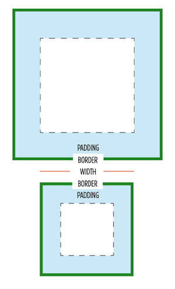

# Módulo *Basic User Interface*

La especificación oficial y el estado actual de desarrollo del módulo *Basic User Interface* en CSS 3 puede consultarse en [http://www.w3.org/TR/css3-ui/](http://www.w3.org/TR/css3-ui/).

## *box-sizing*

La propiedad CSS `box-sizing` se usa para alterar el *box model* o modelo de caja por defecto usado para calcular alturas y anchuras de elementos. Es posible usar esta propiedad para emular el comportamiento de navegadores que no soportan correctamente la especificación de *box model* de CSS.

El *box model* o modelo de caja en CSS funciona de la siguiente manera:

`width` + `padding` + `border` = actual visible/rendered width of box

`height` + `padding` + `border` = actual visible/rendered height of box

La sintaxis de la propiedad `box-sizing` es la siguiente:

| Propiedad             | `box-sizing`    |
| --------------------: | :------------- |
| **Valores** | content-box \| padding-box \| border-box |
| **Se aplica a** | Todos los elementos que aceptan `width` o `height` |
| **Valor inicial**  | content-box |
| **Descripción**       | Indica el componente del modelo de caja que se toma como referencia para calcular el alto o ancho de un elemento |

Los valores que puede tomar esta propiedad son los siguientes:

* `content-box`: este es el estilo por defecto especificado en el estándar de CSS. Las propiedades `width` y `height` se miden incluyendo sólo el contenido, pero no el borde, margen o relleno.
* `padding-box`: las propiedades `width` y `height` incluyen el tamaño del relleno pero no incluyen el borden ni margen.
* `border-box`: las propiedades `width` y `height` incluyen el relleno y el borde, pero no el margen.

    [css]
    /* support Firefox, WebKit, Opera and IE8+ */
    .example {
        box-sizing: border-box;
        width: 500px;
    }

## *overflow-x* y *overflow-y*

Las propiedades `overflow` son utilizadas para controlar el comportamiento del contenido dentro de un elemento de bloque. Especifican si recortan el contenido, muestran una barra de desplazamiento o contenido "se sale" de un elemento de bloque cuando se desborda en los bordes izquierdo y derecho (x) o superior e inferior (y).

| Propiedad             | `overflow-x`, `overflow-y`    |
| --------------------: | :------------- |
| **Valores** | visible \| hidden \| scroll \| auto \| inherit |
| **Se aplica a** | Todos los elementos de bloque e `inline-block` |
| **Valor inicial**  | auto |
| **Descripción**       | Indica el comportamiento del contenido al superar el tamaño de su contenedor |