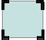
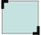
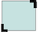
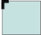
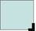
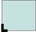

# Módulo *Backgrounds and Borders*

La especificación oficial y el estado actual de desarrollo del módulo *Backgrounds and Borders* en CSS 3 puede consultarse en [http://www.w3.org/TR/css3-background/](http://www.w3.org/TR/css3-background/).

## Bordes

### Propiedades *border-\*-\*-radius*

La propiedad `border-radius` permite definir *esquinas redondeadas* en los elementos de una manera muy sencilla, sin necesidad de utilizar imágenes o una estructura de `div` muy compleja. Las *esquinas redondeadas* pueden ser creadas de manera independiente utilizando las cuatro propiedades individuales `border-*-radius` (`border-bottom-left-radius`, `border-bottom-right-radius`, `border-top-left-radius` y `border-top-right-radius`). La curva o radio de cada esquina se define usando uno o dos radios que definen su forma. Si únicamente definimos un radio, tenemos un **círculo**, si definimos dos radios tenemos una **elipse**.

    [css]
    border-*-*-radius: [ <length> | <%> ] [ <length> | <%> ]?
    
    border-top-left-radius: 10px 5px;
    border-bottom-right-radius: 10% 5%;
    border-top-right-radius: 10px;

Las siguientes imágenes muestran un ejemplo de cómo pueden definirse los diferentes radios de un borde:

### Propiedad *border-radius*

Esta propiedad es una forma abreviada (*shorthand*) de establecer las cuatro propiedades `border-top-left-radius`, `border-top-right-radius`, `border-bottom-right-radius` y `border-bottom-left-radius`.

| Propiedad             | `border-radius`    |
| --------------------: | :------------- |
| **Valores** | [ &lt;length&gt; \| &lt;percentage&gt; ]{1,4} [ / [ &lt;length&gt; \| &lt;percentage&gt; ]{1,4} ]? |
| **Se aplica a** | Todos los elementos, pero los navegadores no están obligados a aplicarlo a los elementos `table` y `inline-table` cuando `border-collapse` es `collapse`. El comportamiento de los elementos internos de una tabla no está definido por el momento. |
| **Valor inicial**  | `border-bottom-left-radius: 0`, `border-bottom-right-radius: 0`, `border-top-left-radius: 0`, `border-top-right-radius: 0` |
| **Descripción**       | Define el radio de las esquinas |

Si se define el primer conjunto de valores, éste indica el radio horizontal de las esquinas. El segundo conjunto de valores, hace referencia al radio vertical. Si únicamente se define el primer conjunto de valores, hacer referencia al radio horizontal y vertical. El valor del radio puede ser:

* `<lenght>`: se puede expresar en cualquier unidad permitida por los tipos de datos del `<lenght>` en CSS. Los valores negativos no son válidos.

* `<percentage>`: los porcentajes para el eje horizontal se refieren a la anchura de la caja y los porcentajes para el eje vertical se refieren a la altura. Los valores negativos no son válidos.

| Valores | Gráficamente | Descripción |
| :------ | :----------: | :---------- |
| `radius` |  | Es un `<lenght>` o `<percentage>` que indica un radio a utilizar para el borde en cada esquina del elemento. |
| `top-left-and-bottom-right` |  | Es un `<lenght>` o `<percentage>` que indica un radio a utilizar para el borde en las esquinas superior-izquierda e inferior-derecha del elemento. |
| `top-right-and-bottom-left` |  | Es un `<lenght>` o `<percentage>` que indica un radio a utilizar para el borde en las esquinas superior-derecha e inferior-izquierda del elemento. |
| `top-left` |  | Es un `<lenght>` o `<percentage>` que indica un radio a utilizar para el borde en la esquina superior-izquierda del elemento. |
| `top-right` |  | Es un `<lenght>` o `<percentage>` que indica un radio a utilizar para el borde en la esquina superior-derecha del elemento. |
| `bottom-right` |  | Es un `<lenght>` o `<percentage>` que indica un radio a utilizar para el borde en la esquina inferior-derecha del elemento. |
| `bottom-left` |  | Es un `<lenght>` o `<percentage>` que indica un radio a utilizar para el borde en la esquina inferior-izquierda del elemento. |
| `inherit` |  | Es una palabra clave que indica que los cuatro valores se heredan del valor calculado del elemento padre. |

    [css]
    border-radius: 5px 10px 5px 10px / 10px 5px 10px 5px;
    border-radius: 5px;
    border-radius: 5px 10px / 10px;

  
Ejercicio 2

[Ver enunciado](#ej02)

## Sombras

La propiedad `box-shadow` es otra de las características más esperadas de CSS 3. Permite aplicar de una manera muy sencilla sombras a los elementos (internas o externas), especificando el color, la separación y la definición.

La propiedad `box-shadow` acepta lista de valores de sombras separados por comas, cada una de ellas con una longitud de 2 a 4 valores (es posible especificar la separación horizontal, vertical, la definición de la sombra y la distancia de la misma con respecto al borde), un color opcional y de finir si la sombra es interna o externa.

| Propiedad             | `box-shadow`    |
| --------------------: | :------------- |
| **Valores** | none | &lt;shadow&gt; [ , &lt;shadow&gt; ]* |
| **Se aplica a** | Todos los elementos. |
| **Valor inicial**  | none |
| **Descripción**       | Define el radio de las esquinas |

Donde `<shadow>`:

    [css]
    <shadow> = inset? && [ <length>{2,4} && <color>? ]

Los posibles valores de `<length>` son:

* El primer valor indica la separación horizontal de la sombra. Un valor positivo desplaza la sombra hacia la derecha de la caja, mientras que un valor negativo la desplazará hacia la izquierda.
* El segundo valor indica la separación vertical de la sombra. Un valor positivo desplaza la sombra debajo de la caja, mientras que un valor negativo la desplazará hacia arriba.
* El tercer valor es el radio del desenfoque. Si el valor es `0` (no se aceptan valores negativos) la sombra será muy nítida. Para valores mayores que `0`, la sombra se va difuminando.
* El cuarto valor es la distancia de propagación. Un valor positivo hace que la sombra se expanda en todas las direcciones según el valor. Valores negativos causan que la sombra se contraiga.

    [css]
    box-shadow: 10px 10px;
    box-shadow: 10px 10px 5px #888;
    box-shadow: inset 2px 2px 2px 2px black;
    box-shadow: 10px 10px #888, -10px -10px #f4f4f4, 0px 0px 5px 5px #cc6600;

El siguiente diagrama muestra un ejemplo del efecto de aplicar los efectos de desenfoque y propagación de la sombra:

Los efectos de sombra son aplicados de arriba hacia debajo, es decir, la primera sombra de la lista está sobre las demás. Las sombras no influyen en la estructura del del documento y pueden solaparse entre ellas. En terminos de pila y orden de pintado, las sombras externas son pintadas debajo del fondo del elemento, y las sombras internas son pintadas encima del fondo del elemento.

  
Ejercicio 3

[Ver enunciado](#ej03)

## Fondos

CSS 3 añade nuevas posibilidades a la hora de trabajar con imágenes de fondo. Ahora podemos definir varias imágenes de fondo y especificar su tamaño.

### Fondos múltiples

Con CSS3 se pueden aplicar **fondos múltiples** a los elementos. Estos se colocan en **capas** una encima de la otra con el primer fondo en la parte superior y el último en la parte posterior. Sólamente el último fondo puede incluir un color de fondo.

Un ejemplo muy sencillo:

    
Esta caja tiene dos imágenes de fondo, la primera es una oveja y la segunda es la hierba con el cielo de fondo.

    [css]
    #background {
        width: 500px;
        height: 250px;
        background-image: url(sheep.png), url(betweengrassandsky.png);
        background-position: center bottom, left top;
        background-repeat: no-repeat;
    }

Las múltiples imágenes de fondo pueden especificarse indicando todas las imágenes de fondo separadas por comas, en la propiedad `background-image`, donde cada una de las imágenes crea una nueva capa.

| Propiedad             | `background-image`    |
| --------------------: | :------------- |
| **Valores** | &lt;bg-image&gt; [ , &lt;bg-image&gt; ]* |
| **Se aplica a** | Todos los elementos. |
| **Valor inicial**  | Ninguno |
| **Descripción**       | Especifica los fondos de un elemento. |

### Posicionar los fondos

Podemos definir la posición de cada uno de los fondo a través de la propiedad `background-position`, utilizando las mismas palabras clave definidas en CSS 2.1.

| Propiedad             | `background-position`    |
| --------------------: | :------------- |
| **Valores** | &lt;position&gt; [ , &lt;position&gt; ]* |
| **Se aplica a** | Todos los elementos. |
| **Valor inicial**  | 0% 0% |
| **Descripción**       | Especifica la posición de las imágenes de fondo definidas. |

Cada uno de los valores separados por comas hacer referencia a las imágenes de fondo definidas en la propiedad `background-image`. Si se definen más valores que imágenes de fondo, los valores sobrantes son ignorados. Por ejemplo, si definimos tres imágenes de fondo, y cinco posiciones, las dos últimas serán igonoradas.

De igual manera, si se especifican menos posiciones que imágenes de fondo, la lista de valores se repite desde el primer elemento, tantas veces como sea necesario.

### Escalar imágenes de fondo

Otra de las propiedades introducidas en CSS 3 ha sido `background-size`. Esta propiedad permite ajustar el **tamaño de las imágenes de fondo**, en lugar del comportamiento predeterminado de mosaico, utilizando medidas estándar, porcentajes o las palabras reservadas `contain` y `cover`.

Un ejemplo muy sencillo:

    background-size: auto;

    background-size: 275px 125px;

    [css]
    #background1 {
        background-size: auto;
    }
    
    #background2 {
        background-size: 275px 125px;
    }

Como en otras muchas propiedades de `background`, es posible especificar los distintos valores separados por comas.

| Propiedad             | `background-size`    |
| --------------------: | :------------- |
| **Valores** | &lt;bg-size&gt; [, &lt;bg-size&gt;]* |
| **Se aplica a** | Todos los elementos. |
| **Valor inicial**  | Ver propiedades individuales |
| **Descripción**       | Especifica los tamaños de fondos de un elemento. |

Donde:

    [css]
    <bg-size> = [ <length> | <percentage> | auto ]{1,2} | cover | contain

Ejemplo:

    [css]
    background-size: 200px;
    background-size: 200px 100px;
    background-size: 200px 100px, 400px 200px;
    background-size: auto 200px;
    background-size: 50% 25%;
    background-size: contain;
    background-size: cover;

Al especificar los valores de `<lenght>` o `<percentage>`, su comportamiento es el esperado y es el que conocemos por ejemplo con las imágenes. Si especificamos un valor, este hace referencia al ancho (manteniendo el alto proporcional) y si especificamos dos valores, estos hacen referencia al ancho y alto respectivamente.

#### Valores especiales *contain* y *cover*

Además de los valores `<lenght>` y `<percentage>` que se comportan de la manera que conocemos hasta ahora, la propiedad `background-size` admite dos valores especiales: `contain` y `cover`.

* `contain`: en este caso, la imagen es redimensionada manteniendo sus proporciones originales, de tal manera que cada lado sea tan grande como sea posible mientras que no exceda la longitud del lado correspondiente del contenedor. La imagen nunca excede el tamaño de su contenedor, por lo que si no coincide con el tamaño de su contenedor, pueden existir zonas del fondo que no queden cubiertas por la imagen.

* `cover`: en este otro caso, la imagen es redimensionada manteniendo sus proporciones originales, de tal manera que el área completa del fondo es siempre cubierta por la imagen de fondo. En este caso, el tamaño de la imagen siempre es igual o superior al área del fondo a cubrir, pudiendo existir zonas de la imagen que no sean visibles.

### Propiedad *shorthand*

Es posible utilizar la propiedad *shorthand* `background` para especificar los distintos fondos y sus propiedades en una misma sentencia, indicando los distintos fondos separados por comas. Si se desea especificar un color de fondo, éste únicamente puede ser definido en el último valor de la propiedad.

| Propiedad             | `background`    |
| --------------------: | :------------- |
| **Valores** | [ &lt;bg-layer&gt; , ]* &lt;final-bg-layer&gt; |
| **Se aplica a** | Todos los elementos. |
| **Valor inicial**  | Ver propiedades individuales |
| **Descripción**       | Especifica los fondos de un elemento. |

Donde:

    [css]
    <bg-layer> = <bg-image> || <bg-position> [ / <bg-size> ]? || <repeat-style> || <attachment> || <box>{1,2}
    
    <final-bg-layer> = <bg-image> || <bg-position> [ / <bg-size> ]? || <repeat-style> || <attachment> || <box>{1,2} || <background-color>

Ejemplo:

    [css]
    background: url(sheep.png) center bottom no-repeat, url(betweengrassandsky.png) left top no-repeat;

  
Ejercicio 4

[Ver enunciado](#ej04)