# Módulo *Image Values and Replaced Content*

La especificación oficial y el estado actual de desarrollo del módulo *Image Values and Replaced Content* en CSS 3 puede consultarse en [http://www.w3.org/TR/css3-images/](http://www.w3.org/TR/css3-images/).

## CSS gradients

Los degradados CSS son los nuevos tipo de `<image>` añadidos en el módulo de imagen de CSS3. Utilizar los degradados de CSS permite mostrar **transiciones suaves entre dos o más colores**; esto permite a su vez evistar el uso de imágenes para lograr estos efectos, lo que reduce mucho el tiempo de descarga y el uso de ancho de banda. Además, debido a que el degradado es generado por el navegador, los objetos con degradados se ven mejor cuando se acercan, y se puede ajustar el diseño de una manera mucho más flexible.

Los navegadores soportan dos tipos de degradados: **lineal**, que se define con la función `linear-gradient` y **radial**, definido con `radial-gradient`.

## Degradados lineales

Para crear un degradado lineal, se establece un punto de partida y una dirección (especificado como un ángulo) a lo largo del cual se aplica dicho degradado.

### Degradados lineales simples

<table class="standard-table">
  <tbody>
    <tr>
      <td class="header">Screen Shot</td>
      <td class="header">Live Demo</td>
    </tr>
    <tr>
      <td>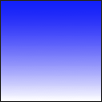</td>
      <td>
        

           

      </td>
    </tr>
  </tbody>
</table>

    [css]
    /* The old syntax, deprecated, but still needed, prefixed, for WebKit-based and old browsers */
    background: -prefix-linear-gradient(top, blue, white); 
     
    /* The new syntax needed by standard-compliant browsers (Opera 12.1, IE 10, Fx 16 onwards), without prefix */
    background: linear-gradient(to bottom, blue, white);

Cambiando el mismo degradado para que se represente de izquierda a derecha:

<table class="standard-table">
  <tbody>
    <tr>
      <td class="header">Screen Shot</td>
      <td class="header">Live Demo</td>
    </tr>
    <tr>
      <td>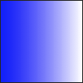</td>
      <td>
        

           

      </td>
    </tr>
  </tbody>
</table>

    [css]
    /* The old syntax, deprecated, but still needed, prefixed, for WebKit-based and old browsers */
    background: -prefix-linear-gradient(left, blue, white); 
     
    /* The new syntax needed by standard-compliant browsers (Opera 12.1, IE 10, Fx 16 onwards), without prefix */
    background: linear-gradient(to right, blue, white); 

Y en diagonal:

<table class="standard-table">
  <tbody>
    <tr>
      <td class="header">Screen Shot</td>
      <td class="header">Live Demo</td>
    </tr>
    <tr>
      <td>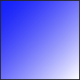</td>
      <td>
        

           

      </td>
    </tr>
  </tbody>
</table>

    [css]
    /* The old syntax, deprecated, but still needed, prefixed, for WebKit-based and old browsers */
    background: -prefix-linear-gradient(left top, blue, white); 
     
    /* The new syntax needed by standard-compliant browsers (Opera 12.1, IE 10, Fx 16 onwards), without prefix */
    background: linear-gradient(to bottom right, blue, white);

### Ángulos

Si no se especifica ningún ángulo, se determina uno de manera automática en función de la dirección dada. Si se desea más control sobre la dirección del degradado, se puede establecer específicamente dicho ángulo.

Por ejemplo, aquí tenemos dos degradados, el primero con una dirección hacia la derecha, y el segundo con un ángulo de 70 grados.

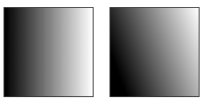

El de la derecha utiliza CSS de esta manera:

    [css]
    background: linear-gradient(70deg, black, white);

El ángulo se especifica como un ñangulo entre una línea horizontal y la línea de degradado, yendo hacia la izquierda. En otras palabras, `0deg` crea un degradado vertical desde la parte inferior a la parte superior, y `90deg` genera un degradado horizontal de izquierda a derecha.

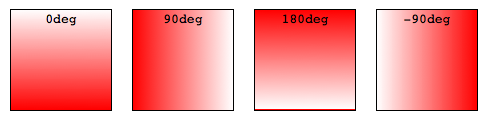

    [css]
    background: linear-gradient(<angle>, red, white);

### Color stops

Los *color stops* son los puntos de la línea de degradado que tendrán un color específico en dicho lugar. La ubicación se puede especificar con un porcentaje de la longitud de la línea o como una longitud absoluta. Se puede especificar tantas paradas de color como se quiera con el fin de conseguir el efecto deseado.

0% representaría el punto de partida y 100% el punto final. Sin embargo, se pueden utilizar los valores fuera de ese rango si es necesario para obtener el efecto deseado.

Ejemplo de tres paradas de color:

<table class="standard-table">
  <tbody>
    <tr>
      <td class="header">Screen Shot</td>
      <td class="header">Live Demo</td>
    </tr>
    <tr>
      <td></td>
      <td>
        

           

      </td>
    </tr>
  </tbody>
</table>

    [css]
    /* The old syntax, deprecated, but still needed, prefixed, for WebKit-based and old browsers */
    background: -prefix-linear-gradient(top, blue, white 80%, orange);
     
    /* The new syntax needed by standard-compliant browsers (Opera 12.1, IE 10, Fx 16 onwards), without prefix */
    background: linear-gradient(to bottom, blue, white 80%, orange);

Ejemplo de variedad de colores:

<table class="standard-table">
  <tbody>
    <tr>
      <td class="header">Screen Shot</td>
      <td class="header">Live Demo</td>
    </tr>
    <tr>
      <td>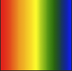</td>
      <td>
        

           

      </td>
    </tr>
  </tbody>
</table>

    [css]
    /* The old syntax, deprecated, but still needed, prefixed, for WebKit-based and old browsers */
    background: -prefix-linear-gradient(left, red, orange, yellow, green, blue);
     
    /* The new syntax needed by standard-compliant browsers (Opera 12.1, IE 10, Fx 16 onwards), without prefix */
    background: linear-gradient(to right, red, orange, yellow, green, blue);

### Transparencia

Los degradados admiten transparencia. Se puede utilizar, por ejemplo, con múltiples fondos o para crear efectos en imágenes de fondo. Por ejemplo:

    [css]
    /* The old syntax, deprecated, but still needed, prefixed, for WebKit-based and old browsers */
    background: linear-gradient(left, rgba(255,255,255,0), rgba(255,255,255,1)), url(http://foo.com/image.jpg);
     
    /* The new syntax needed by standard-compliant browsers (Opera 12.1, IE 10, Fx 16 onwards), without prefix */ 
    background: linear-gradient(to right, rgba(255,255,255,0), rgba(255,255,255,1)), url(http://foo.com/image.jpg);

## Degradados radiales

Los **degradados radiales** se especifican usando la función `radial-gradient`. La sintaxis es similar a los degradados lineales, excepto en que se puede especificar la forma final del degradado (circular o elíptico) así como el tamaño. Por defecto, la forma final es una elipse con las mismas proporciones que la caja contenedora.

### Color stops

Un ejemplo sería:

<table class="standard-table">
  <tbody>
    <tr>
      <td class="header">Screen Shot</td>
      <td class="header">Live Demo</td>
    </tr>
    <tr>
      <td>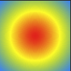</td>
      <td>
        

           

      </td>
    </tr>
  </tbody>
</table>

    [css]
    background: radial-gradient(red, yellow, rgb(30, 144, 255));

Y un segundo ejemplo con localizaciones específicas:

<table class="standard-table">
  <tbody>
    <tr>
      <td class="header">Screen Shot</td>
      <td class="header">Live Demo</td>
    </tr>
    <tr>
      <td></td>
      <td>
        

           

      </td>
    </tr>
  </tbody>
</table>

    [css]
    background: radial-gradient(red 5%, yellow 25%, #1E90FF 50%);

### Tamaño

Ésta es una de las áreas en las que los degradados radiales se diferencias de los lineales. Se puede proporcionar un valor de tamaño que especifica el punto que define el tamaño del círculo o elipse.

**Ejemplos para elipses**

Ejemplo con `closest-side` (el tamaño es establecido por la distancia entre el punto de partida o centro y el lugar más próximo a la caja contenedora):

<table class="standard-table">
  <tbody>
    <tr>
      <td class="header">Screen Shot</td>
      <td class="header">Live Demo</td>
    </tr>
    <tr>
      <td>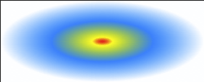</td>
      <td>
        

           

      </td>
    </tr>
  </tbody>
</table>

    [css]
    background: radial-gradient(ellipse closest-side, red, yellow 10%, #1E90FF 50%, white);

Ejemplo similar con `farthest-corner`:

<table class="standard-table">
  <tbody>
    <tr>
      <td class="header">Screen Shot</td>
      <td class="header">Live Demo</td>
    </tr>
    <tr>
      <td>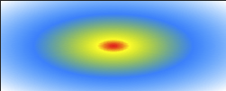</td>
      <td>
        

           

      </td>
    </tr>
  </tbody>
</table>

    [css]
    background: radial-gradient(ellipse farthest-corner, red, yellow 10%, #1E90FF 50%, white);

**Ejemplos para círculos**

Ejemplo con `closest-side`:

<table class="standard-table">
  <tbody>
    <tr>
      <td class="header">Screen Shot</td>
      <td class="header">Live Demo</td>
    </tr>
    <tr>
      <td>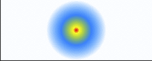</td>
      <td>
        

           

      </td>
    </tr>
  </tbody>
</table>

    [css]
    background: radial-gradient(circle closest-side, red, yellow 10%, #1E90FF 50%, white);

## Repetición de degradados

Las propiedades `linear-gradient` y `radial-gradient` no admiten automáticamente la repetición de los *color stops*. Sin embargo, las propiedades `repeating-linear-gradient` y `repeating-radial-gradient` sí ofrecen esta funcionalidad.

### Ejemplos

Este ejemplo utiliza `repeating-linear-gradient`:

<table class="standard-table">
  <tbody>
    <tr>
      <td class="header">Screen Shot</td>
      <td class="header">Live Demo</td>
    </tr>
    <tr>
      <td>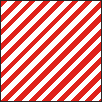</td>
      <td>
        

           

      </td>
    </tr>
  </tbody>
</table>

    [css]
    background: repeating-linear-gradient(-45deg, red, red 5px, white 5px, white 10px);

Otro ejemplo con esta misma propiedad:

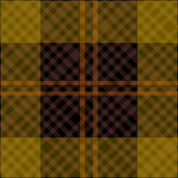

    [css]
    background-color: #000;
    background-image: repeating-linear-gradient(90deg, transparent, transparent 50px,
        rgba(255, 127, 0, 0.25) 50px, rgba(255, 127, 0, 0.25) 56px, transparent 56px, transparent 63px,
        rgba(255, 127, 0, 0.25) 63px, rgba(255, 127, 0, 0.25) 69px, transparent 69px, transparent 116px,
        rgba(255, 206, 0, 0.25) 116px, rgba(255, 206, 0, 0.25) 166px),
    repeating-linear-gradient(0deg, transparent, transparent 50px, rgba(255, 127, 0, 0.25) 50px,
        rgba(255, 127, 0, 0.25) 56px, transparent 56px, transparent 63px, rgba(255, 127, 0, 0.25) 63px,
        rgba(255, 127, 0, 0.25) 69px, transparent 69px, transparent 116px, rgba(255, 206, 0, 0.25) 116px,
        rgba(255, 206, 0, 0.25) 166px),
    repeating-linear-gradient(-45deg, transparent, transparent 5px, rgba(143, 77, 63, 0.25) 5px,
        rgba(143, 77, 63, 0.25) 10px),
    repeating-linear-gradient(45deg, transparent, transparent 5px, rgba(143, 77, 63, 0.25) 5px,
        rgba(143, 77, 63, 0.25) 10px);

Y un ejemplo de repetición de un degradado radial:

<table class="standard-table">
  <tbody>
    <tr>
      <td class="header">Screen Shot</td>
      <td class="header">Live Demo</td>
    </tr>
    <tr>
      <td>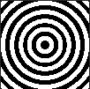</td>
      <td>
        

           

      </td>
    </tr>
  </tbody>
</table>

    [css]
    background: repeating-radial-gradient(black, black 5px, white 5px, white 10px);