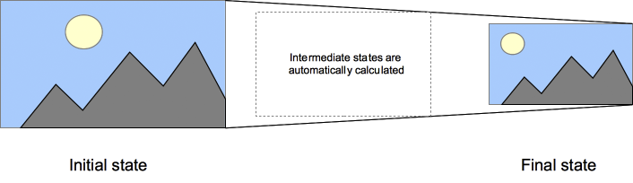

# Módulo *Transitions*

La especificación oficial y el estado actual de desarrollo del módulo *Transitions* en CSS 3 puede consultarse en [http://www.w3.org/TR/css3-transitions/](http://www.w3.org/TR/css3-transitions/).

Las **transiciones CSS**, que forman parte del conjunto de especificaciones de **CSS3**, proporcionan una forma de controlar la velocidad de la animación al cambiar las propiedades CSS. Los cambios en las propiedades no tienen efecto inmediato, sino que se puede establecer un periodo de tiempo para que éstos se ejecuten. Por ejemplo, al cambiar el color de un elemento de blanco a negro, este cambio normalmente se ejecuta de manera inmediata. Sin embargo, con las transiciones CSS, los cambios se producen con intervalos de tiempo que siguen una curva de aceleración, y pueden ser personalizados.

Las animaciones que implican transición entre dos estados se llaman a menudo *transiciones implícitas*, ya que los estados intermedios entre el inicial y el final son implícitamente definidos por el navegador.

Las transiciones CSS permiten decidir qué propiedades animar (mediante su inclusión explícita), cuándo comenzará esta animación (estableciendo un retraso o *delay*), cuánto durará (estableciendo una duración), y cómo se ejecutará (definiendo una función de tiempo).

## Propiedades "animables"

Se puede definir **qué propiedad debe ser animada y en qué manera**. Esto permite la creación de transiciones complejas. Como la animación de algunas propiedades no tiene sentido, la [lista de propiedades](http://www.w3.org/TR/css3-transitions/#animatable-types) "animables" se limita a un conjunto finito.

También el valor `auto` es un caso complejo. La especificación nos dice que no debemos animar desde y hacia dicho valor. Algunos agentes de usuario, como los basados en Gecko o WebKit, implementan este requisito, que al usar animaciones con `auto` nos puede dar lugar a resultados impredecibles, dependiendo del navegador y su versión; por lo que debemos evitarlo.

También se debería tener cuidado al utilizar una transición inmediatamente después de añadir el elemento al DOM utilizando `.appendChild()` o borrando su propiedad `display: none;`. Esto se nos muestra como si el estado inicial nunca hubiese existido y el elemento estuviese siempre en su estado final. La manera más sencilla de superar esta limitación es aplicar un `window.setTimeout()` de algunos milisegundos antes de cambiar la propiedad CSS a la que se pretende aplicar la transición.

## Propiedad *transition-property*

El primer paso al crear una transición, es especificar la propiedad o propiedades sobre las que se va a aplicar los efectos de la transición. Podemos decidir que sean todas las propiedades, ninguna o un listado de ellas.

    [css]
    transition-property: none | all | [ <property> ] [, <property> ]*
    
    transition-property: all;
    transition-property: none;
    transition-property: background-color;
    transition-property: background-color, height, width;

Si se indica la palabra reservada `all`, todas las propiedades que sean capaces de ser animadas y para las que se ha definido un cambio, serán animadas. Si se especifica `none`, ninguna propiedad será animada.

## Propiedad *transition-duration*

La propiedad `transition-duration` acepta una lista separada por comas de tiempos, especificadas en segundos o milisegundos, que determinan cuánto tiempo tarda cada propiedad, en completar la transición.

    [css]
    transition-duration: <time> [, <time>]*
    
    transition-duration: 2s;
    transition-duration: 4000ms;
    transition-duration: 4000ms, 8000ms;

## Propiedad *transition-timing-function*

La propiedad `transition-timing-function` es utilizada para especificar el ritmo en el que se producen los cambios durante la transición. Esto puede realizarse de dos maneras: indicando el nombre de una *función de tiempo* (`ease`, `linear`, `ease-in`, `ease-out` o `ease-in-out`) o definiendo una función de tiempo personalizada (especificando cuatro coordenadas para definir una curva bezier).

    [css]
    transition-timing-function: <timing-function> [, <timing-function>]*
    
    transition-timing-function: ease;
    transition-timing-function: ease, linear;
    transition-timing-function: cubic-bezier(0.6, 0.1, 0.15, 0.8);

Vemos lo primero de todo las funciones predefinidas. Este ejemplo muestra cómo se comporta cada una de las funciones. Cada caja se expandirá de `150px` a `300px`, con una duración de la transición de 3 segundos.

    
ease

    
linear

    
ease-in

    
ease-out

    
ease-in-out

Además de estas funciones de tiempo predefinidas, tenemos la posibilidad de declarar nuestra propia función de tiempo, utilizando una función `cubic-bezier`.

Si no se especifica ninguna función de tiempo, por defecto se aplica `ease`.

## Propiedad *transition-delay*

El último paso para crear una transición, es especificar un retraso (opcional) en el inicio de la transición. Aquí también podemos especificar una lista de tiempos, en segundos o milisegundos, que determinan el inicio de la transición desde que esta se lanza. El valor por defecto es `0`, esto es, se inicia de inmediato.

En este caso los valores negativos sí son aceptados. En este caso, la transición se iniciará tan pronto sea posible, pero dará la impresión que ya lleva tiempo ejecutándose.

    [css]
    transition-delay: <time> [, <time>]*
    
    transition-delay: 5s;
    transition-delay: 4000ms, 8000ms;
    transition-delay: -5s;

    
-2s delay

    
no delay

    
1s delay

    
2s delay

    
3s delay

    
5s delay

## Propiedad *transition*

Como de costumbre, disponemos de la propiedad *shorthand* que nos permite definir todas las propiedades de una sola vez.

    [css]
    transition: <transition> [, <transition>]*
    
    <transition> = <transition-property> <transition-duration>
                   <transition-timing-function> <transition-delay>
    
    transition: background-color 3s linear 1s;
    transition: 4s ease-in-out;
    transition: 5s;

El único valor requerido en esta propiedad es `transition-duration`.

## Listas de valores

Si la lista de valores de cualquier propiedad es más corta que otras, sus valores son repetidos hasta hacer que coincidan. Por ejemplo:

    [css]
    div {
        transition-property: opacity, left, top, height;
        transition-duration: 3s, 5s;
    }

Esto es tratado como si fuese:

    [css]
    div {
        transition-property: opacity, left, top, height;
        transition-duration: 3s, 5s, 3s, 5s;
    }

De manera similar, si la lista de valores de cualquier propiedad es más larga que la de `transition-property`, es acortado, por lo que si tienes este código CSS:

    [css]
    div {
        transition-property: opacity, left;
        transition-duration: 3s, 5s, 2s, 1s;
    }

Se interpreta como:

    [css]
    div {
        transition-property: opacity, left;
        transition-duration: 3s, 5s;
    }

## Finalización de una transición

Existe un sólo evento que se dispara cuando las transiciones se completan. En todos los navegadores que cumplen el estándar, el evento es `transitionend`, en WebKit es `webkitTransitionEnd`. El evento `transitionend` ofrece dos propiedades:

* `propertyName`: *string* que indica el nombre de la propiedad CSS cuya transición está completada.

* `elapsedTime`: un *float* que indica el número de segundos que la transición ha estado ejecutándose en el momento en el que se dispara el evento. Este valor no está afectado por el valor de `transition-delay`.

Como de costumbre, se puede utilizar el método `element.addEventListener()` para supervisar este evento:

    [css]
    el.addEventListener("transitionend", updateTransition, true);

## Transiciones y JavaScript

Las transiciones con una buena herramienta para crear una apariencia mucho más equilibrada sin tener que modificar la funcionalidad JavaScript. Por ejemplo:

    [html]
    
Click anywhere to move the ball

    

Utilizando JavaScript:

    [javascript]
    var f = document.getElementById('foo');
    document.addEventListener('click', function(ev){
        f.style.left = (ev.clientX-25)+'px';
        f.style.top = (ev.clientY-25)+'px';
    },false);

Con CSS simplemente es necesario añadir una transición al elemento:

    [css]
    p {
        padding-left: 60px;

    #foo {
        border-radius: 50px;
        width: 50px;
        height: 50px;
        background: #c00;
        position: absolute;
        top: 0;
        left: 0;
        transition:  all 1s;
    }

  
Ejercicio 8

[Ver enunciado](#ej08)