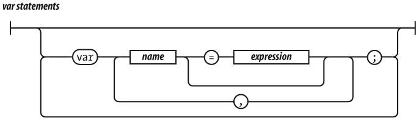
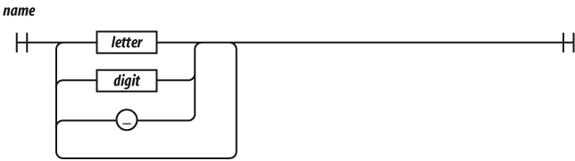
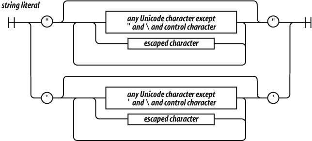
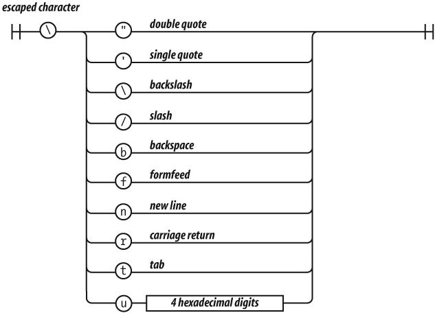

# Sintaxis básica

Antes de comenzar a desarrollar programas y utilidades con JavaScript, es necesario conocer los elementos básicos con los que se construyen las aplicaciones. Este capítulo explica en detalle y comenzando desde cero los conocimientos básicos necesarios para poder comprender la sintaxis básica de Javascript. En el próximo capítulo veremos aspectos más avanzados como objetos, herencia, arrays o expresiones regulares.

## Espacios en blanco

No se tienen en cuenta los espacios en blanco y las nuevas líneas: como sucede con XHTML, el intérprete de JavaScript ignora cualquier espacio en blanco sobrante, por lo que el código se puede ordenar de forma adecuada para entenderlo mejor (tabulando las líneas, añadiendo espacios, creando nuevas líneas, etc.) Sin embargo, en ocasiones estos espacios en blanco son totalmente necesarios, por ejemplo, para reparar nombres de variables o palabras reservadas. Por ejemplo:

    [javascript]
    var that = this;

Aquí el espacio en blanco entre `var` y `that` no puede ser eliminado, pero el resto sí.

## Comentarios

JavaScript ofrece dos tipos de comentarios, de bloque gracias a los caracteres `/* */` y de línea comenzando con `//`. El formato `/* */`de comentarios puede causar problemas en ciertas condiciones, como en las expresiones regulares, por lo que hay que tener cuidado al utilizarlo. Por ejemplo:

    [javascript]
    /*
        var rm_a = /a*/.match(s);
    */

provoca un error de sintaxis. Por lo tanto, suele ser recomendable utilizar únicamente los comentarios de línea, para evitar este tipo de problemas.

## Variables

Las variables en JavaScript se crean mediante la palabra reservada `var`. De esta forma, podemos declarar variables de la siguiente manera:

    [javascript]
    var numero_1 = 3;
    var numero_2 = 1;
    var resultado = numero_1 + numero_2;

La palabra reservada `var` solamente se debe indicar al declarar por primera vez la variable. Cuando se utilizan las variables en el resto de instrucciones del script, solamente es necesario indicar su nombre. En otras palabras, en el ejemplo anterior sería un error indicar lo siguiente:

    [javascript]
    var numero_1 = 3;
    var numero_2 = 1;
    var resultado = var numero_1 + var numero_2;

En JavaScript no es obligatorio inicializar las variables, ya que se pueden declarar por una parte y asignarles un valor posteriormente. Por tanto, el ejemplo anterior se puede rehacer de la siguiente manera:

    [javascript]
    var numero_1;
    var numero_2;
    
    numero_1 = 3;
    numero_2 = 1;
    
    var resultado = numero_1 + numero_2;

Una de las características más sorprendentes de JavaSript para los programadores habituados a otros lenguajes de programación es que tampoco es necesario declarar las variables. En otras palabras, se pueden utilizar variables que no se han definido anteriormente mediante la palabra reservada `var`. El ejemplo anterior también es correcto en JavaScript de la siguiente forma:

    [javascript]
    var numero_1 = 3;
    var numero_2 = 1;
    resultado = numero_1 + numero_2;

La variable `resultado` no está declarada, por lo que JavaScript crea una variable global (más adelante se verán las diferencias entre variables locales y globales) y le asigna el valor correspondiente. De la misma forma, también sería correcto el siguiente código:

    [javascript]
    numero_1 = 3;
    numero_2 = 1;
    resultado = numero_1 + numero_2;

En cualquier caso, se recomienda declarar todas las variables que se vayan a utilizar.

### Nombres de variables

El nombre de una variable también se conoce como **identificador** y debe cumplir las siguientes normas:

* Sólo puede estar formado por letras, números y los símbolos `$` (dólar) y `_` (guión bajo).
* El primer carácter no puede ser un número.

Por tanto, las siguientes variables tienen nombres correctos:

    [javascript]
    var $numero1;
    var _$letra;
    var $$$otroNumero;
    var $_a__$4;

Sin embargo, las siguientes variables tienen identificadores incorrectos:

    [javascript]
    var 1numero;       // Empieza por un número
    var numero;1_123;  // Contiene un carácter ";"

A continuación se indica el listado de palabras reservadas en JavaScript, y que no podremos utilizar para nombrar nuestras variables, parámetros, funciones, operadores o etiquetas:

* `abstract`
* `boolean break byte`
* `case catch char class const continue`
* `debugger default delete do double`
* `else enum export extends`
* `false final finally float for function`
* `goto`
* `if implements import in instanceof int interface`
* `long`
* `native new null`
* `package private protected public`
* `return`
* `short static super switch synchronized`
* `this throw throws transient true try typeof`
* `var volatile void`
* `while with`

### Tipos de variables

JavaScript divide los distintos tipos de variables en dos grupos: tipos primitivos y tipos de referencia o clases.

#### Tipos primitivos

JavaScript define cinco tipos primitivos: `undefined`, `null`, `boolean`, `number` y `string`. Además de estos tipos, JavaScript define el operador `typeof` para averiguar el tipo de una variable.

##### Variables de tipo undefined

El tipo `undefined` corresponde a las variables que han sido definidas y todavía no se les ha asignado un valor:

    [javascript]
    var variable1;
    typeof variable1;  // devuelve "undefined"

##### Variables de tipo null

Se trata de un tipo similar a `undefined`, y de hecho en JavaScript se consideran iguales (`undefined == null`). El tipo `null` se suele utilizar para representar objetos que en ese momento no existen.

    [javascript]
    var nombreUsuario = null;

##### Variables de tipo boolean

Se trata de una variable que sólo puede almacenar uno de los dos valores especiales definidos y que representan el valor *"verdadero"* y el valor *"falso"*.

    [javascript]
    var variable1 = true;
    var variable2 = false;

Los valores `true` y `false` son valores especiales, de forma que no son palabras ni números ni ningún otro tipo de valor. Este tipo de variables son esenciales para crear cualquier aplicación, tal y como se verá más adelante.

Cuando es necesario convertir una variable numérica a una variable de tipo `boolean`, JavaScript aplica la siguiente conversión: el número `0` se convierte en `false` y cualquier otro número distinto de `0` se convierte en `true`.

Por este motivo, en ocasiones se asocia el número `0` con el valor `false` y el número `1` con el valor `true`. Sin embargo, es necesario insistir en que `true` y `false` son valores especiales que no se corresponden ni con números ni con ningún otro tipo de dato.

#### Conversión entre tipos de variables

JavaScript es un lenguaje de programación *"no tipado"*, lo que significa que una misma variable puede guardar diferentes tipos de datos a lo largo de la ejecución de la aplicación. De esta forma, una variable se podría inicializar con un valor numérico, después podría almacenar una cadena de texto y podría acabar la ejecución del programa en forma de variable booleana.

No obstante, en ocasiones es necesario que una variable almacene un dato de un determinado tipo. Para asegurar que así sea, se puede convertir una variable de un tipo a otro, lo que se denomina *typecasting*:

Así, JavaScript incluye un método llamado `toString()` que permite convertir variables de cualquier tipo a variables de cadena de texto, tal y como se muestra en el siguiente ejemplo:

    [javascript]
    var variable1 = true;
    variable1.toString();  // devuelve "true" como cadena de texto
    var variable2 = 5;
    variable2.toString();  // devuelve "5" como cadena de texto

JavaScript también incluye métodos para convertir los valores de las variables en valores numéricos. Los métodos definidos son `parseInt()` y `parseFloat()`, que convierten la variable que se le indica en un número entero o un número decimal respectivamente.

La conversión numérica de una cadena se realiza carácter a carácter empezando por el de la primera posición. Si ese carácter no es un número, la función devuelve el valor NaN. Si el primer carácter es un número, se continúa con los siguientes caracteres mientras estos sean números.

    [javascript]
    var variable1 = "hola";
    parseInt(variable1);  // devuelve NaN
    var variable2 = "34";
    parseInt(variable2);  // devuelve 34
    var variable3 = "34hola23";
    parseInt(variable3);  // devuelve 34
    var variable4 = "34.23";
    parseInt(variable4);  // devuelve 34

En el caso de `parseFloat()`, el comportamiento es el mismo salvo que también se considera válido el carácter . que indica la parte decimal del número:

    [javascript]
    var variable1 = "hola";
    parseFloat(variable1);  // devuelve NaN
    var variable2 = "34";
    parseFloat(variable2);  // devuelve 34.0
    var variable3 = "34hola23";
    parseFloat(variable3);  // devuelve 34.0
    var variable4 = "34.23";
    parseFloat(variable4);  // devuelve 34.23

#### Tipos de referencia

Aunque JavaScript no define el concepto de clase, los tipos de referencia se asemejan a las clases de otros lenguajes de programación. Los objetos en JavaScript se crean mediante la palabra reservada `new` y el nombre de la clase que se va a instanciar. De esta forma, para crear un objeto de tipo `String` se indica lo siguiente (los paréntesis solamente son obligatorios cuando se utilizan argumentos, aunque se recomienda incluirlos incluso cuando no se utilicen):

    [javascript]
    var variable1 = new String("hola mundo");

JavaScript define una clase para cada uno de los tipos de datos primitivos. De esta forma, existen objetos de tipo `Boolean` para las variables booleanas, `Number` para las variables numéricas y `String` para las variables de cadenas de texto. Las clases `Boolean`, `Number` y `String` almacenan los mismos valores de los tipos de datos primitivos y añaden propiedades y métodos para manipular sus valores.

    [javascript]
    var longitud = "hola mundo".length;

La propiedad `length` sólo está disponible en la clase `String`, por lo que en principio no debería poder utilizarse en un dato primitivo de tipo cadena de texto. Sin embargo, JavaScript convierte el tipo de dato primitivo al tipo de referencia `String`, obtiene el valor de la propiedad `length` y devuelve el resultado. Este proceso se realiza de forma automática y transparente para el programador.

En realidad, con una variable de tipo `String` no se pueden hacer muchas más cosas que con su correspondiente tipo de dato primitivo. Por este motivo, no existen muchas diferencias prácticas entre utilizar el tipo de referencia o el tipo primitivo, salvo en el caso del resultado del operador `typeof` y en el caso de la función `eval()`, como se verá más adelante.

La principal diferencia entre los tipos de datos es que los datos primitivos se manipulan por valor y los tipos de referencia se manipulan, como su propio nombre indica, por referencia. Los conceptos *"por valor"* y *"por referencia"* son iguales que en el resto de lenguajes de programación, aunque existen diferencias importantes (no existe por ejemplo el concepto de puntero).

Cuando un dato se manipula por valor, lo único que importa es el valor en sí. Cuando se asigna una variable por valor a otra variable, se copia directamente el valor de la primera variable en la segunda. Cualquier modificación que se realice en la segunda variable es independiente de la primera variable.

De la misma forma, cuando se pasa una variable por valor a una función (como se explicará más adelante) sólo se pasa una copia del valor. Así, cualquier modificación que realice la función sobre el valor pasado no se refleja en el valor de la variable original.

En el siguiente ejemplo, una variable se asigna por valor a otra variable:

    [javascript]
    var variable1 = 3;
    var variable2 = variable1;
    
    variable2 = variable2 + 5;
    // Ahora variable2 = 8 y variable1 sigue valiendo 3

La `variable1` se asigna por valor en la `variable1`. Aunque las dos variables almacenan en ese momento el mismo valor, son independientes y cualquier cambio en una de ellas no afecta a la otra. El motivo es que los tipos de datos primitivos siempre se asignan (y se pasan) por valor.

Sin embargo, en el siguiente ejemplo, se utilizan tipos de datos de referencia:

    [javascript]
    // variable1 = 25 diciembre de 2009
    var variable1 = new Date(2009, 11, 25);
    // variable2 = 25 diciembre de 2009
    var variable2 = variable1;
    
    // variable2 = 31 diciembre de 2010
    variable2.setFullYear(2010, 11, 31);
    // Ahora variable1 también es 31 diciembre de 2010

En el ejemplo anterior, se utiliza un tipo de dato de referencia que se verá más adelante, que se llama `Date` y que se utiliza para manejar fechas. Se crea una variable llamada `variable1` y se inicializa la fecha a 25 de diciembre de 2009. Al constructor del objeto `Date` se le pasa el año, el número del mes (siendo `0` = enero, `1` = febrero, ..., `11` = diciembre) y el día (al contrario que el mes, los días no empiezan en `0` sino en `1`). A continuación, se asigna el valor de la `variable1` a otra variable llamada `variable2`.

Como `Date` es un tipo de referencia, la asignación se realiza por referencia. Por lo tanto, las dos variables quedan "unidas" y hacen referencia al mismo objeto, al mismo dato de tipo `Date`. De esta forma, si se modifica el valor de `variable2` (y se cambia su fecha a 31 de diciembre de 2010) el valor de `variable1` se verá automáticamente modificado.

## Números

En JavaScript únicamente existe un tipo de número. Internamente, es representado como un dato de `64 bits` en coma flotante, al igual el tipo de dato `double` en Java. A diferencia de otros lenguajes de programación, no existe una diferencia entre un número entero y otro decimal, por lo que `1` y `1.0`son el mismo valor. Esto es significativo ya que evitamos los problemas desbordamiento en tipos de dato *pequeños*, al no existir la necesidad de conocer el tipo de dato.

### Tipos de números

Si el número es entero, se indica su valor directamente.

    [javascript]
    var variable1 = 10;

Si el número es decimal, se debe utilizar el punto (.) para separar la parte entera de la decimal.

    [javascript]
    var variable2 = 3.14159265;

Además del sistema numérico decimal, también se pueden indicar valores en el sistema octal (si se incluye un cero delante del número) y en sistema hexadecimal (si se incluye un cero y una x delante del número).

    [javascript]
    var variable1 = 10;
    var variable_octal = 034;
    var variable_hexadecimal = 0xA3;

JavaScript define tres valores especiales muy útiles cuando se trabaja con números. En primer lugar se definen los valores `Infinity` y `–Infinity` para representar números demasiado grandes (positivos y negativos) y con los que JavaScript no puede trabajar.

    [javascript]
    var variable1 = 3, variable2 = 0;
    console.log(variable1/variable2);  // muestra "Infinity"

El otro valor especial definido por JavaScript es `NaN`, que es el acrónimo de *"Not a Number"*. De esta forma, si se realizan operaciones matemáticas con variables no numéricas, el resultado será de tipo `NaN`.

Para manejar los valores `NaN`, se utiliza la función relacionada `isNaN()`, que devuelve `true` si el parámetro que se le pasa no es un número:

    [javascript]
    var variable1 = 3;
    var variable2 = "hola";
    isNaN(variable1);  // false
    isNaN(variable2);  // true
    isNaN(variable1 + variable2);  // true

Por último, JavaScript define algunas constantes matemáticas que representan valores numéricos significativos:

| Constante | Valor | Significado |
| ------------ | :-----------: | ------------ |
| `Math.E` | `2.718281828459045`  | Constante de Euler, base de los logaritmos naturales y también llamado *número e* |
| `Math.LN2` | `0.6931471805599453` | Logaritmo natural de `2` |
| `Math.LN10` | `2.302585092994046`  | Logaritmo natural de `10` |
| `Math.LOG2E` | `1.4426950408889634` | Logaritmo en base `2` de `Math.E` |
| `Math.LOG10E` | `0.4342944819032518`  | Logaritmo en base `10` de `Math.E` |
| `Math.PI` | `3.141592653589793` | Pi, relación entre el radio de una circunferencia y su diámetro |
| `Math.SQRT1_2` | `0.7071067811865476`  | Raíz cuadrada de `1/2` |
| `Math.SQRT2` | `1.4142135623730951` | Raíz cuadrada de `2` |

De esta forma, para calcular el área de un círculo de radio r, se debe utilizar la constante que representa al número Pi:

    [javascript]
    var area = Math.PI * r * r;

## Cadenas de texto

Las variables de tipo cadena de texto permiten almacenar cuaquier sucesión de caracteres, por lo que se utilizan ampliamente en la mayoría de aplicaciones JavaScript. Cada carácter de la cadena se encuentra en una posición a la que se puede acceder individualmente, siendo el primer carácter el de la posición `0`.

El valor de las cadenas de texto se indica encerrado entre comillas simples o dobles:

    [javascript]
    var variable1 = "hola";
    var variable2 = 'mundo';
    var variable3 = "hola mundo, esta es una frase más larga";

Las cadenas de texto pueden almacenar cualquier carácter, aunque algunos no se pueden incluir directamente en la declaración de la variable. Si por ejemplo se incluye un `ENTER` para mostrar el resto de caracteres en la línea siguiente, se produce un error en la aplicación:

    [javascript]
    var variable = "hola mundo, esta es
                                         una frase más larga";

La variable anterior no está correctamente definida y se producirá un error en la aplicación. Por tanto, resulta evidente que algunos caracteres *especiales* no se pueden incluir directamente. De la misma forma, como las comillas (doble y simple) se utilizan para encerrar los contenidos, también se pueden producir errores:

    [javascript]
    var variable1 = "hola 'mundo'";
    var variable2 = 'hola "mundo"';
    var variable3 = "hola 'mundo', esta es una "frase" más larga";

Si el contenido de texto tiene en su interior alguna comilla simple, se encierran los contenidos con comillas dobles (como en el caso de la `variable1` anterior). Si el contenido de texto tiene en su interior alguna comilla doble, se encierran sus contenidos con comillas simples (como en el caso de la `variable2` anterior). Sin embargo, en el caso de la `variable3` su contenido tiene tanto comillas simples como comillas dobles, por lo que su declaración provocará un error.

Para resolver estos problemas, JavaScript define un mecanismo para incluir de forma sencilla caracteres especiales (`ENTER`, `Tabulador`) y problemáticos (comillas). Esta estrategia se denomina "mecanismo de escape", ya que se sustituyen los caracteres problemáticos por otros caracteres seguros que siempre empiezan con la barra `\`:

| Si se quiere incluir... | Se debe sustituir por... |
| ------------ | ----------- |
| Una nueva línea | `\n`  |
| Un tabulador | `\t` |
| Una comilla simple | `\'`  |
| Una comilla doble | `\"` |
| Una barra inclinada | `\\`  |

Utilizando el mecanismo de escape, se pueden corregir los ejemplos anteriores:

    [javascript]
    var variable = "hola mundo, esta es \n una frase más larga";
    var variable3 = "hola 'mundo', esta es una \"frase\" más larga";