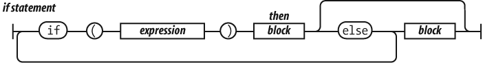
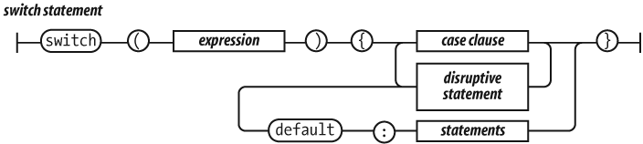
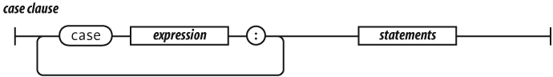
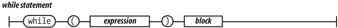
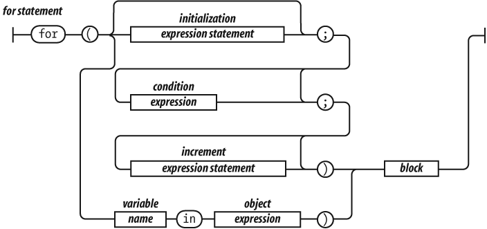
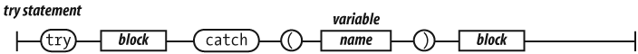

# Estructuras de control

## Estructura if...else

La estructura más utilizada en JavaScript y en la mayoría de lenguajes de programación es la estructura `if`. Se emplea para tomar decisiones en función de una condición. Su definición formal es:

    [javascript]
    if(condicion) {
      ...
    }

Si la condición se cumple (es decir, si su valor es `true`) se ejecutan todas las instrucciones que se encuentran dentro del bloque `{...}`. Si la condición no se cumple (es decir, si su valor es `false`) no se ejecuta ninguna instrucción contenida en `{...}` y el programa continúa ejecutando el resto de instrucciones del script.

Ejemplo:

    [javascript]
    var mostrarMensaje = true;
    
    if(mostrarMensaje) {
      console.log("Hola Mundo");
    }

En el ejemplo anterior, el mensaje sí que se muestra al usuario ya que la variable `mostrarMensaje` tiene un valor de `true` y por tanto, el programa entra dentro del bloque de instrucciones del `if`.

El ejemplo se podría reescribir también como:

    [javascript]
    var mostrarMensaje = true;
    
    if(mostrarMensaje == true) {
      console.log("Hola Mundo");
    }

En este caso, la condición es una comparación entre el valor de la variable `mostrarMensaje` y el valor `true`. Como los dos valores coinciden, la igualdad se cumple y por tanto la condición es cierta, su valor es `true` y se ejecutan las instrucciones contenidas en ese bloque del `if`.

La comparación del ejemplo anterior suele ser el origen de muchos errores de programación, al confundir los operadores `==` y `=`. Las comparaciones siempre se realizan con el operador `==`, ya que el operador `=` solamente asigna valores:

    [javascript]
    var mostrarMensaje = true;
    
    // Se comparan los dos valores
    if(mostrarMensaje == false) {
      ...
    }
    
    // Error - Se asigna el valor "false" a la variable
    if(mostrarMensaje = false) {
      ...
    }

La condición que controla el `if()` puede combinar los diferentes operadores lógicos y relacionales mostrados anteriormente:

    [javascript]
    var mostrado = false;
    
    if(!mostrado) {
      console.log("Es la primera vez que se muestra el mensaje");
    }

Los operadores `AND` y `OR` permiten encadenar varias condiciones simples para construir condiciones complejas:

    [javascript]
    var mostrado = false;
    var usuarioPermiteMensajes = true;
    
    if(!mostrado && usuarioPermiteMensajes) {
      console.log("Es la primera vez que se muestra el mensaje");
    }

La condición anterior está formada por una operación `AND` sobre dos variables. A su vez, a la primera variable se le aplica el operador de negación antes de realizar la operación `AND`. De esta forma, como el valor de `mostrado` es `false`, el valor `!mostrado` sería `true`. Como la variable `usuarioPermiteMensajes` vale `true`, el resultado de `!mostrado && usuarioPermiteMensajes` sería igual a `true && true`, por lo que el resultado final de la condición del `if()` sería `true` y por tanto, se ejecutan las instrucciones que se encuentran dentro del bloque del `if()`.

En ocasiones, las decisiones que se deben realizar no son del tipo *"si se cumple la condición, hazlo; si no se cumple, no hagas nada"*. Normalmente las condiciones suelen ser del tipo *"si se cumple esta condición, hazlo; si no se cumple, haz esto otro"*.

Para este segundo tipo de decisiones, existe una variante de la estructura `if` llamada `if...else`. Su definición formal es la siguiente:

    [javascript]
    if(condicion) {
      ...
    }
    else {
      ...
    }

Si la condición se cumple (es decir, si su valor es `true`) se ejecutan todas las instrucciones que se encuentran dentro del `if()`. Si la condición no se cumple (es decir, si su valor es `false`) se ejecutan todas las instrucciones contenidas en `else { }`. Ejemplo:

    [javascript]
    var edad = 18;
    
    if(edad >= 18) {
      console.log("Eres mayor de edad");
    } else {
      console.log("Todavía eres menor de edad");
    }

Si el valor de la variable `edad` es mayor o igual que el valor numérico `18`, la condición del `if()` se cumple y por tanto, se ejecutan sus instrucciones y se muestra el mensaje `"Eres mayor de edad"`. Sin embargo, cuando el valor de la variable `edad` no es igual o mayor que `18`,la condición del `if()` no se cumple, por lo que automáticamente se ejecutan todas las instrucciones del bloque `else { }`. En este caso, se mostraría el mensaje `"Todavía eres menor de edad"`.

El siguiente ejemplo compara variables de tipo cadena de texto:

    [javascript]
    var nombre = "";
  
    if(nombre == "") {
      console.log("Aún no nos has dicho tu nombre");
    } else {
      console.log("Hemos guardado tu nombre");
    }

La condición del `if()` anterior se construye mediante el operador `==`, que es el que se emplea para comparar dos valores (no confundir con el operador `=` que se utiliza para asignar valores). En el ejemplo anterior, si la cadena de texto almacenada en la variable `nombre` es vacía (es decir, es igual a `""`) se muestra el mensaje definido en el `if()`. En otro caso, se muestra el mensaje definido en el bloque `else { }`.

La estructura `if...else` se puede encadenar para realizar varias comprobaciones seguidas:

    [javascript]
    if(edad < 12) {
      console.log("Todavía eres muy pequeño");
    } else if(edad < 19) {
      console.log("Eres un adolescente");
    } else if(edad < 35) {
      console.log("Aun sigues siendo joven");
    } else {
      console.log("Piensa en cuidarte un poco más");
    }

No es obligatorio que la combinación de estructuras `if...else` acabe con la instrucción `else`, ya que puede terminar con una instrucción de tipo `else if()`.

## Estructura switch

La estructura `switch` es muy útil cuando la condición que evaluamos puede tomar muchos valores. Si utilizasemos una sentencia `if...else`, tendríamos que repetir la condición para los distintos valores.

    [javascript]
    if(dia == 1) {
      console.log("Hoy es lunes.");
    } else if(dia == 2) {
      console.log("Hoy es martes.");
    } else if(dia == 3) {
      console.log("Hoy es miércoles.");
    } else if(dia == 4) {
      console.log("Hoy es jueves.");
    } else if(dia == 5) {
      console.log("Hoy es viernes.");
    } else if(dia == 6) {
      console.log("Hoy es sábado.");
    } else if(dia == 0) {
      console.log("Hoy es domingo.");
    }

En este caso es más conveniente utilizar una estructura de control de tipo `switch`, ya que permite ahorrarnos trabajo y producir un código más limpio. Su definición formal es la siguiente:

    [javascript]
    switch(dia) {
      case 1: console.log("Hoy es lunes."); break;
      case 2: console.log("Hoy es martes."); break;
      case 3: console.log("Hoy es miércoles."); break;
      case 4: console.log("Hoy es jueves."); break;
      case 5: console.log("Hoy es viernes."); break;
      case 6: console.log("Hoy es sábado."); break;
      case 0: console.log("Hoy es domingo."); break;
    }

La cláusula `case` no tiene por qué ser una constante, sino que puede ser una expresión al igual que en la estructura `if`. El comportamiento por defecto de la estructura `switch`es seguir evaluando el resto de cláusulas, aún cuando una de ellas haya cumplido la condición. Para evitar ese comportamiento, es necesario utilizar la sentencia `break` en las cláusulas que deseemos.

## Estructura while

La estructura `while` ejecuta un simple bucle, mientras se cumpla la condición. Su definición formal es la siguiente:

    [javascript]
    var veces = 0;
    
    while(veces < 7) {
      console.log("Mensaje " + veces);
      veces++;
    }

La idea del funcionamiento de un bucle `while` es la siguiente: "mientras la condición indicada se siga cumpliendo, repite la ejecución de las instrucciones definidas dentro del `while`. Es importante modificar los valores de las variables incluidas dentro de la condición, ya que otra manera, el bucle se repetiría de manera indefinida, perjudicando la ejecución de la página y bloqueando la ejecución del resto del script.

    [javascript]
    var veces = 0;
    
    while(veces < 7) {
      console.log("Mensaje " + veces);
      veces = 0;
    }

En este ejemplo, se mostraría de manera infinita una alerta con el texto "Mensaje 0".

## Estructura for

La estructura `for` permite realizar bucles de una forma muy sencilla. Su definición formal es la siguiente:

    [javascript]
    for(inicializacion; condicion; actualizacion) {
      ...
    }

La idea del funcionamiento de un bucle `for` es la siguiente: *"mientras la condición indicada se siga cumpliendo, repite la ejecución de las instrucciones definidas dentro del for. Además, después de cada repetición, actualiza el valor de las variables que se utilizan en la condición"*.

* La "inicialización" es la zona en la que se establece los valores iniciales de las variables que controlan la repetición.
* La "condición" es el único elemento que decide si continua o se detiene la repetición.
* La "actualización" es el nuevo valor que se asigna después de cada repetición a las variables que controlan la repetición.
var mensaje = "Hola, estoy dentro de un bucle";

    [javascript]
    for(var i = 0; i < 5; i++) {
      console.log(mensaje);
    }

La parte de la inicialización del bucle consiste en:

    [javascript]
    var i = 0;

Por tanto, en primer lugar se crea la variable `i` y se le asigna el valor de `0`. Esta zona de inicialización solamente se tiene en consideración justo antes de comenzar a ejecutar el bucle. Las siguientes repeticiones no tienen en cuenta esta parte de inicialización.

La zona de condición del bucle es:

    [javascript]
    i < 5

Los bucles se siguen ejecutando mientras se cumplan las condiciones y se dejan de ejecutar justo después de comprobar que la condición no se cumple. En este caso, mientras la variable `i` valga menos de `5` el bucle se ejecuta indefinidamente.

Como la variable `i` se ha inicializado a un valor de `0` y la condición para salir del bucle es que `i` sea menor que `5`, si no se modifica el valor de `i` de alguna forma, el bucle se repetiría indefinidamente.

Por ese motivo, es imprescindible indicar la zona de actualización, en la que se modifica el valor de las variables que controlan el bucle:

    [javascript]
    i++

En este caso, el valor de la variable `i` se incrementa en una unidad después de cada repetición. La zona de actualización se ejecuta después de la ejecución de las instrucciones que incluye el `for`.

Así, durante la ejecución de la quinta repetición el valor de `i` será `4`. Después de la quinta ejecución, se actualiza el valor de `i`, que ahora valdrá `5`. Como la condición es que `i` sea menor que `5`, la condición ya no se cumple y las instrucciones del `for` no se ejecutan una sexta vez.

Normalmente, la variable que controla los bucles `for` se llama `i`, ya que recuerda a la palabra índice y su nombre tan corto ahorra mucho tiempo y espacio.

El ejemplo anterior que mostraba los días de la semana contenidos en un array se puede rehacer de forma más sencilla utilizando la estructura `for`:

    [javascript]
    var dias = ["Lunes", "Martes", "Miércoles", "Jueves", "Viernes", "Sábado", "Domingo"];
    
    for(var i=0; i<7; i++) {
      console.log(dias[i]);
    }

## Estructura for...in

Una estructura de control derivada de `for` es la estructura `for...in`. Su definición exacta implica el uso de objetos, permitiendo recorrer las propiedades de un objeto. En cada iteración, un nuevo nombre de propiedad del objeto es asignada a la variable:

    [javascript]
    for(propiedad in object) {
      if (object.hasOwnProperty(propiedad)) {
        ...
      }
    }

Suele ser conveniente comprobar que la propiedad pertenece efectivamente al objeto, a través de `object.hasOwnProperty(propiedad)`. De la misma manera que podemos recorrer las propiedades de un objeto, es posible adaptar este comportamiento a los arrays:

    [javascript]
    for(indice in array) {
      ...
    }

Si se quieren recorrer todos los elementos que forman un array, la estructura `for...in` es la forma más eficiente de hacerlo, como se muestra en el siguiente ejemplo:

    [javascript]
    var dias = ["Lunes", "Martes", "Miércoles", "Jueves", "Viernes", "Sábado", "Domingo"];
    
    for(i in dias) {
      console.log(dias[i]);
    }

La variable que se indica como indice es la que se puede utilizar dentro del bucle `for...in` para acceder a los elementos del array. De esta forma, en la primera repetición del bucle la variable `i` vale `0` y en la última vale `6`.

Esta estructura de control es la más adecuada para recorrer arrays (y objetos), ya que evita tener que indicar la inicialización y las condiciones del bucle `for` simple y funciona correctamente cualquiera que sea la longitud del array. De hecho, sigue funcionando igual aunque varíe el número de elementos del array.

## Estructura try

La estructura `try` consiste en un bloque de código que se ejecuta de manera normal, y captura cualquier excepción que se pueda producir en ese bloque de sentencias. Su definición formal es la siguiente:

    [javascript]
    try {
        funcion_que_no_existe();
    } catch(ex) {
        console.log("Error detectado: " + ex.description);
    }

En este ejemplo, llamamos a una función que no está definida, y por lo tanto provoca una excepción en JavaScript. Este error es *capturado* por la  cláusula `catch`, que contiene una serie de sentencias que indican que acciones realizar con esa excepción que acaba de producirse. Si no se produce ninguna excepción en el bloque `try`, no se ejecuta el bloque dentro de `catch`.

### La cláusula finally

La cláusula `finally` contiene las sentencias a ejecutar después de los bloques `try` y `catch`. Las sentencias incluidas en este bloque se ejecutan siempre, se haya producido una excepción o no. Un ejemplo clásico de utilización de la cláusula `finally`, es la de liberar recursos que el script ha solicitado.

    [javascript]
    abrirFichero()
    try {
       escribirFichero(datos);
    } catch(ex) {
        // Tratar la excepción
    } finally {
       cerrarFichero(); // siempre se cierra el recurso
    }

  
Ejercicio 3

[Ver enunciado](#ej03)

  
Ejercicio 4

[Ver enunciado](#ej04)

  
Ejercicio 5

[Ver enunciado](#ej05)