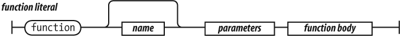
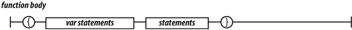

# Funciones

Las funciones son la base de la modularidad en JavaScript. Son utilizadas para reutilizar código, ocultar información y abstracción. Por norma general, las funciones son utilizadas para especificar el comportamiento de los objetos, aunque pueden definirse funciones al margen de los objetos.

Las funciones en JavaScript se definen mediante la palabra reservada `function`, seguida del nombre de la función. Su definición formal es la siguiente:

    [javascript]
    function nombre_funcion() {
      ...
    }

El nombre de la función se utiliza para *llamar* a esa función cuando sea necesario. El concepto es el mismo que con las variables, a las que se les asigna un nombre único para poder utilizarlas dentro del código. Después del nombre de la función, se incluyen dos paréntesis donde indicaremos los parámetros de la función. Por último, los símbolos `{` y `}` se utilizan para encerrar todas las instrucciones que pertenecen a la función.

## Funciones objeto

Las funciones en Javascript son objetos. Las funciones son objetos enlazados con `Function.prototype` (que a su vez enlaza con `Object.prototype`), que incluyen dos propiedades ocultas: el contexto de la función y el código que implementa su comportamiento.

Toda función en JavaScript es creada con una propiedad `protoype`. Su valor es un objeto con una propiedad *constructor* cuyo valor es la propia función. Esto es diferente al enlace oculto a `Function.prototype`. Veremos el significado de esta complicada construcción más adelante. Como las funciones son objetos, pueden ser utilizadas como cualquier otro valor. Pueden ser almacenadas en variables, objetos o arrays. Pueden ser pasadas como argumentos a otras funciones, y pueden ser retornadas por otras funciones. Además, al ser objetos, también pueden tener métodos. Lo que las hace realmente especiales es que pueden ser llamadas.

## Argumentos y valores de retorno

Las funciones más sencillas no necesitan ninguna información para producir sus resultados, aunque lo normal es que necesiten de datos para producir resultados. Las variables que necesitan las funciones se llaman *argumentos*. Antes de que pueda utilizarlos, la función debe indicar cuántos argumentos necesita y cuál es el nombre de cada argumento. Además, al llamar a la función, se deben incluir los valores (o expresiones) que se le van a pasar a la función. Los argumentos se indican dentro de los paréntesis que van detrás del nombre de la función y se separan con una coma (`,`).

    [javascript]
    var s = function suma_y_muestra(n1, n2) { ... }

A continuación, para utilizar el valor de los argumentos dentro de la función, se debe emplear el mismo nombre con el que se definieron los argumentos:

    [javascript]
    var s = function suma_y_muestra(n1, n2) {
      var resultado = n1 + n2;
      console.log("El resultado es " + resultado);
    }

Dentro de la función, el valor de la variable `n1` será igual al primer valor que se le pase a la función y el valor de la variable `n2` será igual al segundo valor que se le pasa.

Las funciones no solamente puede recibir variables y datos, sino que también pueden devolver los valores que han calculado. Para devolver valores dentro de una función, se utiliza la palabra reservada `return`. Aunque las funciones pueden devolver valores de cualquier tipo, solamente pueden devolver un valor cada vez que se ejecutan.

    [javascript]
    var c = function (precio) {
      var impuestos = 1.21;
      var gastosEnvio = 10;
      var precioTotal = ( precio * impuestos ) + gastosEnvio;
        
      return precioTotal;
    }

Para que la función devuelva un valor, solamente es necesario escribir la palabra reservada `return` junto con el nombre de la variable que se quiere devolver. En el ejemplo anterior, la ejecución de la función llega a la instrucción `return precioTotal;` y en ese momento, devuelve el valor que contenga la variable `precioTotal`.

Como la función devuelve un valor, en el punto en el que se realiza la llamada, debe indicarse el nombre de una variable en el que se guarda el valor devuelto:

    [javascript]
    var precioTotal = c(23.34);

Si no se indica el nombre de ninguna variable, JavaScript no muestra ningún error y el valor devuelto por la función simplemente se pierde y por tanto, no se utilizará en el resto del programa. Si la función llega a una instrucción de tipo `return`, se devuelve el valor indicado y finaliza la ejecución de la función. Por tanto, todas las instrucciones que se incluyen después de un `return` se ignoran y por ese motivo la instrucción `return` suele ser la última de la mayoría de funciones.

## Llamadas

Llamar a una función suspende la ejecución de la función actual, pasando el control y los parámetros a la nueva función. Además de los argumentos declarados, todas las funciones reciben dos argumentos extra: `this` y `arguments`. El parámetro `this` es muy importante la programación orientada a objetos, y su valor viene determinado por el patrón de llamada utilizado. Existen cuatro patrones de llamada en JavaScript: el patrón de llamada `method`, el patrón de llamada `function`, el patrón de llamada `constructor` y el patrón de llamada `apply`.

### Argumentos

El parámetro extra disponible en las funciones es el array `arguments`. Da a la función acceso a todas los argumentos pasados en la llamada, incluidos los argumentos extra que no coinciden con los parámetros definidos en la función. Esto hace posible escribir funciones que toman un número indefinido de parámetros.

    [javascript]
    var sum = function() {
        var i, sum = 0;
        for (i = 0; i < arguments.length; i += 1) {
            sum += arguments[i];
        }
        return sum;
    };
    
    document.writeln(sum(4, 8, 15, 16, 23, 42)); // 108

Debido a un problema de diseño, `arguments` no es realmente un array, sino un objeto que se comporta como un array. Dispone de la propiedad `length`, pero no incluye el resto de métodos de los arrays.

## Funciones Anónimas Autoejecutables

Un patrón común en JavaScript son las funciones anónimas autoejecutables. Este patrón consiste en crear una expresión de función e inmediatamente ejecutarla.

    [javascript]
    (function(){
      var foo = 'Hola mundo';
    })();
    
    console.log(foo);   // indefinido (undefined)

## Funciones como argumentos

En JavaScript, las funciones pueden ser asignadas a variables o pasadas a otras funciones como argumentos. En *frameworks* como jQuery por ejemplo, pasar funciones como argumentos es una práctica muy común.

    [javascript]
    var myFn = function(fn) {
      var result = fn();
      console.log(result);
    };
    
    myFn(function() { return 'hola mundo'; });   // muestra en la consola 'hola mundo'
    
    var myOtherFn = function() {
        return 'hola mundo';
    };
    
    myFn(myOtherFn);   // muestra en la consola 'hola mundo'

## Alcance

El alcance en un lenguaje de programación controla la visibilidad y el ciclo de vida de las variables y los parámetros. Por ejemplo:

    [javascript]
    var foo = function () {
        var a = 3, b = 5;
        var bar = function () {
            var b = 7, c = 11;
            // En este punto, a es 3, b es 7, y c es 11
            
            a += b + c;
            // En este punto, a es 21, b es 7, y c es 11
        };
        
        // En este punto, a es 3, b es 5, y c es undefined
        
        bar();
        
        // En este punto, a es 21, b es 5
    };

La mayoría de los lenguajes, con sintaxis de C, tienen un alcance de bloque. Todas las variables definidas en un bloque (sentencias definidas entre llaves) no son visibles fuera de ese bloque. Desafortunadamente, JavaScript no tiene esa visibilidad de bloque, a pesar de que su sintaxis así pueda sugerirlo, y esto puede ser una fuente de problemas. JavaScript tiene un alcance de función: esto quiere decir que los parámetros y variables definidos dentro de una función no son visibles fuera de esa función, y que una variable definida en cualquier lugar de la función, es visible desde cualquier lugar dentro de esa función.

## Funciones de cierre

La buena noticia sobre la visibilidad, es que las funciones internas pueden tener acceso a los parámetros y variables de las funciones donde han sido definidas (con la excepción de `this` y `arguments`). Antes hemos definido un objeto que tenía una propieda `value` y un método `increment`. Supongamos que queremos proteger ese valor cambios no autorizados. En lugar de inicializar ese objeto como un literal, vamos a inicializarlo llamando a una función que devuelva un objeto literal. Vamos a definir una variable `value` y un objeto de retorno con los métodos `increment` y `getValue`:

    [javascript]
    var myObject = (function () {
        var value = 0;
        
        return {
            increment: function (inc) {
                value += typeof inc === 'number' ? inc : 1;
            },
            getValue: function () {
                return value;
            }
        };
    }());

En este caso, tanto el método `increment` como `getValue` tienen acceso a la variable `value`, pero debido a su alcance de función, el resto de la aplicación no tiene acceso a su valor.

## Callbacks

Las funciones pueden facilitar el trabajo con métodos asíncronos. Supongamos el siguiente caso en el que hacemos una petición al servidor:

    [javascript]
    request = prepare_the_request();
    response = send_request_synchronously(request);
    display(response);

El problema aquí, es que esperamos la respuesta del servidor, por lo que bloqueamos la ejecución del script hasta obtener una respuesta. Una estrategia mucho mejor es realizar una llamada asíncrona, proporcionando una función de respuesta (`callback`) que se ejecutará cuando la respuesta esté disponible:

    [javascript]
    request = prepare_the_request();
    send_request_asynchronously(request, function (response) {
        display(response);
    });

## Ejecuciones en cascada

Algunos métodos no devuelven ningún tipo de dato, ya simplemente pueden modificar el estado de algún tipo de dato. Si hacemos que estos métodos devuelvan `this` en lugar de `undefined`, podemos encadenar la ejecución de esos métodos en cascada. Las funciones en cascada pueden permitirnos escribir sentencias de este tipo:

    [javascript]
    getElement('myBoxDiv')
        .move(350, 150)
        .width(100)
        .height(100)
        .color('red')
        .border('10px outset')
        .padding('4px')
        .appendText("Please stand by")
        .on('mousedown', function (m) {
            this.startDrag(m, this.getNinth(m));
        })
        .on('mousemove', 'drag')
        .on('mouseup', 'stopDrag')
        .tip('This box is resizeable');

  
Ejercicio 6

[Ver enunciado](#ej06)

  
Ejercicio 7

[Ver enunciado](#ej07)

  
Ejercicio 8

[Ver enunciado](#ej08)

  
Ejercicio 9

[Ver enunciado](#ej09)

  
Ejercicio 10

[Ver enunciado](#ej10)