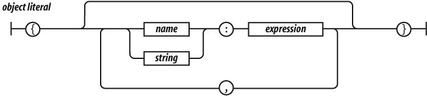

# Objetos

Los tipos primitivos en JavaScript son `undefined`, `null`, `boolean`, `number` y `string`. Aunque pueda resultar extraño, el resto de elementos en JavaScript son objetos, tanto las funciones, arrays, expresiones regulares como los propios objetos. Un objeto en JavaScript es un contenedor de propiedades, donde una propiedad tiene un nombre y un valor. El nombre de una propiedad puede ser una cadena de caracteres, incluso una vacía. El valor de la propiedad puede ser cualquier valor que podamos utilizar en JavaScript, excepto `undefined`.

En JavaScript, los objetos son básicamente [tablas hash](http://en.wikipedia.org/wiki/Hash_table), esto es, un grupo de propiedades y funciones que pueden ser accedidos a través de una clave. Tanto las propiedades como los métodos (que no son más que propiedades cuyo valor es una función) pueden ser creados dinámicamente en tiempo de ejecución.

## Representación de objetos

La manera más simple de construir un objeto en JavaScript, es declarar una nueva variable de tipo *Object* y asignarle las propiedades o métodos que el objeto necesite:

    [javascript]
    var obj = new Object();
    obj.foo = "bar";
    obj.hello = function() { console.log("Hello world!"); }

Existe una manera más rápida (en términos de caracteres), de crear un objeto utilizando la denominada notación literal. Esta representación consiste en asignar a una variable una pareja de llaves (`{` `}`) para crear un objeto vacío, y asignar las propiedades y métodos de la misma manera que en el ejemplo anterior:

    [javascript]
    var obj   = {};
    obj.foo   = "bar";
    obj.hello = function() { console.log("Hello world!"); }
    
    var obj = {
        "foo"   : "bar",
        "hello" : function() { console.log("Hello world!"); }
    };

Como hemos dicho, el nombre de una propiedad puede ser un `string`, incluso uno vacío. Las *comillas dobles* alrededor del nombre de la propiedad son opcionales, si el nombre es un nombre legal de JavaScript, y no es una palabra reservada. Así, las *comillas dobles* son necesarias para un nombre de propiedad como "first-name", pero no son necesarias para first_name. Los valores de las propiedades pueden ser cualquier expresión, incluso la definición de otro objeto:

    [javascript]
    var flight = {
        airline: "Oceanic",
        number: 815,
        departure: {
            IATA: "SYD",
            time: "2004-09-22 14:55",
            city: "Sydney"
        },
        arrival: {
            IATA: "LAX",
            time: "2004-09-23 10:42",
            city: "Los Angeles"
        }
    };

En JavaScript, los objetos son dinámicos, esto quiere decir que sus propiedades no tienen por qué ser definidas en el momento en el que creamos el objeto. Podemos añadir nuevas propiedades al objeto en tiempo de ejecución, tan solo indicando el nombre la propiedad y asignándole un valor o función.

    [javascript]
    var cat = new Object();
    cat.name = "Rufus";
    cat.species = "cat";
    cat.hello = function() { console.log("miaow"); }

Como podemos observar en la propiedad *hello*, su valor no es un tipo primitivo sino una función. Esto es posible porque en JavaScript las funciones son un tipo especial de objetos, que podemos tratar de la misma manera que un *string* o un número. Las propiedades que tienen como valor una función, son tratadas como métodos del objeto.

En estos casos, no suele ser necesario definir la función anteriormente, pudiendo utilizar una función anónima para declarar el método.

### Notación literal

Crear objetos utilizando una notación literal es muy útil en situaciones en las que queremos pasar una serie de datos relacionados a una función o configurar una librería externa.

Imaginemos una situación en la que utilizamos una librería que nos permite crear una galería de imágenes. Una posible solución sería definir un método para cada una de las propiedades de la galería, de manera que pudiésemos llamar a cada uno de esos métodos con el valor correspondiente. Esto supondría tener dos métodos por cada propiedad (*getter* y *setter*), así como una llamada para cada propiedad que deseemos configurar. Utilizando una notación literal de objetos, podemos ahorrarnos todo este código y configurar la librería utilizando un único objeto:

    [javascript]
    domElement.fancybox({
        maxWidth    : 800,
        maxHeight   : 600,
        fitToView   : false,
        width       : '70%',
        height      : '70%',
        autoSize    : false,
        closeClick  : false,
        openEffect  : 'none',
        closeEffect : 'none'
    });

Otra de las ventajas que nos ofrece esta notación literal, es poder crear librerías de utilidades, de la misma manera que podríamos crear una clase abstracta con métodos estáticos en otros lenguajes de programación con Java o C#. 

Aquí un ejemplo de cómo podríamos crear una librería de utilidades para arrays:

    [javascript]
    var ArrayUtil = {
        contains : function(array, element)
        {
            for(var x=0; x<array .length; x++)
            {
                if(array[x] === element)
                   return true;
            }
            return false;
        },
        exclude : function(list, items)
        {
            ...
        },
        makeList : function(list)
        {
            ...
        }
    }
    
    var list = ["A", "B", "C"];
    console.log("¿Contiene A? " + ArrayUtil.contains(list, "A"));

## Acceso

Es posible acceder a los valores de un objeto indicando el nombre de la propiedad dentro de unos corchetes (`[` `]`), como si accediésemos a un elemento de un *array*. Si el nombre de la propiedad es un nombre legal de JavaScript, y no es una palabra reservada, se puede utilizar la notación `.`. Es preferible utilizar la notación `.`, ya que es más corta y comúnmente utilizada como acceso a métodos y propiedades en lenguajes orientados a objetos:

    [javascript]
    flight["airline"]       // "Oceanic"
    flight.departure.IATA   // "SYD"

En algunas ocasiones, puede resultar interesante utilizar la notación corchetes (`[` `]`) para acceder a los elementos, ya que las claves son almacenadas como *strings*. Esto nos permite construir cadenas de caracteres en tiempo de ejecución, para acceder a las propiedades de los objetos. Por ejemplo, podemos crear un bucle para iterar sobre las propiedades de un objeto:

    [javascript]
    for(var property in cat)
        console.log(cat[property].toString());
    
    var myObject = {
        property1: "chocolate",
        property2: "cake",
        property3: "brownies"
    }
    
    for(var x=1; x<4; x++)
        console.log(myObject["property" + x]);

El valor `undefined` es devuelto si se intenta acceder a una propiedad que no existe:

    [javascript]
    stooge["middle-name"]   // undefined
    flight.status           // undefined
    stooge["FIRST-NAME"]    // undefined

El operador `||` puede ser utilizado para obtener valores por defecto:

    [javascript]
    var middle = stooge["middle-name"] || "(none)";
    var status = flight.status || "unknown";

Intentar acceder a los valores de una propiedad no definida, lanzará una excepción de tipo `TypeError`. Esto puede evitarse utilizando el operador `&&`, para asegurarnos que el valor existe y es accesible:

    [javascript]
    flight.equipment       // undefined
    flight.equipment.model // TypeError: Cannot read property 'model' of undefined
    flight.equipment && flight.equipment.model  // undefined

## Modificación

El valor de una objeto puede actualizarse a través de una asignación. Si el nombre de la propiedad existe en el objeto, su valor es reemplazado:

    [javascript]
    stooge['first-name'] = 'Arkaitz';

Si la propiedad no existe en el objeto, esta nueva propiedad es añadida al objeto:

    [javascript]
    stooge['middle-name'] = 'Lester';
    stooge.nickname = 'Curly';
    flight.equipment = { model: 'Boeing 777' }
    flight.status = 'overdue';

## Borrado

El operado `delete` puede ser utilizado para eliminar la propiedad de un objeto. Este operador eliminará la propiedad de un objeto, si la tuviera, pero no afectará al resto de propiedades de los prototipos.

    [javascript]
    another_stooge.nickname // 'Moe'
    
    // Remove nickname from another_stooge, revealing
    // the nickname of the prototype.
    delete another_stooge.nickname;
    
    another_stooge.nickname // 'Curly'

## Paso por referencia

Los objetos siempre son accedidos como referencias, nunca se copia su valor cuando los asignamos a otros objetos, o los pasamos como parámetros en funciones:

    [javascript]
    var x = stooge;
    x.nickname = 'Curly';
    
    // nick contiene 'Curly' porque x y stooge
    // referencian al mismo objeto
    var nick = stooge.nickname;
    
    // a, b, y c hacen referencia a
    // diferentes objetos vacíos
    var a = {}, b = {}, c = {};
    
    // a, b, y c hacen referencia al
    // mismo objeto vacío
    a = b = c = {};
    
    var obj { value = 5 };
    console.log(obj.value); // o.value = 5
    
    function change(obj)
    {
        obj.value = 6;
    }
    
    change(obj);
    console.log(obj.value); // o.value = 6

## Enumeración

La sentencia `for...in` puede iterar sobre todos los nombres de propiedades de un objeto. Esta iteración incluirá todas las propiedades, funciones y propiedades definidas en los prototipos, en las que no podemos estar interesados. La mejor manera de filtrar estas propiedades es a través de la función `hasOwnProperty` y el operador `typeof`:

    [javascript]
    var name;
    for (name in another_stooge) {
        if (typeof another_stooge[name] !== 'function') {
            document.writeln(name + ': ' + another_stooge[name]);
        }
    }

No hay ningún tipo de garantía en el orden en el que se van a mostrar las propiedades, por lo que si esto es importante, tendremos que controlarlo de alguna manera. Para ello, la mejor manera es olvidarnos de la sentencia `for...in` y acceder directamente a las propiedades concretas, en el orden que definamos:

    [javascript]
    var i;
    var properties = [
        'first-name',
        'middle-name',
        'last-name',
        'profession'
    ];
    
    for (i = 0; i < properties.length; i += 1) {
        document.writeln(properties[i] + ': ' +
            another_stooge[properties[i]]);
    }

## Objetos globales

JavaScript permite crear variables globales de una manera muy sencilla, Desafortunadamente, las variables globales perjudican directamente la calidad de los programas, por lo que deben ser evitadas. Una manera de minimizar la utilización de variables globales, es crear una única variable global para toda la aplicación, que incluya el resto de variables:

    [javascript]
    var MYAPP = {};

En este momento, esta variable se convierte en la contenedora de todas las variables de la aplicación:

    [javascript]
    MYAPP.stooge = {
        "first-name": "Joe",
        "last-name": "Howard"
    };
    
    MYAPP.flight = {
        airline: "Oceanic",
        number: 815,
        departure: {
            IATA: "SYD",
            time: "2004-09-22 14:55",
            city: "Sydney"
        },
        arrival: {
            IATA: "LAX",
            time: "2004-09-23 10:42",
            city: "Los Angeles"
        }
    };

Reduciendo el número de variables globales a uno, se reduce de manera significativa la posibilidad de colisiones con otras aplicaciones, widgtes o librerías. Además, la aplicación puede leerse y entenderse de manera más sencilla.