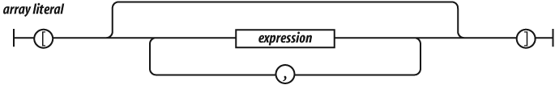

# Arrays

Un array es una asignación lineal de memoria donde los elementos son accedidos a través de índices numéricos, siendo además una estructura de datos muy rápida. Desafortunadamente, JavaScript no utiliza este tipo de arrays. En su lugar, JavaScript ofrece un objeto que dispone de características que le hacen parecer un array. Internamente, convierte los índices del array en `strings` que son utilizados como nombres de propiedades, haciéndolo sensiblemente más lento que un array.

## Representación de un array

JavaScript ofrecen una manera muy cómoda para crear y representar arrays. Una representación de un array consiste en una pareja de corchetes (`[` `]`) que contienen cero o más expresiones. El primer valor recibe la propiedad de nombre '0', la segunda la propiedad de nombre '1', y así sucesivamente. Se define de la siguiente manera:

Algunos ejemplos de declaración de arrays:

    [javascript]
    var empty = [];
    
    var numbers = [
        'zero', 'one', 'two', 'three', 'four',
        'five', 'six', 'seven', 'eight', 'nine'
    ];
    
    empty[1]        // undefined
    numbers[1]      // 'one'
    
    empty.length    // 0
    numbers.length  // 10

Si representasemos el array como un objeto

    [javascript]
    var numbers_object = {
        '0': 'zero', '1': 'one',    '2': 'two',
        '3': 'three', '4': 'four', '5': 'five',
        '6': 'six', '7': 'seven', '8': 'eight',
        '9': 'nine'
    ];

se produce un efecto similar. Ambas representaciones contienen 10 propiedades, y ests propiedades tienen exactamente los mismos nombres y valores. La diferencia radica en que `numbers` hereda de `Array.prototype`, mientras que `numbers_object` lo hace de `Object.prototype`, por lo que `numbers` hereda una serie de métodos que *convierten* a `numbers` en un array.

En la mayoría de los lenguajes de programación, se requiere que todos los elementos de un array sean del mismo tipo, pero en JavaScript eso no ocurre. Un array puede contener una mezcla valores:

    [javascript]
    var misc = [
        'string', 98.6, true, false, null, undefined,
        ['nested', 'array'], {object: true}, NaN,
        Infinity
    ];
    misc.length // 10

## Propiedad length

Todo array tiene una propiedad `length`. A diferencia de otros lenguajes, la longitud del array no es fija, y podemos añadir elementos de manera dinámica. Esto hace que la propiedad `length` varíe, y tenga en cuenta los nuevos elementos. La propiedad `length` hace referencia al mayor índice presente en el array, más uno. Esto es:

    [javascript]
    var myArray = [];
    myArray.length              // 0
    
    myArray[1000000] = true;
    myArray.length              // 1000001
    
    // myArray contiene un elemento!

La propiedad `length` puede indicarse de manera explícita. Aumentando su valor, no vamos a reservar más espacio para el array, pero si disminuimos su valor, haciendo que sea menor que el número de elementos del array, eliminará los elementos cuyo índice sea mayor que el nuevo `length`:

    [javascript]
    numbers.length = 3; // numbers es ['zero', 'one', 'two']

## Borrado

Como los arrays de JavaScript son realmente objetos, podemos utilizar el operador `delete` para eliminar elementos de un array:

    [javascript]
    delete numbers[2];
    // numbers es ['zero', 'one', undefined, 'shi', 'go']

Desafortunadamente, esto deja un espacio en el array. Esto es porque los elementos a la derecha del elemento eliminado conservan sus nombres. Para este caso, JavaScript incorpora una función `splice`, que permite eliminar y reemplazar elementos de un array. El primer argumento indica el por qué elemento comenzar a reemplazar, y el segundo argumento el número de elementos a eliminar.

    [javascript]
    numbers.splice(2, 1);
    // numbers es ['zero', 'one', 'shi', 'go']

  
Ejercicio 12

[Ver enunciado](#ej12)