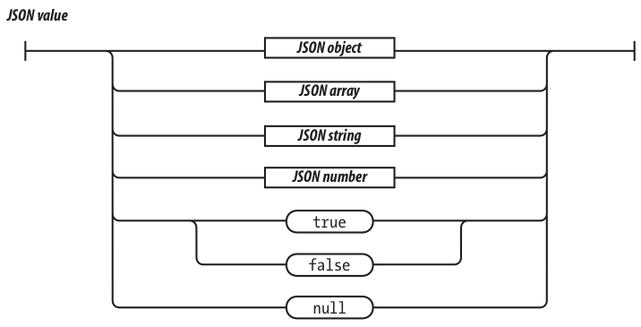
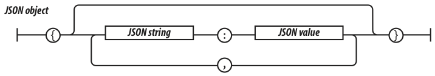
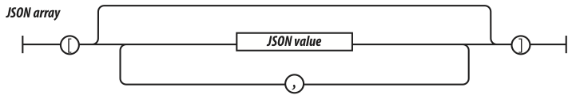

# JSON

JavaScript Object Notation (JSON) es un formato de intercambio de datos muy ligero y está basdo en la notación para la representación de objetos. A pesar de estar basado en JavaScript, es independiente del lenguaje. Puede ser utilizado para intercambiar datos entre programas escritos en lenguajes totalmente diferentes. Es un formato de texto, por lo que puede ser leído por máquinas y humanos, he implementado de una manera muy sencilla. Para acceder a toda la información sobre JSON, acceder a [http://www.JSON.org/](http://www.JSON.org/).

## Sintaxis JSON

JSON define seis tipos de valores: `objects`, `arrays`, `strings`, `numbers`, `booleans` y el valor especial `null`. Los espacios (espacios en blanco, tabuladores, retornos de carro y nueva línea) pueden introducirse antes o después de cualquier valor, sin afectar a los valores representados. Esto hace que un texto JSON sea mucho más fácil de leer por humanos.

Un objeto JSON es un contenedor, no ordenado de parejas clave/valor. Una clave puede ser un string, y un valor puede ser un valor JSON (tanto un array como un objeto). Los objetos JSON se pueden anidar hasta cualquier profundidad. Un array JSON es una secuencia ordenada de valores, donde un valor puede ser un valor JSON (tanto un array como un objeto).

La gran mayoría de lenguajes incluyen características para trabajar de manera cómoda con valores JSON en ambos sentidos: partiendo de un objeto u array para convertirlo a una cadena de caracteres, o a partir de una cadena de caracteres, obtener los valores JSON.

La sintaxis de los valores JSON es la siguiente:

## Utilizando JSON de manera segura

Utilizar JSON es realmente sencillo, ya que JSON es JavaScript. Un cadena de texto JSON puede convertirse en una estructura de datos de JavaScript utilizando la función `eval`:

    [javascript]
    var myData = eval('(' + myJSONText + ')');

La utilización de la función `eval` conlleva graves problemas de seguridad, por lo que su uso está totalmente desaconsejado. En su lugar, es recomendable utilizar el método `JSON.parse`, disponible en [github](https://github.com/douglascrockford/JSON-js). El método JSON.parse lanzará una excepción si la cadena que se intenta evaluar contiene un error.

Otro de los problemas puede venir de la interacción con el servidor y la propiedad `innerHTML` de los elementos del DOM. Un patrón común en los desarrollos con AJAX, es que el servidor devuelva un código HTML que nosotros asignamos directamente a un elemento del documento. Si el código HTML contiene una etiqueta `script`, entonces un script malicioso puede actuar.

¿Pero qué es lo realmente peligroso? Si un script consigue ejecutarse en una página, éste obtiene acceso al estado y las capacidades de la página. Puede interactuar con el servidor (sin que este pueda distingir una petición legítima de una maliciosa). Puede acceder al objeto global de JavaScript, a todos los datos de la aplicación (variables de JavaScript), al DOM y todo lo que el usuario está viendo e interactuando... De la misma manera que si el `script` hubiese sido programado por nosotros.

Este peligro viene dado por los objetos globales de JavaScript, no por AJAX, JSON, XMLHttpRequest o la Web 2.0. Simplemente el peligro está ahí desde la introducción de JavaScript en los navegadores, y seguirá ahí hasta que JavaScript sea reemplazado o reparado.