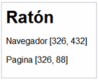
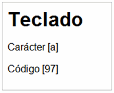
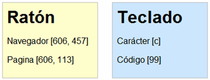

# Ejercicios

## Ejercicio 1 ## {#ej01}

Modificar el siguiente script para que:

    [html]
    <!DOCTYPE html PUBLIC "-//W3C//DTD XHTML 1.0 Transitional//EN" "http://www.w3.org/TR/xhtml1/DTD/xhtml1-transitional.dtd">
    <html xmlns="http://www.w3.org/1999/xhtml">
    <head>
    <meta http-equiv="Content-Type" content="text/html; charset=iso-8859-1" />
    <title>El primer script</title>
    
    
    </head>
    
    <body>
    
Esta página contiene el primer script

    </body>
    </html>

1. Todo el código JavaScript se encuentre en un archivo externo llamado `codigo.js` y el script siga funcionando de la misma manera.
2. Después del primer mensaje, se debe mostrar otro mensaje que diga "Soy el primer script"
3. Añadir algunos comentarios que expliquen el funcionamiento del código
4. Añadir en la página XHTML un mensaje de aviso para los navegadores que no tengan activado el soporte de JavaScript

## Ejercicio 2 ## {#ej02}

Modificar el script del ejercicio anterior para que:

1. El mensaje que se muestra al usuario se almacene en una variable llamada mensaje y el funcionamiento del script sea el mismo.
2. El mensaje mostrado sea el de la siguiente imagen:

## Ejercicio 3 ## {#ej03}

Crear un array llamado meses y que almacene el nombre de los doce meses del año. Mostrar por pantalla los doce nombres utilizando la función `console.log()`.

## Ejercicio 4 ## {#ej04}

A partir del siguiente array que se proporciona: `var valores = [true, 5, false, "hola", "adios", 2];`

1. Determinar cual de los dos elementos de texto es mayor
2. Utilizando exclusivamente los dos valores booleanos del array, determinar los operadores necesarios para obtener un resultado true y otro resultado false
3. Determinar el resultado de las cinco operaciones matemáticas realizadas con los dos elementos numéricos

## Ejercicio 5 ## {#ej05}

Completar las condiciones de los if del siguiente script para que los mensajes se muestren siempre de forma correcta:

    [javascript]
    var numero1 = 5;
    var numero2 = 8;
    
    if(...) {
      console.log("numero1 no es mayor que numero2");
    }
    if(...) {
      console.log("numero2 es positivo");
    }
    if(...) {
      console.log("numero1 es negativo o distinto de cero");
    }
    if(...) {
      console.log("Incrementar en 1 unidad el valor de numero1 no lo hace mayor o igual que numero2");
    }

## Ejercicio 6 ## {#ej06}

El cálculo de la letra del Documento Nacional de Identidad (DNI) es un proceso matemático sencillo que se basa en obtener el resto de la división entera del número de DNI y el número 23. A partir del resto de la división, se obtiene la letra seleccionándola dentro de un array de letras.

El array de letras es:

    [javascript]
    var letras = ['T', 'R', 'W', 'A', 'G', 'M', 'Y', 'F', 'P', 'D', 'X', 'B', 'N', 'J', 'Z', 'S', 'Q', 'V', 'H', 'L', 'C', 'K', 'E', 'T'];

Por tanto si el resto de la división es `0`, la letra del DNI es la `T` y si el resto es `3` la letra es la `A`. Con estos datos, elaborar un pequeño script que:

1. Almacene en una variable el número de DNI indicado por el usuario y en otra variable la letra del DNI que se ha indicado.
2. En primer lugar (y en una sola instrucción) se debe comprobar si el número es menor que `0` o mayor que `99999999`. Si ese es el caso, se muestra un mensaje al usuario indicando que el número proporcionado no es válido y el programa no muestra más mensajes.
3. Si el número es válido, se calcula la letra que le corresponde según el método explicado anteriormente.
4. Una vez calculada la letra, se debe comparar con la letra indicada por el usuario. Si no coinciden, se muestra un mensaje al usuario diciéndole que la letra que ha indicado no es correcta. En otro caso, se muestra un mensaje indicando que el número y la letra de DNI son correctos.

## Ejercicio 7 ## {#ej07}

El factorial de un número entero n es una operación matemática que consiste en multiplicar todos los factores `n x (n-1) x (n-2) x ... x 1`. Así, el factorial de `5` (escrito como `5!`) es igual a: `5! = 5 x 4 x 3 x 2 x 1 = 120`

Utilizando la estructura `for`, crear un script que calcule el factorial de un número entero.

## Ejercicio 8 ## {#ej08}

Escribir el código de una función a la que se pasa como parámetro un número entero y devuelve como resultado una cadena de texto que indica si el número es par o impar. Mostrar por pantalla el resultado devuelto por la función.

## Ejercicio 9 ## {#ej09}

Definir una función que muestre información sobre una cadena de texto que se le pasa como argumento. A partir de la cadena que se le pasa, la función determina si esa cadena está formada sólo por mayúsculas, sólo por minúsculas o por una mezcla de ambas.

## Ejercicio 10 ## {#ej10}

Definir una función que determine si la cadena de texto que se le pasa como parámetro es un palíndromo, es decir, si se lee de la misma forma desde la izquierda y desde la derecha. Ejemplo de palíndromo complejo: "La ruta nos aporto otro paso natural".

## Ejercicio 11 ## {#ej11}

Definir la siguiente jerarquía de objetos, haciendo uso de los prototipos de JavaScript:

* Objeto `Persona` con las propiedades `nombre`, `edad` y género, y el método `obtDetalles()`, que muestra por pantalla las propiedades de la persona.
* Objeto `Estudiante`, que hereda de `Persona`, e incluye las propiedades `curso` y `grupo` y el método `registrar()`.
* Objeto `Profesor`, que hereda de `Persona`, e incluye las propiedades `asignatura` y `nivel` y el método `asignar()`.

Crear los objetos y casos de prueba necesarios para comprobar el correcto funcionamiento de la jerarquía. 

## Ejercicio 12 ## {#ej12}

Escribir un script que simule el lanzamiento de dos dados. Hacer uso de la función `Math.random` para obtener números aleatorios entre 1 y 6 para cada uno de los lanzamientos de los dados. Sumar el resultado de lanzar dos dados y anotar en un array el número de apariciones de dicha suma, repitiendo 36.000 veces esta operación.

## Ejercicio 13 ## {#ej13}

Crear las expresiones regulares necesarias para resolver los siguientes puntos:

* Crear una expresión regular valide una fecha en formato "XX/XX/XXXX", donde "X" es un dígito. Probarlo con la expresión: "Nací el 05/04/1982 en Donostia.".
* Crear una expresión regular que valide una dirección de email. Para simplificar, los valores antes de la @ pueden contener cualquier carácter alfanumérico, y los caracteres `.` y `-`, mientras que los valores tra la @ pueden contener caracteres alfanuméricos, y el tipo de dominio puede tener una longitud de 2 o 3 caracteres.
* Dada la siguiente función que de reemplazo de caracteres, reescribirla utilizando expresiones regulares.

    [javascript]
    function escapeHTML(text) {
        var replacements = [["&", "&amp;"], ["\"", "&quot;"],
                            ["<", "&lt;"], [">", "&gt;"]];
        forEach(replacements, function(replace) {
            text = text.replace(replace[0], replace[1]);
        });
        return text;
    }

* Dados un nombre y un apellido, crear la expresión regulatr necesaria para mostrarlos en orden inverso y separados por una coma. Por ejemplo, la cadena "John Smith", convertirla en "Smith, John".
* Crear una expresión regular que elimine las etiquetas potencialmente peligrosas (``) y todo su contenido de una cadena HTML.

## Ejercicio 14 ## {#ej14}

A partir de la página web proporcionada y utilizando las funciones DOM, mostrar por pantalla la siguiente información:

1. Número de enlaces de la página
2. Dirección a la que enlaza el penúltimo enlace
3. Numero de enlaces que enlazan a http://prueba
4. Número de enlaces del tercer párrafo

[Descargar página HTML](snippets/cap18/ej14.html)

## Ejercicio 15 ## {#ej15}

Completar el código JavaScript proporcionado para que cuando se pulse sobre el enlace se muestre completo el contenido de texto. Además, el enlace debe dejar de mostrarse después de pulsarlo por primera vez. La acción de pulsar sobre un enlace forma parte de los "Eventos" de JavaScript que se ven en el siguiente capítulo. En este ejercicio, sólo se debe saber que al pinchar sobre el enlace, se ejecuta la función llamada muestra().

[Descargar página HTML](snippets/cap18/ej15.html)

## Ejercicio 16 ## {#ej16}

Completar el código JavaScript proporcionado para que se añadan nuevos elementos a la lista cada vez que se pulsa sobre el botón. Utilizar las funciones DOM para crear nuevos nodos y añadirlos a la lista existente. Al igual que sucede en el ejercicio anterior, la acción de pinchar sobre un botón forma parte de los "Eventos" de JavaScript que se ven en el siguiente capítulo. En este ejercicio, sólo se debe saber que al pinchar sobre el botón, se ejecuta la función llamada anade().

[Descargar página HTML](snippets/cap18/ej16.html)

## Ejercicio 17 ## {#ej17}

A partir de la página web proporcionada, completar el código JavaScript para que:

1. Cuando se pinche sobre el primer enlace, se oculte su sección relacionada
2. Cuando se vuelva a pinchar sobre el mismo enlace, se muestre otra vez esa sección de contenidos
3. Completar el resto de enlaces de la página para que su comportamiento sea idéntico al del primer enlace
4. Cuando una sección se oculte, debe cambiar el mensaje del enlace asociado

[Descargar página HTML](snippets/cap18/ej17.html)

## Ejercicio 18 ## {#ej18}

Completar el código JavaScript proporcionado para que:

* Al mover el ratón en cualquier punto de la ventana del navegador, se muestre la posición del puntero respecto del navegador y respecto de la página:

Para mostrar los mensajes, utilizar la función `muestraInformacion()` deduciendo su funcionamiento a partir de su código fuente.

* Al pulsar cualquier tecla, el mensaje mostrado debe cambiar para indicar el nuevo evento y su información asociada:

* Añadir la siguiente característica al script: cuando se pulsa un botón del ratón, el color de fondo del cuadro de mensaje debe ser amarillo (`#FFFFCC`) y cuando se pulsa una tecla, el color de fondo debe ser azul (`#CCE6FF`). Al volver a mover el ratón, el color de fondo vuelve a ser blanco.

[Descargar página HTML](snippets/cap18/ej18.html)

## Ejercicio 19 ## {#ej19}

Crear un script que informe al usuario en que zona de la pantalla ha pulsado el ratón. Las zonas definidas son las siguientes: izquierda arriba, izquierda abajo, derecha arriba y derecha abajo. Para determinar el tamaño de la ventana del navegador, utilizar la función `tamanoVentanaNavegador()` proporcionada.

[Descargar página HTML](snippets/cap18/ej19.html)

## Ejercicio 20 ## {#ej20}

Mejorar el ejemplo anterior indicando en todo momento al usuario el número de caracteres que aún puede escribir. Además, se debe permitir pulsar las teclas Backspace, Supr. y las flechas horizontales cuando se haya llegado al máximo número de caracteres.

## Ejercicio 21 ## {#ej21}

Construir un validador para un formulario de registro que, dado el HTML que se proporciona, valide cada uno de los campos cuando el usuario ha terminado de introducir datos en cada uno de ellos, es decir, al perder el foco. Si el campo no cumple las restricciones, se mostrará una alerta al usuario, pero se le permitirá seguir introduciendo datos en el resto de campos.

En el momento en el que el usuario envíe el formulario (evento `submit`), se validarán todos los campos y el formulario no se enviará si alguno de los campos no es válido. Las restricciones a cumplir son las siguientes:

* El nombre, email y comentarios son campos obligatorios.
* El campo email debe ser una dirección de email válida.
* El texto introducido en el campo de comentarios no debe exceder los 50 caracteres.
* El password debe tener una longitud mínima de 6 caracteres, y contener al menos una letra minúscula, una letra mayúscula y un dígito.

[Descargar página HTML](snippets/cap18/ej21.html)