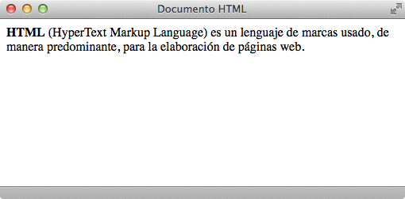

# Introducción

##¿Qué es HTML?

**HTML** *(HyperText Markup Language)* es un lenguaje de marcas usado, de manera predominante, para la elaboración de páginas web. El lenguaje **HTML** es utilizado en forma de texto para describir y crear la estructura de estas páginas, tanto por programas, que traducen un diseño de página en código HTML, como por parte de las personas de manera directa.

Este lenguaje es un estándar reconocido mundialmente y cuyas normas vienen dadas por el *World Wide Web Consortium* o [**W3C**](http://www.w3.org/) - consorcio internacional que produce recomendaciones para la *World Wide Web* -, lo que hace que una misma página HTML sea visualizada de forma *similar* en diferentes navegadores y sistemas operativos.

### Especificación oficial

Este organismo **W3C** elabora las normas a seguir para la creación de las páginas HTML o XHTML. Sin embargo, no es necesario conocer todas estas especificaciones, escritas en un lenguaje bastante formal, para diseñar páginas con este lenguaje.  Las normas oficiales están escritas en inglés y se pueden consultar de forma gratuita en las siguientes direcciones:

- [Especificación oficial de HTML 4.01](http://www.w3.org/TR/html401/)
- [Especificación oficial de XHTML 1.0](http://www.w3.org/TR/xhtml1/)

El estándar XHTML 1.0 incluye el 95% del estándar HTML 4.01, ya que sólo añade pequeñas mejoras y modificaciones menores. Este sería un sencillo gráfico del esquema de relación y evolución de los lenguajes **HTML** y **XHTML** *(eXtensible HyperText Markup Language)* - que es básicamente HTML expresado como **XML** válido, una versión más estricta a nivel técnico - :

### HTML, CSS y Javascript

Originalmente, las páginas HTML sólo incluian información sobre sus contenidos de texto e imágenes. Con el desarrollo del **estándar HTML**, las páginas empezaron a incluir también información sobre el aspecto de sus contenidos.

La posterior aparición de tecnologías como **JavaScript** provocó que las páginas HTML también incluyeran el código de las aplicaciones (llamadas *scripts*) que se utilizan para crear páginas web dinámicas.

Una página web está compuesta, como vemos en este gráfico, por **contenidos, presentación e interacción**. Esto es, está subdividida de manera que, en vez de incluir en una misma página todo, se utilizan mecanismos para separar dichos contenidos: como son **CSS** y **JavaScript**.

## Estructura y primer documento

### Cómo se construye y qué contiene

Este lenguaje de marcado se construye en forma de **etiquetas** o *tags* rodeadas por corchetes angulares (como `<html>`) dentro del contenido de la página web.
Muchas de las etiquetas vienen 'en pareja', como pueden ser `<h1>` y`</h1>`, siendo la primera la etiqueta o __*tag* inicial o de apertura__ y la segunda __de cierre__; pero también existen algunos *tags* conocidos como elementos vacíos, por ejemplo ``.

**HTML** puede incluir o incrustar *scripts* escritos en lenguajes como **JavaScript** que afectan al comportamiento de las páginas en HTML y crean webs dinámicas, y puede también describir en cierta manera la apariencia de un documento, aunque para dar estilo a las páginas web escritas con este lenguaje, lo más habitual es la utilización de las **hojas de estilo en cascada**, *Cascading Style Sheets*, o su nombre más común, **CSS**.

### Esquema de páginas HTML

Las páginas HTML se dividen en:

- **cabecera** o *head*: incluye información sobre dicha página (título, idioma, hojas de estilos) - todo lo que el usuario no ve, a excepción del título.
- **cuerpo** o *body*: incluye todos sus contenidos (párrafos de texto, imágenes) - todo lo que ve el usuario.

    [html]
    <html>
        <head>
           <title>Documento HTML</title>
        </head>
        <body>
           
<strong>HTML</strong> (HyperText Markup Language) es un lenguaje
            de marcas usado, de manera predominante, para la elaboración
            de páginas web.

        </body>
    </html>

Si guardásemos este código HTML con un editor de texto sin formato y la extensión **.html**, y lo abriésemos con cualquier navegador, esto sería lo que veríamos:

En este ejemplo anterior, hemos utilizado los *tags* `<html>`, `<head>` y `<body>`, las tres etiquetas principales de un documento HTML:

- `<html>`: es el primer y último *tag* (`</html>`) de un documento HTML, lo que significa que ninguna etiqueta o contenido debe colocarse antes o después de éstas (a excepción del *doctype*).

- `<head>`: delimita la parte de la cabecera del documento y contiene información sobre éste que no se muestran al usuario (a excepción del *tag* `<title>` que muestra el título de la página en la parte superior izquierda de la ventana del navegador).

- `<body>`: delimita el cuerpo del documento HTML y encierra todos sus contenidos visibles.
