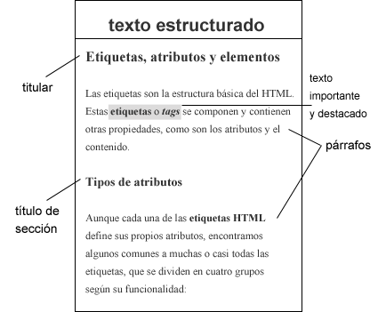
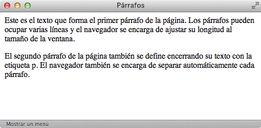
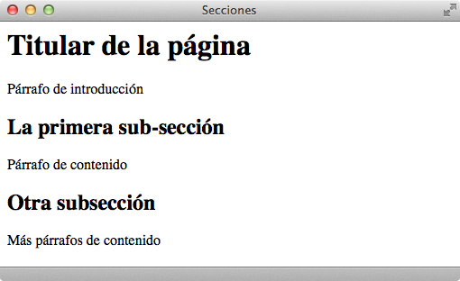
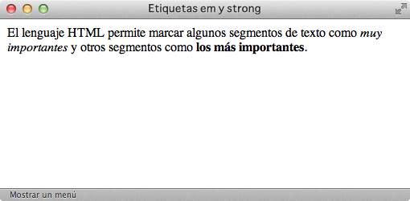
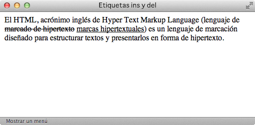
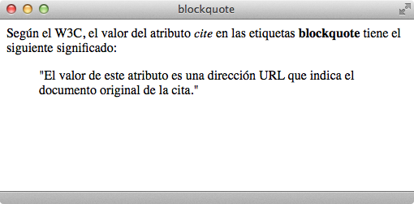
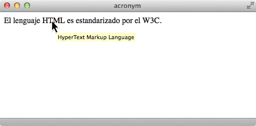
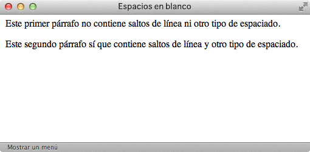
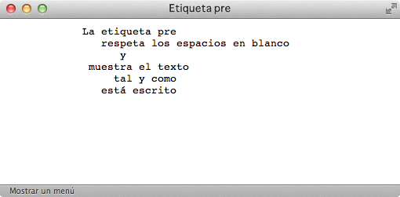
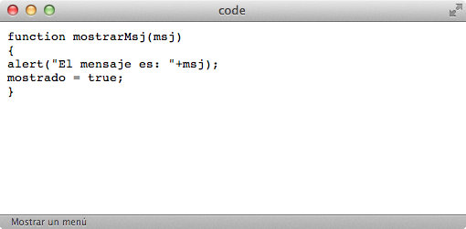

# Texto

La mayor parte de las **páginas HTML** están formadas por **texto** (llegando a ser más del 90% del código de la página).
Este lenguaje define *tags* para **estructurar** el contenido y otros para **marcar** elementos importantes dentro del texto.

El proceso de **estructuración** de un texto simple consiste en indicar las diferentes zonas o secciones que componen un texto: como son los párrafos o títulos de sección.

El proceso posterior a estructurar el texto consiste en **marcar** los diferentes elementos dentro de éste: definiciones, abreviaturas, textos importantes, textos modificados, citas a otras referencias, etc.

Un **ejemplo** de texto original y otro de texto estructurado sería:

Este ejemplo muestra una transformación de un párrafo con un **texto simple** a un **texto estructurado y marcado** donde encontramos:

## Cómo estructurar un texto

### Párrafos

| Etiqueta              | `
`    |
| --------------------: | :------------- |
| **Atributos comunes** | básicos, internacionalización, eventos |
| **Atributos propios** | - |
| **Tipo de elemento**  | En bloque |
| **Descripción**       | Delimita el contenido de un párrafo de texto |

Esta etiqueta `
` permite definir los **párrafos** que forman el texto de una página. Como se puede ver en la tabla anterior, estos párrafos son **elementos en bloque**, por lo que ocupan toda la anchura del navegador. No presentan **atributos** específicos pero sí se les pueden asignar los atributos comunes de HTML básicos, de internacionalización y de eventos.

Un ejemplo de **código HTML** con la etiqueta `
` sería:

    [html]
    <html>
        <head>
            <title>Párrafos</title>
        </head>
        <body>
            
Este es el texto que forma el primer párrafo de la página.
            Los párrafos pueden ocupar varias líneas y el navegador se encarga
            de ajustar su longitud al tamaño de la ventana.

            
El segundo párrafo de la página también se define encerrando
            su texto con la etiqueta p. El navegador también se encarga de
            separar automáticamente cada párrafo.

        </body>
    </html>

Y un navegador lo visualizaría de esta manera:

### Secciones

| Etiqueta              | `<h1>`,`<h2>`,`<h3>`,`<h4>`,`<h5>`,`<h6>`    |
| --------------------: | :------------- |
| **Atributos comunes** | básicos, internacionalización, eventos |
| **Atributos propios** | - |
| **Tipo de elemento**  | En bloque |
| **Descripción**       | Define los títulos de las secciones de mayor importancia de la página |

Estas etiquetas `<h1>`…`<h6>` definen **títulos de sección**, no secciones completas. Como se puede ver en la tabla anterior y al igual que el *tag* `
`, estas secciones son **elementos en bloque**, por lo que ocupan toda la anchura del navegador y tampoco presentan **atributos** específicos pero sí se les pueden asignar los atributos comunes de HTML básicos, de internacionalización y de eventos.

Los navegadores asignan de forma automática el tamaño del título de cada sección en función de su importancia, que se puede modificar utilizando las hojas de estilos **CSS**.

Un ejemplo de **código HTML** con la etiqueta `
` más las etiquetas `<h1>`y `<h2>` sería:

    [html]
    <html>
        <head>
            <title>Secciones</title>
        </head>
        <body>
            <h1>Titular de la página</h1>
            
Párrafo de introducción

            <h2>La primera sub-sección</h2>
            
Párrafo de contenido

            <h2>Otra subsección</h2>
            
Más párrafos de contenido

        </body>
    </html>

Y un navegador lo visualizaría de esta manera:

## Marcado básico de un texto

El siguiente paso posterior a la **estructuración** del texto consistiría en el **marcado** de éste. Para el marcado básico de un texto encontraríamos estas etiquetas:

| Etiqueta              | `<em>`    |
| --------------------: | :------------- |
| **Atributos comunes** | básicos, internacionalización, eventos |
| **Atributos propios** | - |
| **Tipo de elemento**  | En línea |
| **Descripción**       | Realza la importancia del texto que encierra - *cursiva* |

| Etiqueta              | `<strong>`    |
| --------------------: | :------------- |
| **Atributos comunes** | básicos, internacionalización, eventos |
| **Atributos propios** | - |
| **Tipo de elemento**  | En línea |
| **Descripción**       | Realza con la máxima importancia el texto que encierra - **negrita** |

Un ejemplo de **código HTML** con las etiquetas `<em>` y `<strong>` sería:

    [html]
    <html>
        <head>
            <title>Etiquetas em y strong</title>
        </head>
        <body>
            
El lenguaje HTML permite marcar algunos segmentos de texto
            como <em>muy importantes</em> y otros segmentos como <strong>los
            más importantes</strong>.

        </body>
    </html>

Y un navegador lo visualizaría de esta manera:

HTML también permite marcar de forma adecuada las modificaciones realizadas en el contenido de una página: el texto que **ha sido eliminado** y el texto que **ha sido añadido**:

| Etiqueta              | `<ins>`    |
| --------------------: | :------------- |
| **Atributos comunes** | básicos, internacionalización, eventos |
| **Atributos propios** | `cite="url"` Indica la URL de la página en la que se puede obtener más información sobre el motivo por el que se realizó la modificación. `datetime="fecha"` Especifica la fecha y hora en la que se realizó el cambio |
| **Tipo de elemento**  | En bloque y en línea |
| **Descripción**       | Se emplea para marcar una modificación en los contenidos originales consistente en la inserción de un nuevo contenido |

| Etiqueta              | `<del>`    |
| --------------------: | :------------- |
| **Atributos comunes** | básicos, internacionalización, eventos |
| **Atributos propios** | `cite="url"` Indica la URL de la página en la que se puede obtener más información sobre el motivo por el que se realizó la modificación. `datetime="fecha"` Especifica la fecha y hora en la que se realizó el cambio |
| **Tipo de elemento**  | En bloque y en línea |
| **Descripción**       | Se emplea para marcar una modificación en los contenidos originales consistente en el borrado de cierto contenido |

Por defecto, el texto eliminado (`<del>`) se muestra tachado y el texto insertado (`<ins>`) se muestra subrayado.

Un ejemplo de **código HTML** con las etiquetas `<ins>` y `<del>` sería:

    [html]
    <html>
        <head>
            <title>Etiquetas ins y del</title>
        </head>
        <body>
            
El HTML, acrónimo inglés de Hyper Text Markup Language (lenguaje
            de <del datetime="20091025" cite="http://www.enlace.com">marcado de
            hipertexto</del> <ins datetime="20091026" cite="http://enlace.com">
            marcas hipertextuales</ins>) es un lenguaje de marcación diseñado
            para estructurar textos y presentarlos en forma de hipertexto.

        </body>
    </html>

Y un navegador lo visualizaría de esta manera:

Además de estas dos, encontramos la etiqueta `<blockquote>` para incluir citas textuales en las páginas web.

| Etiqueta              | `<blockquote>`    |
| --------------------: | :------------- |
| **Atributos comunes** | básicos, internacionalización, eventos |
| **Atributos propios** | `cite="url"` Indica la URL de la página en la que se puede obtener más información sobre el motivo por el que se realizó la modificación |
| **Tipo de elemento**  | En bloque |
| **Descripción**       | Se emplea para indicar que el texto que encierra es una cita textual de otro texto externo |

Un ejemplo de **código HTML** con la etiqueta `<blockquote>` sería:

    [html]
    <html>
        <head>
            <title>Etiqueta blockquote</title>
        </head>
        <body>
            
Según el W3C, el valor del atributo <em>cite</em> en las
            etiquetas <strong>blockquote</strong> tiene el siguiente
            significado:

            <blockquote cite="http://www.w3.org/TR/html401/struct/text.html">
            "El valor de este atributo es una dirección URL que indica el
            documento original de la cita."</blockquote>
        </body>
    </html>

Y un navegador lo visualizaría de esta manera:

  
Ejercicio 2

[Ver enunciado](#ej02)

  
Ejercicio 3

[Ver enunciado](#ej03)

## Marcado avanzado de un texto

La etiqueta `<abbr>` marca las abreviaturas de un texto y la etiqueta `<acronym>` se emplea para marcar las siglas o acrónimos del texto. En ambos casos, el atributo `title` se puede utilizar para incluir el significado completo de la abreviatura o sigla. La mayoría de navegadores muestran por defecto un borde inferior punteado para estos elementos.

| Etiqueta              | `<abbr>`    |
| --------------------: | :------------- |
| **Atributos comunes** | básicos, internacionalización, eventos |
| **Atributos propios** | `title="texto"` Indica el significado completo de la abreviatura |
| **Tipo de elemento**  | En línea |
| **Descripción**       | Se emplea para marcar las abreviaturas del texto y proporcionar el significado de esas abreviaturas |

| Etiqueta              | `<acronym>`    |
| --------------------: | :------------- |
| **Atributos comunes** | básicos, internacionalización, eventos |
| **Atributos propios** | `title="texto"` Indica el significado completo del acrónimo o sigla |
| **Tipo de elemento**  | En línea |
| **Descripción**       | Se emplea para marcar las siglas o acrónimos del texto y proporcionar el significado de esas siglas |

Un ejemplo de **código HTML** con la etiqueta `<acronym>` sería:

    [html]
    <html>
        <head>
            <title>Etiqueta acronym</title>
        </head>
        <body>
            
El lenguaje <acronym title="HyperText Markup Language">
            HTML</acronym> es estandarizado por el <acronym title="World
            Wide Web Consortium">W3C</acronym>.

        </body>
    </html>

Y un navegador lo visualizaría de esta manera:

La etiqueta `<dfn>` proporciona al usuario la definición de todas las palabras para las que se considere apropiado, y la etiqueta `<cite>` se utiliza para marcar un texto como una citación:

| Etiqueta              | `<dfn>`    |
| --------------------: | :------------- |
| **Atributos comunes** | básicos, internacionalización, eventos |
| **Atributos propios** | `title="texto"` Indica el significado completo del término |
| **Tipo de elemento**  | En línea |
| **Descripción**       | Se emplea para marcar las definiciones de ciertos términos y proporcionar el significado de esos términos |

Un ejemplo de **código HTML** con la etiqueta `<dfn>` sería:

    [html]
    
Con estos síntomas, podría tratarse de un caso de <dfn title="Imagen o sensación subjetiva, propia de un sentido, determinada por otra sensación que afecta a un sentido diferente">sinestesia</dfn>

| Etiqueta              | `<cite>`    |
| --------------------: | :------------- |
| **Atributos comunes** | básicos, internacionalización, eventos |
| **Atributos propios** | - |
| **Tipo de elemento**  | En línea |
| **Descripción**       | Se emplea para marcar una cita o una referencia a otras fuentes |

La diferencia entre `<cite>` y `<blockquote>` está en que el elemento `<cite>` marca el autor de la cita (persona, documento, etc.) y `<blockquote>` marca el contenido de la propia cita.

Un ejemplo de **código HTML** con ambas etiquetas sería:

    [html]
    Como dijo <cite>Mahatma Gandhi</cite>:
    <blockquote>Vive como si fueras a morir mañana y aprende como si fueras a vivir para siempre.</blockquote>

## Etiqueta &lt;span&gt;

La etiqueta `` permite agrupar varios elementos en línea seguidos dentro de un mismo bloque (por ejemplo, varias palabras seguidas en un párrafo), para después darles formato con las hojas de estilo **CSS**.
Se emplea para marcar cualquier elemento que no se puede marcar con las otras etiquetas definidas.

La etiqueta `` se visualiza por defecto con el mismo aspecto que el texto normal. Por tanto, es habitual utilizar esta etiqueta junto con los atributos `id` y `class` para modificar posteriormente su aspecto con **CSS**.

Este *tag* sólo se puede utilizar, como ya hemos mencionado, para encerrar **contenidos y etiquetas en línea**. Cuando se quieren estructurar elementos en bloque, se utiliza la etiqueta `
`.

Un ejemplo de **código HTML** con la etiqueta `` sería:

    [html]
    Importante: Si quiere ponerse en contacto con nuestra empresa, puede hacerlo en el teléfono 0034 900 000 000 o a través de la dirección de correo contacto@empresa.com

## Espacios en blanco y nuevas líneas

### Espacios en blanco

El lenguaje **HTML** considera **espacio en blanco** a: los espacios en blanco, los tabuladores, los retornos de carro y el carácter de nueva línea. HTML ignora todos los espacios en blanco sobrantes, es decir, todos los espacios en blanco que no son el espacio en blanco que separa las palabras.

Un ejemplo de este comportamiento sería:

    [html]
    <html>
        <head>
            <title>Espacios en blanco</title>
        </head>
        <body>
            
Este primer párrafo no contiene saltos de línea ni otro tipo de espaciado.

            
Este segundo párrafo sí que contiene saltos
            de
            línea
            y   otro   tipo   de   espaciado.

        </body>
    </html>

Que un navegador visualizaría de esta manera:

Sin embargo, existen alternativas para incluir **espacios en blanco adicionales**. Esto se consigue sustituyendo cada nuevo espacio en blanco por el texto `&nbsp;`.

Cada texto `&nbsp;` equivale a un sólo espacio en blanco, por lo que se deben escribir tantos `&nbsp;` seguidos como espacios en blanco se quieran conseguir.

Si quisiéramos visualizar el texto del ejemplo anterior con todos los espacios adicionales, debería escribirse de esta manera:

    [html]
    <html>
        <head>
            <title>Espacios en blanco</title>
        </head>
        <body>
            
Este primer párrafo no contiene saltos de línea ni otro tipo de espaciado.

            
Este segundo párrafo sí que contiene saltos  
            de  
            línea  
            y &nbsp;&nbsp; otro &nbsp; tipo &nbsp; de &nbsp; espaciado.

        </body>
    </html>

Que un navegador visualizaría de esta manera:

Este ejemplo de **código HTML** incluye la etiqueta ` `, que se explica a continuación.

### Nuevas líneas

Para forzar una nueva línea, o lo que es lo mismo, lo equivalente a presionar la tecla *Enter* o *Intro* escribiendo un texto, se utiliza el *tag* ` `. Se trata de una **etiqueta vacía**, es decir, no encierra ningún texto.

| Etiqueta              | ` `    |
| --------------------: | :------------- |
| **Atributos comunes** | básicos |
| **Atributos propios** | - |
| **Tipo de elemento**  | En línea y etiqueta vacía |
| **Descripción**       | Fuerza al navegador a insertar una nueva línea |

Existen varias formas de expresar esta etiqueta. Si bien se puede abrir y cerrar de forma consecutiva (`  `), la forma de uso más común es abriendo y cerrando un único *tag* de esta forma: ` `o ` `.

### Texto preformateado

Existe una manera de mostrar el **texto tal y como está escrito**, respetando los espacios en blanco y las nuevas líneas. Se utiliza, por ejemplo, cuando una página debe mostrar directamente el texto generado por alguna aplicación.

| Etiqueta              | `<pre>`    |
| --------------------: | :------------- |
| **Atributos comunes** | básicos, internacionalización, eventos |
| **Atributos propios** | - |
| **Tipo de elemento**  | En bloque |
| **Descripción**       | Muestra el texto que encierra tal y como está escrito |

Los elementos `<pre>` son algo especiales, ya que los navegadores les aplican algunas reglas:

- Mantienen todos los espacios en blanco (tabuladores, espacios y nuevas líneas)
- Muestra el texto con un tipo de letra de ancho fijo (todas las letras de la misma anchura)
- No se ajusta la longitud de las líneas (las líneas largas producen un *scroll* horizontal), lo que provoca que la anchura de la página sea superior a la anchura de la ventana del navegador.

Un ejemplo de **código HTML** con la etiqueta `<pre>` sería:

    [html]
    <html>
        <head>
            <title>Etiqueta pre</title>
        </head>
        <body>
            <pre>
            La etiqueta pre
               respeta los espacios en blanco
                  y
             muestra el texto
                 tal y como
               está escrito
            

            </pre>
        </body>
    </html>

Y un navegador lo visualizaría de esta manera:

También existe la etiqueta `<code>` que se utiliza para mostrar código fuente de cualquier lenguaje de programación.

| Etiqueta              | `<code>`    |
| --------------------: | :------------- |
| **Atributos comunes** | básicos, internacionalización, eventos |
| **Atributos propios** | - |
| **Tipo de elemento**  | En bloque |
| **Descripción**       | Delimita el texto considerado un fragmento de código fuente |

Las reglas que los navegadores aplican a las etiquetas `<code>` son:

- Muestra el texto con un tipo de letra de ancho fijo (todas las letras de la misma anchura)

Sin embargo, no respeta los espacios en blanco ni las líneas, por lo que, en ese sentido, su comportamiento es similar a la etiqueta `
`.

Un ejemplo de **código HTML** con la etiqueta `<code>` sería:

    [html]
    <html>
        <head>
            <title>code</title>
        </head>
        <body>
            <code>
                function mostrarMsj(msj)
                {
                    alert("El mensaje es: "+msj);
                    mostrado = true;
                }
            </code>
        </body>
    </html>

  
Ejercicio 4

[Ver enunciado](#ej04)

  
Ejercicio 5

[Ver enunciado](#ej05)

## Codificación de caracteres

Existen **caracteres** que se utilizan habitualmente en los textos que no se pueden incluir directamente en las páginas web o que pueden darnos problemas. Estos son:

- Los caracteres que utiliza el lenguaje **HTML** para definir sus etiquetas.
- Los caracteres **propios de idiomas que no son el inglés**.

Para los caracteres propios del lenguaje HTML existen algunas expresiones o **entidades HTML** que los sustituyen:

| Entidad | Caracter    |
| ------: | :---------- |
| `&lt;`  | < |
| `&gt;`  | > |
| `&amp;` | & |
| `&quot;`| " |
| `&nbsp;`| espacio en blanco |
| `&apos;`| ' |

En cuanto a los caracteres propios de idiomas diferentes al inglés, cuando todos los procesos involucrados (entorno de desarrollo, servidor web y navegador) utilizan la misma codificación de caracteres (por ejemplo, **UTF-8**), el texto se verá correctamente en el navegador. Pero si la codificación cambia sin realizar una conversión correcta, el navegador mostrará caracteres extraños.

La solución más correcta y sencilla es sustituir estos caracteres potencialmente problemáticos por su **entidad HTML**, ya que si se utilizan las entidades HTML en vez de los caracteres problemáticos, es indiferente pasar de una codificación de caracteres a otra diferente.

| Entidad     | Caracter    |
| ----------: | :---------- |
| `&ntilde;`  | ñ |
| `&Ntilde;`  | Ñ |
| `&aacute;`  | á |
| `&eacute;`  | é |
| `&iacute;`  | í |
| `&oacute;`  | ó |
| `&uacute;`  | ú |
| `&Aacute;`  | Á |
| `&Eacute;`  | É |
| `&Iacute;`  | Í |
| `&Oacute;`  | Ó |
| `&Uacute;`  | Ú |
| `&euro;`    | € |

Puedes consultar la tabla completa de entidades HTML en Wikipedia: [http://en.wikipedia.org/wiki/List_of_XML_and_HTML_character_entity_references](http://en.wikipedia.org/wiki/List_of_XML_and_HTML_character_entity_references)

