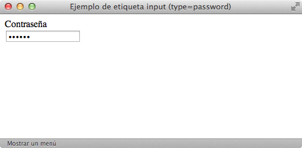
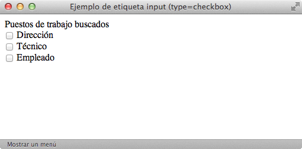
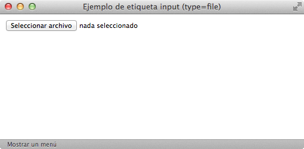
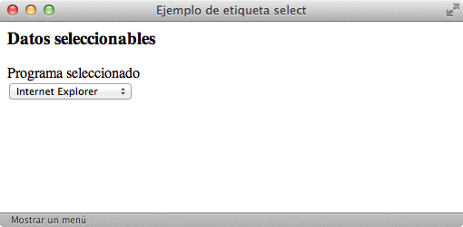

# Formularios

Como ya hemos mencionado en numerosas ocasiones, **HTML** es un **lenguaje de marcado** cuyo propósito principal consiste en **estructurar los contenidos** de los documentos y páginas web. Sin embargo, HTML también incluye elementos para crear **aplicaciones web**. El estándar HTML/XHTML permite crear **formularios** para que los usuarios interactúen con las aplicaciones web.

**HTML/XHTML** incluye los suficientes elementos de formulario para crear desde los formularios sencillos que utilizan los buscadores hasta los formularios complejos de las aplicaciones más avanzadas.

## Formularios básicos

Los formularios más sencillos se pueden crear utilizando solamente dos etiquetas: `<form>` y `<input>`.

Un ejemplo de **código HTML** con ambas etiquetas sería:

    [html]
    <html>
        <head>
            <title>Ejemplo de formulario sencillo</title>
        </head>
        <body>
            <h3>Formulario muy sencillo</h3>
            <form action="http://www.enlace.es/formulario.php" method="post">
                Escribe tu nombre:
                <input type="text" name="nombre" value="" />
                 
                <input type="submit" value="Enviar" />
            </form>
        </body>
    </html>

Y un navegador lo visualizaría de esta manera:

La etiqueta `<form>` encierra todos los contenidos del formulario (botones, cuadros de texto, listas desplegables) y la etiqueta `<input>` permite definir varios tipos diferentes de elementos (botones y cuadros de texto).

| Etiqueta              | `<form>`    |
| --------------------: | :------------- |
| **Atributos comunes** | básicos, internacionalización, eventos |
| **Atributos propios** | `action="url"` Indica la URL que se encarga de procesar los datos del formulario `method="POST o GET"` Método HTTP empleado al enviar el formulario `enctype="application/x-www-form-urlencoded o multipart/form-data"` Tipo de codificación empleada al enviar el formulario al servidor (sólo se indica de forma explícita en los formularios que permiten adjuntar archivos) `accept="tipo"` Lista separada por comas de todos los tipos de archivos aceptados por el servidor (sólo para los formularios que permiten adjuntar archivos) Otros: `accept-charset`, `onsubmit`, `onreset` |
| **Tipo de elemento**  | En bloque |
| **Descripción**       | Se emplea para insertar un formulario en la página |

La mayoría de formularios utilizan sólo los atributos `action` y `method`. El atributo `action` indica la URL de la aplicación del servidor que se encarga de **procesar los datos** introducidos por los usuarios. Esta aplicación también se encarga de generar la **respuesta** que muestra el navegador.

El atributo `method` establece la **forma en la que se envían los datos** del formulario al servidor. Este atributo hace referencia al **método HTTP**, por lo que no es algo propio de HTML. Los dos valores que se utilizan en los formularios son `GET` y `POST`. De esta forma, casi todos los formularios incluyen el atributo `method="get"` o el atributo `method="post"`.

Al margen de otras diferencias técnicas, el método `POST` permite el envío de mucha más información que el método `GET`. En general, el método `GET` admite como máximo el envío de unos 500 bytes de información. La otra gran limitación del método `GET` es que no permite el envío de archivos adjuntos con el formulario. Además, los datos enviados mediante `GET` se ven en la barra de direcciones del navegador (se añaden al final de la URL de la página), mientras que los datos enviados mediante `POST` no se pueden ver tan fácilmente.

Si no sabes que método elegir para un formulario, existe una regla general que dice que el __método `GET`__ se debe utilizar en los **formularios que no modifican la información** (por ejemplo en un formulario de búsqueda). Por su parte, el __método `POST`__ se debería utilizar cuando el **formulario modifica la información original** (insertar, modificar o borrar alguna información).

El ejemplo más común de formulario con método `GET` es el de los buscadores. Si realizas una búsqueda con tu buscador favorito, verás que las palabras que has introducido en tu búsqueda aparecen como parte de la URL de la página de resultados.

Del resto de atributos de la etiqueta `<form>`, el único que se utiliza ocasionalmente es enctype. Como se explica más adelante, este atributo es imprescindible en los formularios que permiten adjuntar archivos.

## Elementos de formulario

Los **elementos de formulario** como botones y cuadros de texto también se denominan "campos de formulario" y "controles de formulario". La mayoría de controles se crean con la etiqueta `<input>`, por lo que su definición formal y su lista de atributos es muy extensa:

| Etiqueta              | `<input>`    |
| --------------------: | :------------- |
| **Atributos comunes** | básicos, internacionalización, eventos y foco |
| **Atributos propios** | `type="text | password | checkbox | radio | submit | reset | file | hidden | image | button"` Indica el tipo de control que se incluye en el formulario `name="texto"` Asigna un nombre al control (es imprescindible para que el servidor pueda procesar el formulario) `value="texto"` Valor inicial del control `size="unidad"` Tamaño inicial del control (para los campos de texto y de password se refiere al número de caracteres, en el resto de controles se refiere a su tamaño en píxel) `maxlength="numero"` Máximo número de caracteres para los controles de texto y de password `checked="checked"` Para los controles checkbox y radiobutton permite indicar qué opción aparece preseleccionada `disabled="disabled"` El control aparece deshabilitado y su valor no se envía al servidor junto con el resto de datos `readonly="readonly"` El contenido del control no se puede modificar `src="url"` Para el control que permite crear botones con imágenes, indica la URL de la imagen que se emplea como botón de formulario `alt="texto"` Descripción del control |
| **Tipo de elemento**  | En línea y etiqueta vacía |
| **Descripción**       | Se emplean para insertar un control en un formulario |

A continuación se muestran ejemplos para los diez controles que se pueden crear con la etiqueta `<input>`.

### Cuadro de texto

Se trata del elemento más utilizado en los formularios. En el caso más sencillo, se muestra un cuadro de texto vacío en el que el usuario puede escribir cualquier texto:

    [html]
    Nombre  
    <input type="text" name="nombre" value="" />

__El atributo `type`__ diferencia a cada uno de los diez controles que se pueden crear con la etiqueta `<input>`. Para los cuadros de texto, su valor es `text`. El atributo `name` es el más importante en los campos del formulario. De hecho, si un campo no incluye el atributo `name`, sus datos no se envían al servidor. El valor que se indica en el atributo `name` es el nombre que utiliza la aplicación del servidor para obtener el valor de este campo de formulario.

Cuando el usuario pulsa el **botón de envío** del formulario, el navegador envía los datos a una aplicación del servidor para que procese la información y genere una **respuesta adecuada**. En el servidor, la aplicación que procesa los datos debe obtener en primer lugar toda la información introducida por el usuario. Para ello, utiliza el valor del atributo `name` para obtener los datos de cada control del formulario.

Como el valor del atributo `name` se utiliza en aplicaciones programadas, es esencial ponerse de acuerdo con el programador de la aplicación, no se debe modificar su valor sin modificar la aplicación y no se deben utilizar caracteres problemáticos en programación (espacios en blanco, acentos y caracteres como `ñ` o `ç`).

__El atributo `value`__ se emplea para establecer el valor inicial del cuadro de texto. Si se crea un formulario para insertar datos, los cuadros de texto deberían estar vacíos. Por lo tanto, o no se añade el atributo `value` o se incluye con un valor vacío `value=""`. Si por el contrario se crea un formulario para modificar datos, lo lógico es que se muestren inicialmente los datos guardados en el sistema. En este caso, el atributo `value` incluirá el valor que se desea mostrar: `<input type="text" name="nombre" value="Juan Pérez" />`

Si no se especifica un tamaño, el navegador muestra el cuadro de texto con un tamaño predeterminado. __El atributo `size`__ permite establecer el tamaño, en caracteres, con el que se muestra el cuadro de texto. Su uso es imprescindible en muchos formularios, en los que algunos campos como la dirección deben mostrar más caracteres de lo normal (`<input size="100" ...`) y otros campos como el código postal deben mostrar menos caracteres de lo normal (`<input size="5"...`).

Además de controlar el tamaño con el que se muestra un cuadro de texto, también se puede limitar el tamaño del texto introducido. El __atributo `maxlength`__ permite establecer el máximo número de caracteres que el usuario puede introducir en un cuadro de texto. Su uso es imprescindible para campos como el código postal, el número de la Seguridad Social y cualquier otro dato con formato predefinido y limitado.

Por último, el __atributo `readonly`__ permite que el usuario pueda ver los contenidos del cuadro de texto pero no pueda modificarlos y el atributo `disabled` deshabilita un cuadro de texto de forma que el usuario no pueda modificarlo y además, el navegador no envía sus datos al servidor.

### Cuadro de contraseña

La única diferencia entre este control y el cuadro de texto normal es que el texto que el usuario escribe en un cuadro de contraseña no se ve en la pantalla. En su lugar, los navegadores ocultan el texto utilizando asteriscos o círculos, por lo que es ideal para escribir contraseñas y otros datos sensibles.

    [html]
    Contraseña  
    <input type="password" name="contrasena" value="" />

Cambiando el valor del atributo `type` por `password` se transforma el cuadro de texto normal en un cuadro de contraseña. Todos los demás atributos se utilizan de la misma forma y tienen el mismo significado.

### Checkbox

Los *checkbox* o "casillas de verificación" son controles de formulario que permiten al usuario seleccionar y deseleccionar opciones individualmente. Aunque en ocasiones se muestran varios *checkbox* juntos, cada uno de ellos es completamente independiente del resto. Por este motivo, se utilizan cuando el usuario puede activar y desactivar varias opciones relacionadas pero no excluyentes.

    [html]
    Puestos de trabajo buscados  
    <input name="puesto_direct" type="checkbox" value="direccion"/> Dirección
    <input name="puesto_tecnico" type="checkbox" value="tecnico"/> Técnico
    <input name="puesto_empleado" type="checkbox" value="empleado"/> Empleado

El valor del atributo `type` para estos controles de formulario es `checkbox`. Como se muestra en el ejemplo anterior, el texto que se encuentra al lado de cada *checkbox* no se puede establecer mediante ningún atributo, por lo que es necesario añadirlo manualmente fuera del control del formulario. Si no se añade un texto al lado de la etiqueta `<input />` del *checkbox*, el usuario sólo ve un pequeño cuadrado sin ninguna información relativa a la finalidad de ese *checkbox*.

El valor del atributo `value`, junto con el valor del atributo `name`, es la información que llega al servidor cuando el usuario envía el formulario.

Si se quiere mostrar un *checkbox* seleccionado por defecto, se utiliza el atributo `checked`. Si el valor del atributo es `checked`, el *checkbox* se muestra seleccionado. En cualquier otro caso, el *checkbox* permanece sin seleccionar. Aunque resulta redundante que el nombre y el valor del atributo sean idénticos, es obligatorio indicarlo de esta forma porque los atributos en XHTML no pueden tener valores vacíos:

    [html]
    <input type="checkbox" checked="checked" /> Checkbox seleccionado

### Radiobutton

Los controles de tipo `radiobutton` son similares a los controles de tipo `checkbox`, pero presentan una diferencia muy importante: son mutuamente excluyentes. Los `radiobutton` se utilizan cuando el usuario solamente puede escoger una opción entre las distintas opciones relacionadas que se le presentan. Cada vez que se selecciona una opción, automáticamente se deselecciona la otra opción que estaba seleccionaba.

    [html]
    Sexo  
    <input type="radio" name="sexo" value="hombre" checked="checked" /> Hombre
    <input type="radio" name="sexo" value="mujer" /> Mujer

El valor del atributo `type` para estos controles de formulario es `radio`. El atributo `name` se emplea para indicar los *radiobutton* que están relacionados. Por lo tanto, cuando varios radiobutton tienen el mismo valor en su atributo `name`, el navegador sabe que están relacionados y puede deseleccionar una opción del grupo de *radiobutton* cuando se seleccione otra opción.

### Botón de envío de formulario
La mayoría de formularios dispone de un botón para enviar al servidor los datos introducidos por el usuario:

    [html]
    <input type="submit" name="buscar" value="Buscar" />

El valor del atributo `type` para este control de formulario es `submit`. El navegador se encarga de enviar automáticamente los datos cuando el usuario pincha sobre este tipo de botón. El valor del atributo `value` es el texto que muestra el botón. Si no se establece el atributo `value`, el navegador muestra el texto predefinido `Enviar consulta`.

### Botón de reseteo del formulario
Aunque su uso era muy popular hace unos años, la mayoría de formularios modernos ya no utilizan este tipo de botón. Se trata de un botón especial que borra todos los datos introducidos por el usuario y devuelve el formulario a su estado original:

    [html]
    <input type="reset" name="limpiar" value="Borrar datos del formulario" />

El valor del atributo `type` para este control de formulario es `reset`. Cuando el usuario pulsa este botón, el navegador borra toda la información introducida y muestra el formulario en su estado original. Si el formulario no contenía originalmente ningún valor, el botón de `reset` lo vuelve a mostrar vacío. Si el formulario contenía información, el botón `reset` vuelve a mostrar la misma información original.

Como es habitual en los botones de formulario, el atributo `value` permite establecer el texto que muestra el botón. Si no es utiliza este atributo, el navegador muestra el texto predefinido del botón, que en este caso es `Restablecer`.

### Ficheros adjuntos

Los formularios también permiten adjuntar archivos para subirlos al servidor. Aunque desde el punto de vista de HTML y del navegador no existe ninguna limitación sobre el número, tipo o tamaño total de los archivos que se pueden adjuntar, todos los servidores añaden restricciones por motivos de seguridad.

    [html]
    Fichero adjunto
    <input type="file" name="adjunto" />

El valor del atributo `type` para este control de formulario es `file`. El navegador se encarga de mostrar un cuadro de texto donde aparece el nombre del archivo seleccionado y un botón que permite navegar por los directorios y archivos del ordenador del usuario.

Si se incluye un control para adjuntar archivos, es obligatorio añadir el atributo `enctype` en la etiqueta `<form>` del formulario. El valor del atributo enctype debe ser `multipart/form-data`, por lo que la etiqueta `<form>` de los formularios que permiten adjuntar archivos siempre es:

    [html]
    <form action="..." method="post" enctype="multipart/form-data">
      ...
    </form>

### Campos ocultos

Los campos ocultos se emplean para añadir información oculta en el formulario:

    [html]
    <input type="hidden" name="url_previa" value="/articulo/primero.html" />

El valor del atributo `type` para este control de formulario es `hidden`. Los campos ocultos no se muestran por pantalla, de forma que el usuario desconoce que el formulario los incluye. Normalmente los campos ocultos se utilizan para incluir información que necesita el servidor pero que no es necesario o no es posible que la establezca el usuario.

### Botón de imagen

El aspecto de los botones de formulario se puede personalizar por completo, ya que incluso es posible utilizar una imagen como botón:

    [html]
    <input type="image" name="enviar" src="accept.png" />

El valor del atributo `type` para este control de formulario es `image`. El atributo `src` indica la URL de la imagen que debe mostrar el navegador en lugar del botón normal.

Su principal ventaja es que permite personalizar por completo la estética de los botones y mostrarlos con un aspecto homogéneo en todos los navegadores. El principal inconveniente es que ralentiza la carga del formulario y que si se quiere modificar su aspecto, es necesario crear una nueva imagen.

### Botón

Algunos formularios complejos necesitan botones más avanzados que los de enviar datos (`type="submit"`) y resetear el formulario (`type="reset"`). Por ese motivo, el estándar HTML/XHTML define un botón de tipo genérico:

    [html]
    <input type="button" name="guardar" value="Guardar Cambios" />

El valor del atributo `type` para este control de formulario es `button`. Si pruebas a pulsar un botón de este tipo, verás que el navegador no hace nada: no envía los datos al servidor y no borra los datos introducidos. Este tipo de botones sólo son útiles si se utilizan junto con el lenguaje de programación JavaScript. Si la página incluye código JavaScript, los botones de este tipo se pueden programar para que realicen cualquier tarea compleja cuando se pulsa sobre ellos.

  
Ejercicio 14

[Ver enunciado](#ej14)

## Formularios avanzados

Utilizando solamente las etiquetas `<form>` y `<input>` es posible diseñar la mayoría de formularios de las aplicaciones web. No obstante, HTML define algunos elementos adicionales para mejorar la estructura de los formularios creados.

La etiqueta `<fieldset>` agrupa campos del formulario y la etiqueta `<legend>` asigna un nombre a cada grupo.

| Etiqueta              | `<fieldset>`    |
| --------------------: | :------------- |
| **Atributos comunes** | básicos, internacionalización, eventos |
| **Atributos propios** | - |
| **Tipo de elemento**  | En bloque |
| **Descripción**       | Se emplea para agrupar de forma lógica varios campos de un formulario |

| Etiqueta              | `<leyend>`    |
| --------------------: | :------------- |
| **Atributos comunes** | básicos, internacionalización, eventos |
| **Atributos propios** | - |
| **Tipo de elemento**  | En línea |
| **Descripción**       | Se emplea para definir el título o leyenda de un conjunto de campos de formulario agrupados con la etiqueta fieldset |

Un ejemplo de **código HTML** con las etiquetas `<fieldset>` y `<legend>` sería:

    [html]
    <form action="maneja_formulario.php" method="post">
      <fieldset>
        <legend>Datos personales</legend>
        Nombre  
        <input type="text" name="nombre" value="" />
         
        Apellidos  
        <input type="text" name="apellidos" value="" />
         
        DNI  
        <input type="text" name="dni" value="" size="10" maxlength="9" />
      </fieldset>
      <fieldset>
        <legend>Datos de conexión</legend>
        Nombre de usuario 
        <input type="text" name="nombre" value="" maxlength="10" />
         
        Contraseña 
        <input type="password" name="password" value="" maxlength="10" />
         
        Repite la contraseña 
        <input type="password" name="password2" value="" maxlength="10" />
      </fieldset>
    </form>

Y un navegador lo visualizaría de esta manera:

La etiqueta `<fieldset>` agrupa todos los controles de formulario a los que encierra. El navegador muestra por defecto un borde resaltado para cada agrupación. La etiqueta `<legend>` se incluye dentro de cada etiqueta `<fieldset>` y establece el título que muestra el navegador para cada agrupación de elementos.

Por otra parte, todos los controles de formulario salvo los botones presentan una carencia muy importante: no disponen de la opción de establecer el título o texto que se muestra junto al control. En el código HTML del ejemplo anterior, el nombre de cada campo se incluye en forma de texto normal, sin ninguna relación con el campo al que hace referencia.

Afortunadamente, el lenguaje HTML incluye una etiqueta denominada `<label>` y que se utiliza para establecer el título de cada campo del formulario. Su definición formal es la siguiente:

| Etiqueta              | `<label>`    |
| --------------------: | :------------- |
| **Atributos comunes** | básicos, internacionalización, eventos |
| **Atributos propios** | `for="id"` Indica el ID del campo del formulario para el que este elemento es su título Otros: `accesskey`, `onfocus` y `onblur` |
| **Tipo de elemento**  | En línea |
| **Descripción**       | Se emplea para definir el título o leyenda de los campos definidos en un formulario |

El único atributo que suele utilizarse con la etiqueta `<label>` es `for`, que indica el identificador (atributo id) del campo de formulario para el que esta etiqueta hace de título.

En el anterior ejemplo, el nombre de los campos de formulario se incluía mediante un texto normal:

    [html]
    Nombre  
    <input type="text" name="nombre" value="" />
    Apellidos  
    <input type="text" name="apellidos" value="" />
    DNI  
    <input type="text" name="dni" value="" size="10" maxlength="9" />

Utilizando la etiqueta `<label>`, cada campo de formulario puede disponer de su propio título:

    [html]
    <label for="nombre">Nombre</label>  
    <input type="text" id="nombre" name="nombre" value="" />
    <label for="apellidos">Apellidos</label>  
    <input type="text" id="apellidos" name="apellidos" value="" />
    <label for="dni">DNI</label>  
    <input type="text" id="dni" name="dni" value="" size="10" maxlength="9" />

La principal ventaja de utilizar `<label>` es que el código HTML está mejor estructurado y se mejora su accesibilidad. Además, al pinchar sobre el texto del `<label>`, el puntero del ratón se posiciona automáticamente para poder escribir sobre el campo de formulario asociado. Este comportamiento es especialmente útil para los campos de tipo radiobutton y checkbox.

## Otros elementos de formulario

La etiqueta `<input>` permite crear diez tipos diferentes de controles de formulario. Sin embargo, algunas aplicaciones web utilizan otros elementos de formulario que no se pueden crear con `<input>`. Las listas desplegables y las áreas de texto disponen de sus propias etiquetas (`<select>` y `<textarea>` respectivamente).

Las áreas de texto son útiles cuando se debe introducir una gran cantidad de texto, ya que es mucho más cómodo de introducir que en un campo de texto normal:

    [html]
    <form action="insertar_producto.php" method="post">
        <label for="nombre">Nombre del producto</label>  
        <input type="text" id="nombre" name="nombre" value="" />
        <label for="descripcion">Descripción del producto</label>  
        <textarea id="descripcion" name="descripcion" cols="40" rows="5">
            Texto
        </textarea>
    </form>

La definición formal de la etiqueta `<textarea>` es:

| Etiqueta              | `<textarea>`    |
| --------------------: | :------------- |
| **Atributos comunes** | básicos, internacionalización, eventos, foco |
| **Atributos propios** | `rows="numero"` Número de filas de texto que mostrará el textarea `cols="numero"` Número de caracteres que se muestran en cada fila del textarea Otros: `name`, `disabled`, `readonly`, `onselect`, `onchange`, `onfocus`, `onblur` |
| **Tipo de elemento**  | En línea |
| **Descripción**       | Se emplea para incluir un área de texto en un formulario |

Los atributos más utilizados en las etiquetas `<textarea>` son los que controlan su anchura y altura. La anchura del área de texto se controla mediante el atributo cols, que indica las columnas o número de caracteres que se podrán escribir como máximo en cada fila. La altura del área de texto se controla mediante rows, que indica directamente las filas de texto que serán visibles.

El principal inconveniente de los elementos `<textarea>` es que el lenguaje HTML no permite limitar el número máximo de caracteres que se pueden introducir. Mientras los elementos `<input type="text">` disponen del atributo `maxlength`, las áreas de texto no disponen de un atributo equivalente, por lo que sólo es posible limitar el número de caracteres mediante su programación con JavaScript.

Por otra parte, el otro control disponible para los formularios es el de las listas desplegables:

La imagen anterior muestra los tres tipos de listas desplegables disponibles. El primero es el de las listas más utilizadas que sólo muestran un valor cada vez y sólo permiten seleccionar un valor. El segundo tipo de lista es el que sólo permite seleccionar un valor pero muestra varios a la vez. Por último, el tercer tipo de lista desplegable es aquella que muestra varios valores y permite realizar selecciones múltiples.

El **código HTML** del ejemplo anterior sería:

    [html]
    <label for="so">Sistema operativo</label>  
    <select id="so" name="so">
      <option value="" selected="selected">- selecciona -</option>
      <option value="windows">Windows</option>
      <option value="mac">Mac</option>
      <option value="linux">Linux</option>
      <option value="otro">Otro</option>
    </select>
    <label for="so2">Sistema operativo</label>  
    <select id="so2" name="so2" size="5">
      <option value="windows" selected="selected">Windows</option>
      <option value="mac">Mac</option>
      <option value="linux">Linux</option>
      <option value="otro">Otro</option>
    </select>
    <label for="so3">Sistema operativo</label>  
    <select id="so3" name="so3" size="5" multiple="multiple">
      <option value="windows" selected="selected">Windows</option>
      <option value="mac">Mac</option>
      <option value="linux">Linux</option>
      <option value="otro">Otro</option>
    </select>

Los tres tipos de listas desplegables se definen con la misma etiqueta `<select>` y cada elemento de la lista se define mediante la etiqueta `<option>`:

| Etiqueta              | `<select>`    |
| --------------------: | :------------- |
| **Atributos comunes** | básicos, internacionalización, eventos |
| **Atributos propios** | `size="numero"` Número de filas que se muestran de la lista (por defecto sólo se muestra una) `multiple="multiple"` Si se incluye, se permite seleccionar más de un elemento Otros: name, disabled, onchange, onfocus, onblur |
| **Tipo de elemento**  | En línea |
| **Descripción**       | Se emplea para incluir una lista desplegable en un formulario |

| Etiqueta              | `<option>`    |
| --------------------: | :------------- |
| **Atributos comunes** | básicos, internacionalización, eventos |
| **Atributos propios** | `selected="selected"` Indica si el elemento aparece seleccionado por defecto al cargarse la página `value="texto"` El valor que se envía al servidor cuando el usuario elige esa opción Otros: `label`, `disabled` |
| **Tipo de elemento**  | - |
| **Descripción**       | Se emplea para definir cada elemento de una lista desplegable |

La inmensa mayoría de listas desplegables que utilizan las aplicaciones web son simples, por lo que el código HTML habitual de las listas desplegables es:

    [html]
    <label for="so">Sistema operativo</label>  
    <select id="so" name="so">
      <option value="" selected="selected">- selecciona -</option>
      <option value="windows">Windows</option>
      <option value="mac">Mac</option>
      <option value="linux">Linux</option>
      <option value="otro">Otro</option>
    </select>

La etiqueta `<select>` define la lista y encierra todas las opciones que muestra la lista. Cada una de las opciones de la lista se define mediante una etiqueta `<option>`. El atributo `value` de cada opción es obligatorio, ya que es el dato que se envía al servidor cuando el usuario envía el formulario. Para seleccionar por defecto una opción al mostrar la lista, se añade el atributo `selected` a la opción deseada.

Por otra parte, las listas desplegables permiten agrupar sus opciones de forma que el usuario pueda encontrar fácilmente las opciones cuando la lista es muy larga:

El **código HTML** correspondiente a la imagen anterior sería:

    [html]
    <form id="formulario" method="post" action="">
    <label for="programa">Programa seleccionado</label>  
    <select id="programa" name="programa">
      <optgroup label="Sistemas Operativos">
        <option value="Windows" selected="selected">Windows</option>
        <option value="Mac">Mac</option>
        <option value="Linux">Linux</option>
        <option value="Other">Otro</option>
      </optgroup>
      <optgroup label="Navegadores">
        <option value="Internet Explorer" selected="selected">Internet Explorer</option>
        <option value="Firefox">Firefox</option>
        <option value="Safari">Safari</option>
        <option value="Opera">Opera</option>
        <option value="Other">Otro</option>
      </optgroup>
    </select>
    </form>

La etiqueta `<optgroup>` permite agrupar opciones relacionadas dentro de una lista desplegable. Su definición formal se muestra a continuación:

| Etiqueta              | `<optgroup>`    |
| --------------------: | :------------- |
| **Atributos comunes** | básicos, internacionalización, eventos |
| **Atributos propios** | `label="texto"` Texto que se muestra como título de la agrupación de opciones Otros: `disabled`, `selected` |
| **Tipo de elemento**  | - |
| **Descripción**       | Se emplea para definir una agrupación lógica de opciones de una lista desplegable |

El único atributo que suele utilizarse con la etiqueta `<optgroup>` es `label`, que indica el nombre de cada agrupación. Los navegadores muestran de forma destacada el título de cada agrupación, de forma que el usuario pueda localizar más fácilmente la opción deseada.

  
Ejercicio 15

[Ver enunciado](#ej15)

  
Ejercicio 16

[Ver enunciado](#ej16)