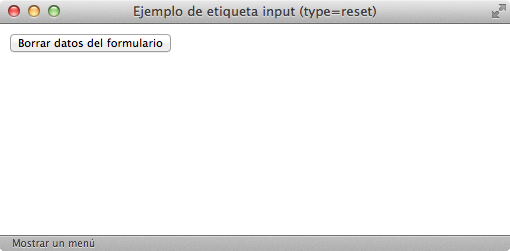

# Elementos de formulario

Los **elementos de formulario** como botones y cuadros de texto también se denominan "campos de formulario" y "controles de formulario". La mayoría de controles se crean con la etiqueta `<input>`, por lo que su definición formal y su lista de atributos es muy extensa:

| Etiqueta              | `<input>`    |
| --------------------: | :------------- |
| **Atributos comunes** | básicos, internacionalización, eventos y foco |
| **Atributos propios** | `type="text | password | checkbox | radio | submit | reset | file | hidden | image | button"` Indica el tipo de control que se incluye en el formulario<br />`name="texto"` Asigna un nombre al control (es imprescindible para que el servidor pueda procesar el formulario)<br />`value="texto"` Valor inicial del control<br />`size="unidad"` Tamaño inicial del control (para los campos de texto y de password se refiere al número de caracteres, en el resto de controles se refiere a su tamaño en píxel)<br />`maxlength="numero"` Máximo número de caracteres para los controles de texto y de password<br />`checked="checked"` Para los controles checkbox y radiobutton permite indicar qué opción aparece preseleccionada<br />`disabled="disabled"` El control aparece deshabilitado y su valor no se envía al servidor junto con el resto de datos<br />`readonly="readonly"` El contenido del control no se puede modificar<br />`src="url"` Para el control que permite crear botones con imágenes, indica la URL de la imagen que se emplea como botón de formulario<br />`alt="texto"` Descripción del control |
| **Tipo de elemento**  | En línea y etiqueta vacía |
| **Descripción**       | Se emplean para insertar un control en un formulario |

A continuación se muestran ejemplos para los diez controles que se pueden crear con la etiqueta `<input>`.

## Cuadro de texto

Se trata del elemento más utilizado en los formularios. En el caso más sencillo, se muestra un cuadro de texto vacío en el que el usuario puede escribir cualquier texto:


```html
Nombre <br/>
<input type="text" name="nombre" value="" />```

__El atributo `type`__ diferencia a cada uno de los diez controles que se pueden crear con la etiqueta `<input>`. Para los cuadros de texto, su valor es `text`. El atributo `name` es el más importante en los campos del formulario. De hecho, si un campo no incluye el atributo `name`, sus datos no se envían al servidor. El valor que se indica en el atributo `name` es el nombre que utiliza la aplicación del servidor para obtener el valor de este campo de formulario.

Cuando el usuario pulsa el **botón de envío** del formulario, el navegador envía los datos a una aplicación del servidor para que procese la información y genere una **respuesta adecuada**. En el servidor, la aplicación que procesa los datos debe obtener en primer lugar toda la información introducida por el usuario. Para ello, utiliza el valor del atributo `name` para obtener los datos de cada control del formulario.

Como el valor del atributo `name` se utiliza en aplicaciones programadas, es esencial ponerse de acuerdo con el programador de la aplicación, no se debe modificar su valor sin modificar la aplicación y no se deben utilizar caracteres problemáticos en programación (espacios en blanco, acentos y caracteres como `ñ` o `ç`).

__El atributo `value`__ se emplea para establecer el valor inicial del cuadro de texto. Si se crea un formulario para insertar datos, los cuadros de texto deberían estar vacíos. Por lo tanto, o no se añade el atributo `value` o se incluye con un valor vacío `value=""`. Si por el contrario se crea un formulario para modificar datos, lo lógico es que se muestren inicialmente los datos guardados en el sistema. En este caso, el atributo `value` incluirá el valor que se desea mostrar: `<input type="text" name="nombre" value="Juan Pérez" />`

Si no se especifica un tamaño, el navegador muestra el cuadro de texto con un tamaño predeterminado. __El atributo `size`__ permite establecer el tamaño, en caracteres, con el que se muestra el cuadro de texto. Su uso es imprescindible en muchos formularios, en los que algunos campos como la dirección deben mostrar más caracteres de lo normal (`<input size="100" ...`) y otros campos como el código postal deben mostrar menos caracteres de lo normal (`<input size="5"...`).

Además de controlar el tamaño con el que se muestra un cuadro de texto, también se puede limitar el tamaño del texto introducido. El __atributo `maxlength`__ permite establecer el máximo número de caracteres que el usuario puede introducir en un cuadro de texto. Su uso es imprescindible para campos como el código postal, el número de la Seguridad Social y cualquier otro dato con formato predefinido y limitado.

Por último, el __atributo `readonly`__ permite que el usuario pueda ver los contenidos del cuadro de texto pero no pueda modificarlos y el atributo `disabled` deshabilita un cuadro de texto de forma que el usuario no pueda modificarlo y además, el navegador no envía sus datos al servidor.

## Cuadro de contraseña

La única diferencia entre este control y el cuadro de texto normal es que el texto que el usuario escribe en un cuadro de contraseña no se ve en la pantalla. En su lugar, los navegadores ocultan el texto utilizando asteriscos o círculos, por lo que es ideal para escribir contraseñas y otros datos sensibles.


```html
Contraseña <br/>
<input type="password" name="contrasena" value="" />```

Cambiando el valor del atributo `type` por `password` se transforma el cuadro de texto normal en un cuadro de contraseña. Todos los demás atributos se utilizan de la misma forma y tienen el mismo significado.

## Checkbox

Los *checkbox* o "casillas de verificación" son controles de formulario que permiten al usuario seleccionar y deseleccionar opciones individualmente. Aunque en ocasiones se muestran varios *checkbox* juntos, cada uno de ellos es completamente independiente del resto. Por este motivo, se utilizan cuando el usuario puede activar y desactivar varias opciones relacionadas pero no excluyentes.


```html
Puestos de trabajo buscados <br/>
<input name="puesto_direct" type="checkbox" value="direccion"/> Dirección
<input name="puesto_tecnico" type="checkbox" value="tecnico"/> Técnico
<input name="puesto_empleado" type="checkbox" value="empleado"/> Empleado```

El valor del atributo `type` para estos controles de formulario es `checkbox`. Como se muestra en el ejemplo anterior, el texto que se encuentra al lado de cada *checkbox* no se puede establecer mediante ningún atributo, por lo que es necesario añadirlo manualmente fuera del control del formulario. Si no se añade un texto al lado de la etiqueta `<input />` del *checkbox*, el usuario sólo ve un pequeño cuadrado sin ninguna información relativa a la finalidad de ese *checkbox*.

El valor del atributo `value`, junto con el valor del atributo `name`, es la información que llega al servidor cuando el usuario envía el formulario.

Si se quiere mostrar un *checkbox* seleccionado por defecto, se utiliza el atributo `checked`. Si el valor del atributo es `checked`, el *checkbox* se muestra seleccionado. En cualquier otro caso, el *checkbox* permanece sin seleccionar. Aunque resulta redundante que el nombre y el valor del atributo sean idénticos, es obligatorio indicarlo de esta forma porque los atributos en XHTML no pueden tener valores vacíos:

```html
<input type="checkbox" checked="checked" /> Checkbox seleccionado```

## Radiobutton

Los controles de tipo `radiobutton` son similares a los controles de tipo `checkbox`, pero presentan una diferencia muy importante: son mutuamente excluyentes. Los `radiobutton` se utilizan cuando el usuario solamente puede escoger una opción entre las distintas opciones relacionadas que se le presentan. Cada vez que se selecciona una opción, automáticamente se deselecciona la otra opción que estaba seleccionaba.


```html
Sexo <br/>
<input type="radio" name="sexo" value="hombre" checked="checked" /> Hombre
<input type="radio" name="sexo" value="mujer" /> Mujer```

El valor del atributo `type` para estos controles de formulario es `radio`. El atributo `name` se emplea para indicar los *radiobutton* que están relacionados. Por lo tanto, cuando varios radiobutton tienen el mismo valor en su atributo `name`, el navegador sabe que están relacionados y puede deseleccionar una opción del grupo de *radiobutton* cuando se seleccione otra opción.

## Botón de envío de formulario

La mayoría de formularios dispone de un botón para enviar al servidor los datos introducidos por el usuario:


```html
<input type="submit" name="buscar" value="Buscar" />```

El valor del atributo `type` para este control de formulario es `submit`. El navegador se encarga de enviar automáticamente los datos cuando el usuario pincha sobre este tipo de botón. El valor del atributo `value` es el texto que muestra el botón. Si no se establece el atributo `value`, el navegador muestra el texto predefinido `Enviar consulta`.

## Botón de reseteo del formulario

Aunque su uso era muy popular hace unos años, la mayoría de formularios modernos ya no utilizan este tipo de botón. Se trata de un botón especial que borra todos los datos introducidos por el usuario y devuelve el formulario a su estado original:



```html
<input type="reset" name="limpiar" value="Borrar datos del formulario" />```

El valor del atributo `type` para este control de formulario es `reset`. Cuando el usuario pulsa este botón, el navegador borra toda la información introducida y muestra el formulario en su estado original. Si el formulario no contenía originalmente ningún valor, el botón de `reset` lo vuelve a mostrar vacío. Si el formulario contenía información, el botón `reset` vuelve a mostrar la misma información original.

Como es habitual en los botones de formulario, el atributo `value` permite establecer el texto que muestra el botón. Si no es utiliza este atributo, el navegador muestra el texto predefinido del botón, que en este caso es `Restablecer`.

## Ficheros adjuntos

Los formularios también permiten adjuntar archivos para subirlos al servidor. Aunque desde el punto de vista de HTML y del navegador no existe ninguna limitación sobre el número, tipo o tamaño total de los archivos que se pueden adjuntar, todos los servidores añaden restricciones por motivos de seguridad.


```html
Fichero adjunto
<input type="file" name="adjunto" />```

El valor del atributo `type` para este control de formulario es `file`. El navegador se encarga de mostrar un cuadro de texto donde aparece el nombre del archivo seleccionado y un botón que permite navegar por los directorios y archivos del ordenador del usuario.

Si se incluye un control para adjuntar archivos, es obligatorio añadir el atributo `enctype` en la etiqueta `<form>` del formulario. El valor del atributo enctype debe ser `multipart/form-data`, por lo que la etiqueta `<form>` de los formularios que permiten adjuntar archivos siempre es:

```html
<form action="..." method="post" enctype="multipart/form-data">
  ...
</form>```

## Campos ocultos

Los campos ocultos se emplean para añadir información oculta en el formulario:

```html
<input type="hidden" name="url_previa" value="/articulo/primero.html" />```

El valor del atributo `type` para este control de formulario es `hidden`. Los campos ocultos no se muestran por pantalla, de forma que el usuario desconoce que el formulario los incluye. Normalmente los campos ocultos se utilizan para incluir información que necesita el servidor pero que no es necesario o no es posible que la establezca el usuario.

## Botón de imagen

El aspecto de los botones de formulario se puede personalizar por completo, ya que incluso es posible utilizar una imagen como botón:

```html
<input type="image" name="enviar" src="accept.png" />```

El valor del atributo `type` para este control de formulario es `image`. El atributo `src` indica la URL de la imagen que debe mostrar el navegador en lugar del botón normal.

Su principal ventaja es que permite personalizar por completo la estética de los botones y mostrarlos con un aspecto homogéneo en todos los navegadores. El principal inconveniente es que ralentiza la carga del formulario y que si se quiere modificar su aspecto, es necesario crear una nueva imagen.

## Botón

Algunos formularios complejos necesitan botones más avanzados que los de enviar datos (`type="submit"`) y resetear el formulario (`type="reset"`). Por ese motivo, el estándar HTML/XHTML define un botón de tipo genérico:

```html
<input type="button" name="guardar" value="Guardar Cambios" />```

El valor del atributo `type` para este control de formulario es `button`. Si pruebas a pulsar un botón de este tipo, verás que el navegador no hace nada: no envía los datos al servidor y no borra los datos introducidos. Este tipo de botones sólo son útiles si se utilizan junto con el lenguaje de programación JavaScript. Si la página incluye código JavaScript, los botones de este tipo se pueden programar para que realicen cualquier tarea compleja cuando se pulsa sobre ellos.

<div class="exercise">
  <p class="title">Ejercicio 14</p>
</div>

[Ver enunciado](#ej14)
