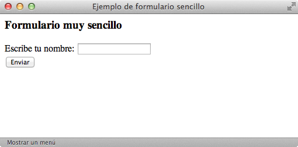

# Formularios básicos

Los formularios más sencillos se pueden crear utilizando solamente dos etiquetas: `<form>` y `<input>`.

Un ejemplo de **código HTML** con ambas etiquetas sería:

```html
<html>
    <head>
        <title>Ejemplo de formulario sencillo</title>
    </head>
    <body>
        <h3>Formulario muy sencillo</h3>
        <form action="http://www.enlace.es/formulario.php" method="post">
            Escribe tu nombre:
            <input type="text" name="nombre" value="" />
            <br/>
            <input type="submit" value="Enviar" />
        </form>
    </body>
</html>```


Y un navegador lo visualizaría de esta manera:



La etiqueta `<form>` encierra todos los contenidos del formulario (botones, cuadros de texto, listas desplegables) y la etiqueta `<input>` permite definir varios tipos diferentes de elementos (botones y cuadros de texto).

| Etiqueta              | `<form>`    |
| --------------------: | :------------- |
| **Atributos comunes** | básicos, internacionalización, eventos |
| **Atributos propios** | `action="url"` Indica la URL que se encarga de procesar los datos del formulario<br />`method="POST o GET"` Método HTTP empleado al enviar el formulario<br />`enctype="application/x-www-form-urlencoded o multipart/form-data"` Tipo de codificación empleada al enviar el formulario al servidor (sólo se indica de forma explícita en los formularios que permiten adjuntar archivos)<br />`accept="tipo"` Lista separada por comas de todos los tipos de archivos aceptados por el servidor (sólo para los formularios que permiten adjuntar archivos)<br />Otros: `accept-charset`, `onsubmit`, `onreset` |
| **Tipo de elemento**  | En bloque |
| **Descripción**       | Se emplea para insertar un formulario en la página |

La mayoría de formularios utilizan sólo los atributos `action` y `method`. El atributo `action` indica la URL de la aplicación del servidor que se encarga de **procesar los datos** introducidos por los usuarios. Esta aplicación también se encarga de generar la **respuesta** que muestra el navegador.

El atributo `method` establece la **forma en la que se envían los datos** del formulario al servidor. Este atributo hace referencia al **método HTTP**, por lo que no es algo propio de HTML. Los dos valores que se utilizan en los formularios son `GET` y `POST`. De esta forma, casi todos los formularios incluyen el atributo `method="get"` o el atributo `method="post"`.

Al margen de otras diferencias técnicas, el método `POST` permite el envío de mucha más información que el método `GET`. En general, el método `GET` admite como máximo el envío de unos 500 bytes de información. La otra gran limitación del método `GET` es que no permite el envío de archivos adjuntos con el formulario. Además, los datos enviados mediante `GET` se ven en la barra de direcciones del navegador (se añaden al final de la URL de la página), mientras que los datos enviados mediante `POST` no se pueden ver tan fácilmente.

Si no sabes que método elegir para un formulario, existe una regla general que dice que el __método `GET`__ se debe utilizar en los **formularios que no modifican la información** (por ejemplo en un formulario de búsqueda). Por su parte, el __método `POST`__ se debería utilizar cuando el **formulario modifica la información original** (insertar, modificar o borrar alguna información).

El ejemplo más común de formulario con método `GET` es el de los buscadores. Si realizas una búsqueda con tu buscador favorito, verás que las palabras que has introducido en tu búsqueda aparecen como parte de la URL de la página de resultados.

Del resto de atributos de la etiqueta `<form>`, el único que se utiliza ocasionalmente es enctype. Como se explica más adelante, este atributo es imprescindible en los formularios que permiten adjuntar archivos.
