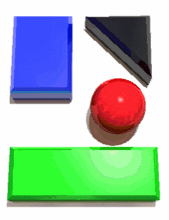

# Imágenes

Aunque el uso de los **mapas de imagen** se ha reducido mucho en los últimos años, aún se utilizan en algunos sitios especializados. La mayoría de mapas se realiza hoy en día mediante *Flash*, aunque algunos sitios siguen recurriendo a los mapas de imagen.

Un **mapa de imagen** permite definir diferentes zonas *"pinchables"* dentro de una imagen. El usuario puede pinchar sobre cada una de las zonas definidas y cada una de ellas puede apuntar a una **URL diferente**. Una imagen que muestre un mapa de todos los continentes puede definir una zona diferente para cada continente. De esta forma, el usuario puede pinchar sobre la zona correspondiente a cada continente.

Las zonas o regiones que se pueden definir en una imagen se crean mediante rectángulos, círculos y polígonos. Para crear un mapa de imagen, en primer lugar se inserta la imagen original mediante la etiqueta ``. A continuación, se utiliza la etiqueta `<map>` para definir las zonas o regiones de la imagen. Cada zona se define mediante la etiqueta `<area>`.

| Etiqueta              | `<map>`    |
| --------------------: | :------------- |
| **Atributos comunes** | básicos, internacionalización, eventos |
| **Atributos propios** | `name="texto"` Nombre que identifica de forma única al mapa definido (es obligatorio indicar un nombre único) |
| **Tipo de elemento**  | En bloque y en línea |
| **Descripción**       | Se emplea para definir mapas de imagen |

| Etiqueta              | `<area>`    |
| --------------------: | :------------- |
| **Atributos comunes** | básicos, internacionalización, eventos y foco |
| **Atributos propios** | `href="url"` URL a la que se accede al pinchar sobre el área <br /> `nohref="nohref"` Se emplea para las áreas que no son seleccionables <br /> `shape="default &#124; rect &#124; circle &#124; poly"` Indica el tipo de área que se define (toda la imagen, rectangular, circular o poligonal) <br /> `coords="lista de números"` Se trata de una lista de números separados por comas que representan las coordenadas del área.<br />Rectangular = X1,Y1,X2,Y2 (coordenadas X e Y del vértice superior izquierdo y coordenadas X e Y del vértice inferior derecho)<br /> Circular = X1,Y1,R (coordenadas X e Y del centro y radio del círculo) <br />Poligonal = X1,Y1,X2,Y2,...,XnYn (coordenadas de los vértices del polígono. Si las últimas coordenadas no son iguales que las primeras, se cierra automáticamente el polígono uniendo ambos vértices) |
| **Tipo de elemento**  | Etiqueta vacía |
| **Descripción**       | Se emplea para definir las distintas áreas que forman un mapa de imagen |

Si una imagen utiliza un mapa de imagen, se debe indicar mediante el atributo `usemap`. El valor del atributo debe ser el nombre del mapa de imagen definido en otra parte del mismo documento HTML:

```html

...
<map name="continentes">
    ...
</map>```


Las áreas se definen mediante el atributo `shape` que indica el tipo de área y `coords` que es una lista de coordenadas cuyo significado depende del tipo de área definido. El enlace de cada área se define mediante el atributo `href`, con la misma sintaxis y significado que para los enlaces normales.

El siguiente ejemplo muestra una imagen sencilla que contiene cuatro figuras geométricas:



Utilizando un círculo, dos rectángulos y un polígono se pueden definir fácilmente cuatro zonas *pinchables* en la imagen mediante el siguiente código HTML:

```html

<map name="mapa_zonas">
    <area shape="rect" coords="20,25,84,113"
        href="rectangulo.html" />
    <area shape="polygon" coords="90,25,162,26,163,96,89,25,90,24"
        href="triangulo.html" />
    <area shape="circle" coords="130,114,29"
        href="circulo.html" />
    <area shape="rect" coords="19,156,170,211"
        href="mailto:rectangulo@direccion.com" />
    <area shape="default" nohref="nohref" />
</map>```

