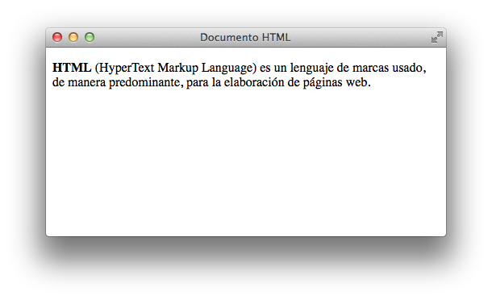

# Estructura y primer documento

Este lenguaje de marcado se construye en forma de **etiquetas** o *tags* rodeadas por corchetes angulares (como `<html>`) dentro del contenido de la página web.
Muchas de las etiquetas vienen 'en pareja', como pueden ser `<h1>` y`</h1>`, siendo la primera la etiqueta o __*tag* inicial o de apertura__ y la segunda __de cierre__; pero también existen algunos *tags* conocidos como elementos vacíos, por ejemplo ``.

**HTML** puede incluir o incrustar *scripts* escritos en lenguajes como **JavaScript** que afectan al comportamiento de las páginas en HTML y crean webs dinámicas, y puede también describir en cierta manera la apariencia de un documento, aunque para dar estilo a las páginas web escritas con este lenguaje, lo más habitual es la utilización de las **hojas de estilo en cascada**, *Cascading Style Sheets*, o su nombre más común, **CSS**.

## Esquema de páginas HTML

Las páginas HTML se dividen en:

- **cabecera** o *head*: incluye información sobre dicha página (título, idioma, hojas de estilos) - todo lo que el usuario no ve, a excepción del título.
- **cuerpo** o *body*: incluye todos sus contenidos (párrafos de texto, imágenes) - todo lo que ve el usuario.

```html
<html>
    <head>
       <title>Documento HTML</title>
    </head>
    <body>
       <p><strong>HTML</strong> (HyperText Markup Language) es un lenguaje
        de marcas usado, de manera predominante, para la elaboración
        de páginas web.</p>
    </body>
</html>```


Si guardásemos este código HTML con un editor de texto sin formato y la extensión **.html**, y lo abriésemos con cualquier navegador, esto sería lo que veríamos:



En este ejemplo anterior, hemos utilizado los *tags* `<html>`, `<head>` y `<body>`, las tres etiquetas principales de un documento HTML:

- `<html>`: es el primer y último *tag* (`</html>`) de un documento HTML, lo que significa que ninguna etiqueta o contenido debe colocarse antes o después de éstas (a excepción del *doctype*).

- `<head>`: delimita la parte de la cabecera del documento y contiene información sobre éste que no se muestran al usuario (a excepción del *tag* `<title>` que muestra el título de la página en la parte superior izquierda de la ventana del navegador).

- `<body>`: delimita el cuerpo del documento HTML y encierra todos sus contenidos visibles.
