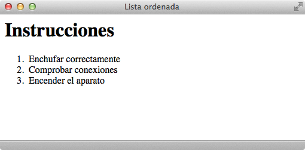

# Listas ordenadas

Estas listas son iguales que las anteriores, salvo por que en este caso los elementos relacionados se muestran siguiendo **un orden determinado**.

El uso de esta lista es el más adecuado cuando existe una mayor **importancia en el orden** de los elementos (índice de un libro, instrucciones, etc.), ya que los símbolos que preceden a los elementos serán números y éstos se irán generando automáticamente por orden.

Las **listas ordenadas** van dentro de las etiquetas `<ol>`…`</ol>` y cada punto que queramos añadir dentro de las etiquetas `<li>`…`</li>`.

| Etiqueta              | `<ol>`    |
| --------------------: | :------------- |
| **Atributos comunes** | básicos, internacionalización, eventos |
| **Atributos propios** | - |
| **Tipo de elemento**  | En bloque |
| **Descripción**       | Se emplea para definir listas ordenadas |

De la misma manera que en las listas no ordenadas, el navegador por defecto muestra los elementos de la lista tabulados y con una consecución de numeración arábiga. Esto puede cambiarse mediante el atributo `type` pero, como ya hemos comentado, no sería correcto; se debe modificar con las hojas de estilo **CSS**. También se puede modificar el primer número con el que queremos que comience la lista (si nos interesa que comience con un número distinto al 1).

Un ejemplo de **código HTML** con las etiquetas `<ol>` y `<li>` sería:

```html
<html>
    <head>
        <title>Lista ordenada</title>
    </head>
    <body>
        <h1>Instrucciones</h1>
        <ol>
            <li>Enchufar correctamente</li>
            <li>Comprobar conexiones</li>
            <li>Encender el aparato</li>
        </ol>
    </body>
</html>```


Que un navegador visualizaría de esta manera:


