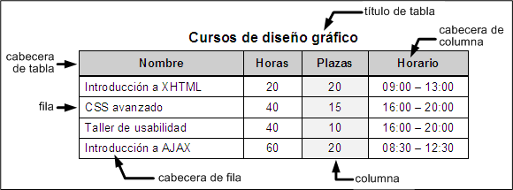

# Tablas

Desde sus primeras versiones, HTML incluyó el soporte para crear tablas de datos en las páginas web. Además de ser sencillo, el **modelo definido por HTML** es muy flexible y bastante completo.

Las **tablas en HTML** utilizan los mismos conceptos de filas, columnas, cabeceras y títulos que los que se utilizan en cualquier otro entorno y pueden contener elementos simples, agrupaciones de filas y de columnas, cabeceras y pies de tabla, subdivisiones, cabeceras múltiples y otros elementos complejos.

El problema de las tablas es que no siempre se utilizan adecuadamente. Aunque parezca obvio, las tablas se deben utilizar para mostrar información tabular.

Hasta hace algún tiempo, las tablas también se utilizaban para definir la estructura de las páginas web y aunque hoy en día hay diseñadores que siguen utilizando este método, se trata de una técnica poco recomendable ya que se complica en exceso el código HTML. La solución correcta para definir la **estructura de las páginas** consiste en la utilización de hojas de estilos **CSS**.
