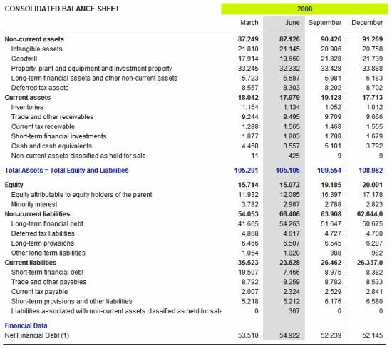
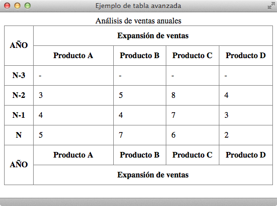
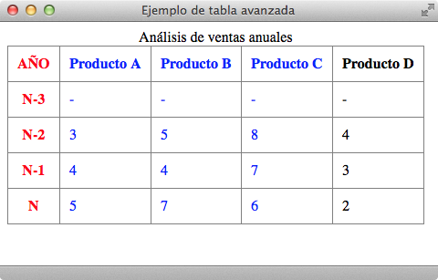

# Tablas avanzadas

Algunas **tablas complejas** están formadas por más elementos que filas y celdas de datos. Así, es común que las tablas más avanzadas dispongan de una **sección de cabecera, una sección de pie y varias secciones de datos**. Además, también es posible agrupar varias columnas de forma lógica para poder aplicar estilos similares a un determinado grupo de columnas.

Un ejemplo clásico de tablas avanzadas es el de las tablas utilizadas en **contabilidad**, como por ejemplo la tabla que muestra el balance de una empresa:



Las partes que componen las tablas complejas se definen mediante las etiquetas `<thead>`, `<tbody>` y `<tfoot>`. La cabecera de la tabla se define con la etiqueta `<thead>`, el pie de la tabla se define mediante `<tfoot>` y cada sección de datos se define con una etiqueta `<tbody>`.

| Etiqueta              | `<thead>` `<tbody>` `<tfoot>`    |
| --------------------: | :------------- |
| **Atributos comunes** | básicos, internacionalización, eventos |
| **Atributos propios** | - |
| **Tipo de elemento**  | En bloque |
| **Descripción**       | Se emplean para agrupar varias filas en una cabecera (*thead*) un pie (*tfoot*) o una sección (*tbody*) de una tabla |

Cada tabla puede contener solamente una cabecera y un pie, pero puede incluir un número ilimitado de secciones. Si se define una cabecera y/o un pie, las etiquetas `<thead>` y/o `<tfoot>` deben colocarse inmediatamente antes que cualquier etiqueta `<tbody>`.

Un ejemplo de **código HTML** con las etiquetas `<thead>`, `<tbody>` y `<tfoot>` sería:

```html
<html>
    <head>
        <title>Ejemplo de tabla avanzada</title>
    </head>
    <body>
      <h3>Análisis de ventas</h3>
      <table summary="Análisis de ventas anuales">
        <caption>Análisis de ventas anuales</caption>
        <thead>
          <tr>
            <th rowspan="2" scope="col">AÑO</th>
            <th colspan="4" scope="col">Expansión de ventas</th>
          </tr>
          <tr>
            <th scope="col">Producto A</th>
            <th scope="col">Producto B</th>
            <th scope="col">Producto C</th>
            <th scope="col">Producto D</th>
          </tr>
        </thead>
        <tfoot>
          <tr>
            <th rowspan="2" scope="col">AÑO</th>
            <th scope="col">Producto A</th>
            <th scope="col">Producto B</th>
            <th scope="col">Producto C</th>
            <th scope="col">Producto D</th>
          </tr>
          <tr>
            <th colspan="4" scope="col">Expansión de ventas</th>
          </tr>
        </tfoot>
        <tbody>
          <tr>
            <th scope="row">N-3</th>
            <td>-</td><td>-</td><td>-</td><td>-</td>
          </tr>
          <tr>
            <th scope="row">N-2</th>
            <td>3</td><td>5</td><td>8</td><td>4</td>
          </tr>
          <tr>
            <th scope="row">N-1</th>
            <td>4</td><td>4</td><td>7</td><td>3</td>
          </tr>
          <tr>
            <th scope="row">N</th>
            <td>5</td><td>7</td><td>6</td><td>2</td>
          </tr>
        </tbody>
      </table>
    </body>
</html>```


Y un navegador lo visualizaría de esta manera:


Aunque al principio resulta extraño, el elemento `<tfoot>` siempre se escribe antes que cualquier elemento `<tbody>` en el código HTML. De hecho, si la etiqueta `<tfoot>` aparece después de un elemento `<tbody>`, la página no se considera válida.

Esta etiqueta `<tbody>` permite realizar agrupaciones de filas, pero en ocasiones se necesitan agrupar columnas. Aunque su uso no es muy común, HTML define dos **etiquetas similares para agrupar columnas**: `<col>` y `<colgroup>`.

La etiqueta `<col>` se utiliza para asignar los mismos atributos a varias columnas de forma simultánea. De esta forma, la etiqueta `<col>` no agrupa columnas, sino que sólo asigna atributos comunes a varias columnas.

Un ejemplo de **código HTML** con la etiqueta `<col>` sería:

```html
<table summary="Análisis de ventas anuales">
  <caption>Análisis de ventas anuales</caption>
  <col style="width:10%;" />
  <col style="width:30%;" />
  <thead>
    <tr>
      <th scope="col">AÑO</th>
      <th scope="col">Producto A</th>
      <th scope="col">Producto B</th>
      <th scope="col">Producto C</th>
      <th scope="col">Producto D</th>
    </tr>
  </thead>
  <tbody>
    <tr>
      <th scope="row">N-3</th>
      <td>-</td><td>-</td><td>-</td><td>-</td>
    </tr>
    <tr>
      <th scope="row">N-2</th>
      <td>3</td><td>5</td><td>8</td><td>4</td>
    </tr>
    <tr>
      <th scope="row">N-1</th>
      <td>4</td><td>4</td><td>7</td><td>3</td>
    </tr>
    <tr>
      <th scope="row">N</th>
      <td>5</td><td>7</td><td>6</td><td>2</td>
    </tr>
  </tbody>
</table>```


Y un navegador lo visualizaría de esta manera:



Por otra parte, la etiqueta `<colgroup>` se emplea para agrupar de forma estructural varias columnas de la tabla. La forma habitual de indicar el número de columnas que abarca la agrupación es utilizar el atributo `span`, que establece el número de columnas de cada agrupación.

Un ejemplo de **código HTML** con la etiqueta `<colgroup>` sería:

```html
<table summary="Análisis de ventas anuales">
  <caption>Análisis de ventas anuales</caption>
  <colgroup span="1" style="color:red;" />
  <colgroup span="3" style="color:blue;" />
  <thead>
    <tr>
      <th scope="col">AÑO</th>
      <th scope="col">Producto A</th>
      <th scope="col">Producto B</th>
      <th scope="col">Producto C</th>
      <th scope="col">Producto D</th>
    </tr>
  </thead>
  <tbody>
    <tr>
      <th scope="row">N-3</th>
      <td>-</td><td>-</td><td>-</td><td>-</td>
    </tr>
    <tr>
      <th scope="row">N-2</th>
      <td>3</td><td>5</td><td>8</td><td>4</td>
    </tr>
    <tr>
      <th scope="row">N-1</th>
      <td>4</td><td>4</td><td>7</td><td>3</td>
    </tr>
    <tr>
      <th scope="row">N</th>
      <td>5</td><td>7</td><td>6</td><td>2</td>
    </tr>
  </tbody>
</table>```


Y un navegador lo visualizaría de esta manera:



El uso de las etiquetas `<col>` y `<colgroup>` no está muy extendido, ya que la mayoría de navegadores no soportan muchas de sus funcionalidades.

<div class="exercise">
  <p class="title">Ejercicio 11</p>
</div>

[Ver enunciado](#ej11)

<div class="exercise">
  <p class="title">Ejercicio 12</p>
</div>

[Ver enunciado](#ej12)

<div class="exercise">
  <p class="title">Ejercicio 13</p>
</div>

[Ver enunciado](#ej13)
