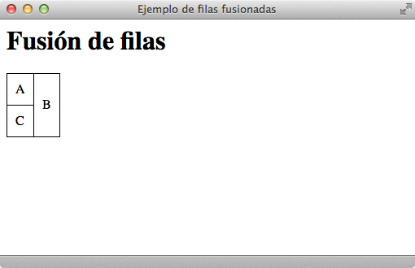
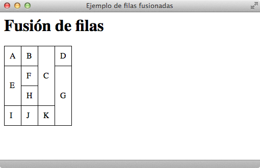

# Tablas básicas

Las tablas más sencillas de HTML se definen con tres etiquetas: `<table>` para crear la tabla, `<tr>` para crear cada fila y `<td>` para crear cada columna.

Un ejemplo de **código HTML** con una tabla sencilla sería:

```html
<html>
    <head>
        <title>Ejemplo de tabla sencilla</title>
    </head>
    <body>
        <h1>Listado de cursos</h1>
        <table>
        <tr>
          <td><strong>Curso</strong></td>
          <td><strong>Horas</strong></td>
          <td><strong>Horario</strong></td>
        </tr>
        <tr>
          <td>CSS</td>
          <td>20</td>
          <td>16:00 - 20:00</td>
        </tr>
        <tr>
          <td>HTML</td>
          <td>20</td>
          <td>16:00 - 20:00</td>
        </tr>
        <tr>
          <td>Dreamweaver</td>
          <td>60</td>
          <td>16:00 - 20:00</td>
        </tr>
        </table>
    </body>
</html>```


Y un navegador lo visualizaría de esta manera:


La etiqueta `<table>` encierra todas las **filas y columnas de la tabla**. Las etiquetas `<tr>` (*table row*) definen cada fila de la tabla y encierran todas las columnas. Por último, la etiqueta `<td>` (*table data cell*) define cada una de las columnas de las filas (aunque realmente HTML no define columnas sino celdas de datos).

Al definir una tabla, se debe pensar en primer lugar en las filas que la forman y a continuación en las columnas. El motivo es que **HTML** procesa primero las filas y por eso las etiquetas `<tr>` aparecen antes que las etiquetas `<td>`.

| Etiqueta              | `<table>`    |
| --------------------: | :------------- |
| **Atributos comunes** | básicos, internacionalización, eventos |
| **Atributos propios** | `summary="texto"` Permite describir el contenido de la tabla (lo utilizan los buscadores y las personas discapacitadas) |
| **Tipo de elemento**  | Tabla |
| **Descripción**       | Se emplea para definir tablas de datos |

| Etiqueta              | `<tr>`    |
| --------------------: | :------------- |
| **Atributos comunes** | básicos, internacionalización, eventos |
| **Atributos propios** | - |
| **Tipo de elemento**  | Fila de tabla |
| **Descripción**       | Se emplea para definir cada fila de las tablas de datos |

| Etiqueta              | `<td>`    |
| --------------------: | :------------- |
| **Atributos comunes** | básicos, internacionalización y eventos |
| **Atributos propios** | `abbr="texto"` Permite describir el contenido de la celda (empleado sobre todo en los navegadores utilizados por personas discapacitadas)<br />`headers="lista_de_id"` Indica las celdas que actúan como cabeceras para esta celda (los títulos de las columnas y filas). Se indica como una lista de valores del atributo "id" de celdas<br />`scope="col, row, colgroup, rowgroup"` Indica las celdas para las que esta celda será su cabecera<br />`colspan="numero"` Número de columnas que ocupa esta celda<br />`rowspan="numero"` Número de filas que ocupa esta celda |
| **Tipo de elemento**  | Celda de tabla |
| **Descripción**       | Se emplea para definir cada una de las celdas que forman las filas de una tabla, es decir, las columnas de la tabla |

De todos los **atributos** disponibles para las celdas, los más utilizados son `rowspan` y `colspan`, que se emplean para construir tablas complejas como las que se ven más adelante. Entre los demás atributos, sólo se utiliza de forma habitual el atributo `scope`, sobre todo con las celdas de cabecera que se ven a continuación.

Normalmente, algunas de las celdas de la tabla se utilizan como **cabecera** de las demás celdas de la fila o de la columna. Para esto, HTML define la etiqueta `<th>` (*table header cell*) para indicar que una celda es cabecera de otras.

| Etiqueta              | `<th>`    |
| --------------------: | :------------- |
| **Atributos comunes** | básicos, internacionalización, eventos |
| **Atributos propios** | `abbr="texto"` Permite describir el contenido de la celda (empleado sobre todo en los navegadores utilizados por personas discapacitadas)<br />`headers="lista_de_id"` Indica las celdas que actúan como cabeceras para esta celda (los títulos de las columnas y filas). Se indica como una lista de valores del atributo `id` de celdas<br />`scope="col, row, colgroup, rowgroup"` Indica las celdas para las que esta celda será su cabecera <br />`colspan="numero"` Número de columnas que ocupa esta celda<br />`rowspan="numero"` Número de filas que ocupa esta celda |
| **Tipo de elemento**  | Celda de tabla |
| **Descripción**       | Se emplea para definir las celdas que son cabecera de una fila o de una columna de la tabla |

Los **atributos** de la etiqueta `<th>` son idénticos que los atributos definidos para la etiqueta `<td>`. En este caso, el atributo más utilizado es `scope`, que permite indicar si la celda es cabecera de la fila o de la columna (`<th scope="row">` y `<th scope="col">` respectivamente).

Por otra parte, HTML define la etiqueta `<caption>` para establecer la leyenda o título de una tabla. La etiqueta debe colocarse inmediatamente después de la etiqueta `<table>` y cada tabla sólo puede incluir una etiqueta `<caption>`.

| Etiqueta              | `<caption>`    |
| --------------------: | :------------- |
| **Atributos comunes** | básicos, internacionalización, eventos |
| **Atributos propios** | - |
| **Tipo de elemento**  | En línea |
| **Descripción**       | Se emplea para definir la leyenda o título de una tabla |

Las tablas complejas suelen disponer de una estructura irregular que junta varias columnas para formar una columna ancha o une varias filas para formar una fila más alta que las demás. Para fusionar filas o columnas, se utilizan los atributos `rowspan` y `colspan` respectivamente.

Un ejemplo de **código HTML** y una tabla compleja que ha fusionado dos columnas simples para formar una columna más ancha sería:

```html
<table>
<tr>
  <td colspan="2">A</td>
</tr>
<tr>
  <td>B</td>
  <td>C</td>
</tr>
</table>```


Y un navegador lo visualizaría de esta manera:


La primera fila de la tabla está formada sólo por una columna, mientras que la segunda fila está formada por dos columnas. En principio, podría pensarse en utilizar el siguiente código HTML para definir la tabla:

```html
<table>
<tr>
  <td>A</td>
</tr>
<tr>
  <td>B</td>
  <td>C</td>
</tr>
</table>```


Sin embargo, si se utiliza el código anterior, el navegador visualiza de forma incorrecta la tabla, ya que las tablas en HTML deben disponer de una **estructura regular**. Por lo tanto, si se quieren mostrar menos columnas en una fila, se fusionan mediante el atributo `colspan`, que indica el número de columnas simples que va a ocupar una determinada celda.

En el ejemplo anterior, la celda de la primera fila debe ocupar el espacio de dos columnas simples, por lo que el código HTML debe ser `<td colspan="2">A</td>`.

Un ejemplo de **código HTML** y na tabla HTML que fusiona filas sería:

```html
<table>
<tr>
  <td>A</td>
  <td rowspan="2">B</td>
</tr>
<tr>
  <td>C</td>
</tr>
</table>```


Y un navegador lo visualizaría de esta manera:



De forma análoga a la **fusión** de columnas del ejemplo anterior, la fusión de filas debe indicarse de forma especial. Como las tablas HTML tienen que ser regulares, todas las columnas deben tener el mismo número de filas. Así, si en el ejemplo anterior se utilizara el siguiente código,

```html
<table>
<tr>
  <td>A</td>
  <td>B</td>
</tr>
<tr>
  <td>C</td>
</tr>
</table>```


la tabla anterior no se visualizaría correctamente. Como la segunda columna de la tabla ocupa el espacio de las dos filas, el código HTML debe indicar claramente que esa celda va a ocupar dos filas, de manera que todas las columnas de la tabla cuenten con el mismo número de filas.

Utilizando los atributos `rowspan` y `colspan`, es posible diseñar tablas tan complejas como las que se muestran en los siguientes ejemplos.

Ejemplo de fusión de múltiples columnas:


El **código HTML** necesario para fusionar las columnas de la tabla anterior sería:

```html
<html>
    <head>
        <title>Ejemplo de columnas fusionadas</title>
    </head>
    <body>
        <h1>Fusión de columnas</h1>
        <table>
        <tr>
          <td colspan="3">A</td>
          <td>B</td>
        </tr>
        <tr>
          <td>C</td>
          <td colspan="2">D</td>
          <td>E</td>
        </tr>
        <tr>
          <td colspan="4">F</td>
        </tr>
        <tr>
          <td>G</td>
          <td>H</td>
          <td>I</td>
          <td>J</td>
        </tr>
        </table>
    </body>
</html>```


Ejemplo de fusión de múltiples filas:



El **código HTML** necesario para fusionar las filas de la tabla anterior sería:

```html
<html>
    <head>
        <title>Ejemplo de filas fusionadas</title>
    </head>
    <body>
        <h1>Fusión de filas</h1>
        <table>
          <tr>
            <td>A</td>
            <td>B</td>
            <td rowspan="3">C</td>
            <td>D</td>
          </tr>
          <tr>
            <td rowspan="2">E</td>
            <td>F</td>
            <td rowspan="3">G</td>
          </tr>
          <tr>
            <td>H</td>
          </tr>
          <tr>
            <td>I</td>
            <td>J</td>
            <td>K</td>
          </tr>
        </table>
    </body>
</html>```

