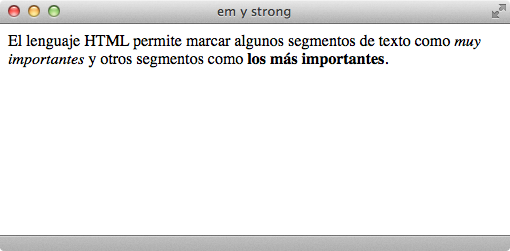

# Marcado básico de un texto

El siguiente paso posterior a la **estructuración** del texto consistiría en el **marcado** de éste. Para el marcado básico de un texto encontraríamos estas etiquetas:

| Etiqueta              | `<em>`    |
| --------------------: | :------------- |
| **Atributos comunes** | básicos, internacionalización, eventos |
| **Atributos propios** | - |
| **Tipo de elemento**  | En línea |
| **Descripción**       | Realza la importancia del texto que encierra - *cursiva* |

| Etiqueta              | `<strong>`    |
| --------------------: | :------------- |
| **Atributos comunes** | básicos, internacionalización, eventos |
| **Atributos propios** | - |
| **Tipo de elemento**  | En línea |
| **Descripción**       | Realza con la máxima importancia el texto que encierra - **negrita** |

Un ejemplo de **código HTML** con las etiquetas `<em>` y `<strong>` sería:

```html
<html>
    <head>
        <title>Etiquetas em y strong</title>
    </head>
    <body>
        <p>El lenguaje HTML permite marcar algunos segmentos de texto
        como <em>muy importantes</em> y otros segmentos como <strong>los
        más importantes</strong>.</p>
    </body>
</html>```


Y un navegador lo visualizaría de esta manera:



HTML también permite marcar de forma adecuada las modificaciones realizadas en el contenido de una página: el texto que **ha sido eliminado** y el texto que **ha sido añadido**:

| Etiqueta              | `<ins>`    |
| --------------------: | :------------- |
| **Atributos comunes** | básicos, internacionalización, eventos |
| **Atributos propios** | `cite="url"` Indica la URL de la página en la que se puede obtener más información sobre el motivo por el que se realizó la modificación.<br />`datetime="fecha"` Especifica la fecha y hora en la que se realizó el cambio |
| **Tipo de elemento**  | En bloque y en línea |
| **Descripción**       | Se emplea para marcar una modificación en los contenidos originales consistente en la inserción de un nuevo contenido |

| Etiqueta              | `<del>`    |
| --------------------: | :------------- |
| **Atributos comunes** | básicos, internacionalización, eventos |
| **Atributos propios** | `cite="url"` Indica la URL de la página en la que se puede obtener más información sobre el motivo por el que se realizó la modificación.<br />`datetime="fecha"` Especifica la fecha y hora en la que se realizó el cambio |
| **Tipo de elemento**  | En bloque y en línea |
| **Descripción**       | Se emplea para marcar una modificación en los contenidos originales consistente en el borrado de cierto contenido |

Por defecto, el texto eliminado (`<del>`) se muestra tachado y el texto insertado (`<ins>`) se muestra subrayado.

Un ejemplo de **código HTML** con las etiquetas `<ins>` y `<del>` sería:

```html
<html>
    <head>
        <title>Etiquetas ins y del</title>
    </head>
    <body>
        <p>El HTML, acrónimo inglés de Hyper Text Markup Language (lenguaje
        de <del datetime="20091025" cite="http://www.enlace.com">marcado de
        hipertexto</del> <ins datetime="20091026" cite="http://enlace.com">
        marcas hipertextuales</ins>) es un lenguaje de marcación diseñado
        para estructurar textos y presentarlos en forma de hipertexto.</p>
    </body>
</html>```


Y un navegador lo visualizaría de esta manera:


Además de estas dos, encontramos la etiqueta `<blockquote>` para incluir citas textuales en las páginas web.

| Etiqueta              | `<blockquote>`    |
| --------------------: | :------------- |
| **Atributos comunes** | básicos, internacionalización, eventos |
| **Atributos propios** | `cite="url"` Indica la URL de la página en la que se puede obtener más información sobre el motivo por el que se realizó la modificación |
| **Tipo de elemento**  | En bloque |
| **Descripción**       | Se emplea para indicar que el texto que encierra es una cita textual de otro texto externo |

Un ejemplo de **código HTML** con la etiqueta `<blockquote>` sería:

```html
<html>
    <head>
        <title>Etiqueta blockquote</title>
    </head>
    <body>
        <p>Según el W3C, el valor del atributo <em>cite</em> en las
        etiquetas <strong>blockquote</strong> tiene el siguiente
        significado:</p>
        <blockquote cite="http://www.w3.org/TR/html401/struct/text.html">
        "El valor de este atributo es una dirección URL que indica el
        documento original de la cita."</blockquote>
    </body>
</html>```


Y un navegador lo visualizaría de esta manera:


<div class="exercise">
  <p class="title">Ejercicio 2</p>
</div>

[Ver enunciado](#ej02)

<div class="exercise">
  <p class="title">Ejercicio 3</p>
</div>

[Ver enunciado](#ej03)
