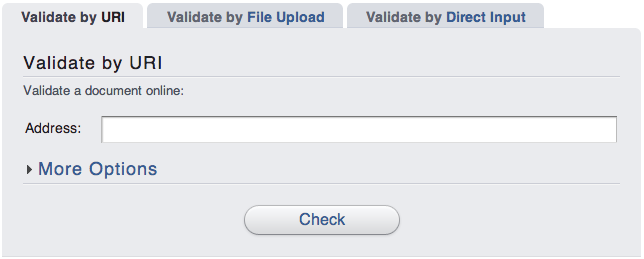
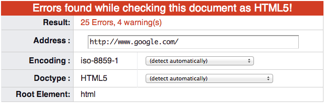

# Validador del W3C

La validación de las páginas web no requiere el uso de editores avanzados como Dreamweaver, ya que el organismo W3C ha creado una herramienta que se puede utilizar gratuitamente a través de Internet: [http://validator.w3.org/](http://validator.w3.org/)

Aunque la herramienta sólo está disponible en inglés, su uso es muy intuitivo:

* `Validate by URI`, permite escribir la URL de la página que se quiere validar. Esta opción es la más sencilla para validar las páginas que ya están publicadas en Internet.
* `Validate by File Upload`, muestra un formulario mediante el que se puede subir el archivo HTML correspondiente a la página que se quiere validar. Esta opción es la mejor para validar las páginas web que has desarrollado y que aún no has publicado en Internet.
* `Validate by Direct Input`, permite validar código HTML de forma directa. Se trata de la opción más rápida para validar trozos o páginas HTML completas. Esta opción es la mejor cuando estás desarrollando las páginas y quieres asegurarte que el código sea válido.

La siguiente imagen muestra el **resultado de la validación** de la página principal de Google realizada mediante la opción Validate by URI:

Si la página no pasa correctamente la prueba de validación, se muestra el listado completo de fallos junto con la ayuda necesaria para resolver cada uno de los errores.

Como se observa en la imagen anterior, incluso una página tan sencilla como la portada de Google contiene decenas de errores que impiden considerarla válida. Por lo tanto, la página principal de Google no es una página válida, aunque eso no impide que se vea bien en todos los navegadores y que los usuarios la consideren correcta.
